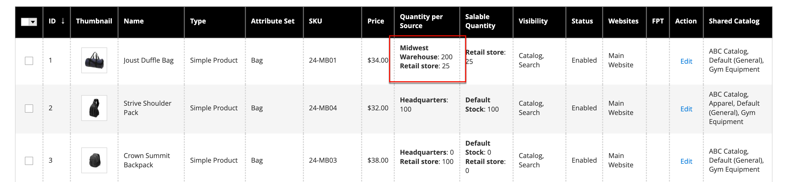

# 存貨 — 指定來源與數量

針對使用[[!DNL Inventory Management]](../inventory-management/introduction.md)的多重來源商家，向下捲動至&#x200B;**來源**&#x200B;區段，並指派來源與數量：

1. 若要新增來源，請按一下&#x200B;**[!UICONTROL Assign Sources]**。

1. 瀏覽或搜尋來源，並選取您要為產品新增之來源旁的核取方塊。

   {width="600" zoomable="yes"}

1. 按一下&#x200B;**[!UICONTROL Done]**&#x200B;以新增來源。

1. 若要管理來源的數量和狀態，請按一下&#x200B;**[!UICONTROL Advanced Inventory]**&#x200B;並將&#x200B;**[!UICONTROL Manage Stock]**&#x200B;設為`Yes`。

1. 將&#x200B;**[!UICONTROL Source Item Status]**&#x200B;設為`In Stock`。

1. 輸入更新庫存量&#x200B;**[!UICONTROL Qty]**&#x200B;的金額。

1. 若要設定存貨數量的通知，請執行下列其中一項作業：

   - _自訂通知數量_ — 清除&#x200B;**[!UICONTROL Notify Quantity Use Default]**&#x200B;核取方塊並在&#x200B;**[!UICONTROL Notify Quantity]**&#x200B;中輸入數量。

   - _預設通知數量_ — 選取&#x200B;**[!UICONTROL Notify Quantity Use Default]**&#x200B;核取方塊。 Commerce會檢查並使用[!UICONTROL Advanced Inventory]或全域存放區組態中的設定。

   {width="600" zoomable="yes"}
