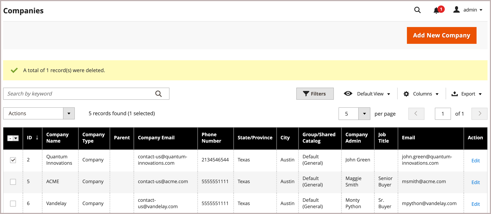
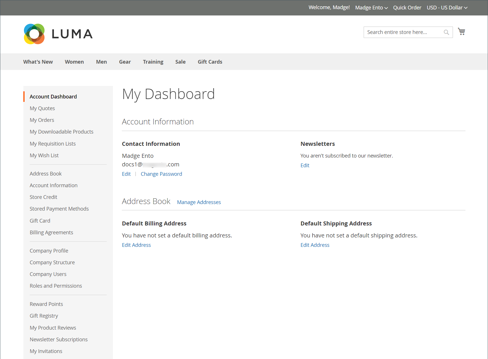
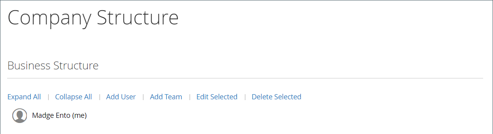

# 公司帳戶

當您在商店中合併B2B公司帳戶時，您可以讓公司根據其組織中的使用者角色，建立多個具有彈性許可權的子帳戶，藉此簡化公司購物體驗。

根據公司不同，商店管理員可以調整促銷活動和價格以符合其需求，並建立高度客製化的優惠方案以迎合購物者的需求並增加訂單。

將公司帳戶關聯新增至標準[個人](../customers/account-create.md)，可讓客戶使用為公司定義的特定採購工作流程。

公司帳戶的優點：

- 提供不限數量的[公司使用者](account-company-users.md)以及建立其他帳戶，可簡化公司購買作業。

- 包含對具有不同[角色和許可權](account-company-roles-permissions.md)的&#x200B;_智慧_&#x200B;公司帳戶階層的訂單支援。

- 提供[公司商店信用額](credit-company.md)作為付款方式，提供商戶增加收入的機制。

- 支援管理員管理所有公司帳戶的[管理](account-company-manage.md)。

## 檢視公司帳戶

_公司_&#x200B;方格會列出所有作用中的公司帳戶和擱置的要求，無論狀態設定為何。 它還提供用於[建立](account-company-create.md)和[管理](account-company-manage.md)公司帳戶的工具。 使用標準格線控制項來篩選清單，並調整欄版面配置。 如需資料行說明的清單，請參閱[管理公司帳戶](account-company-manage.md)中的&#x200B;_資料行說明_&#x200B;區段。

客戶可以從店面建立公司帳戶，商家可以從管理員建立帳戶。 依預設，會啟用從店面建立公司帳戶的功能。 如果設定允許，則商店的訪客可請求開啟公司帳戶。 在公司帳戶獲得核准後，公司管理員可以設定公司結構和具有各種許可權等級的使用者。

在&#x200B;_管理員_&#x200B;側邊欄中，移至&#x200B;**[!UICONTROL Customers]** > **[!UICONTROL Companies]**。

{width="700" zoomable="yes"}

[!UICONTROL Companies]方格會列出所有公司，無論狀態為何。 公司清單指出公司是否與[公司階層](manage-company-hierarchy.md)相關聯，並提供有關公司、公司管理員及其他資訊的[詳細資訊](/help/b2b/account-company-manage.md#company-options-and-columns)。 使用[管理方格控制項](../getting-started/admin-grid-controls.md)來設定篩選器、欄檢視選項等，以自訂檢視。

## 公司管理員

下列範例顯示具有初始公司管理員帳戶的&#x200B;_客戶_&#x200B;網格。

{width="700" zoomable="yes"}

每個公司都有單一的公司管理員，由帳戶電子郵件地址以及管理員的名字和姓氏來識別。 管理員可以使用者身分指派給其他公司，但他們只能是一個公司的管理員。

建立帳戶之後，公司管理員會定義[團隊](account-company-structure.md)的公司結構、設定[公司使用者](account-company-users.md)，並為每個使用者建立[角色和許可權](account-company-roles-permissions.md)。

### 在第一次登入前設定公司管理員密碼

1. 公司管理員會從市集找到一封歡迎電子郵件。

   {width="500"}

   >[!NOTE]
   >
   >電子郵件的電子郵件地址目標和內容由[公司電子郵件選項](email-company-configuration.md)組態中指定的選項決定。

1. 遵循指示並按一下&#x200B;[!UICONTROL **連結**]&#x200B;設定密碼。

1. 輸入其帳戶的&#x200B;[!UICONTROL **新密碼**]&#x200B;和密碼確認。

   密碼必須至少包括下列三種字元型別：

   - 小寫字元(abc...)
   - 大寫字元(ABC...)
   - 數字(1234567890)
   - 特殊字元(！@#$...)

1. 按一下&#x200B;[!UICONTROL **設定新密碼**]。

   {width="700" zoomable="yes"}

1. 當[!UICONTROL Customer Login]頁面出現時，客戶輸入其&#x200B;[!UICONTROL **電子郵件**]&#x200B;和&#x200B;[!UICONTROL **密碼**]。

1. 按一下&#x200B;[!UICONTROL **登入**]&#x200B;以存取其帳戶儀表板。

   {width="700" zoomable="yes"}

## 公司結構

可以設定公司帳戶以反映業務結構。 最初，公司結構僅包含公司管理員，但可展開以包含使用者團隊。 使用者可與專案團隊建立關聯，或在公司內部門與細分的階層內進行組織。 此結構設計支援使用與公司帳戶相關聯的[採購單](purchase-order-flow.md) (PO)的[核准規則](account-dashboard-approval-rules.md)。

{width="450"}

在公司管理員的帳戶儀表板中，公司結構以樹狀結構表示，最初僅由公司管理員組成。

{width="600"}

建立帳戶時，公司管理員可以使用公司電子郵件地址或指派不同的電子郵件地址。

在下列範例中，初始公司結構包括公司管理員以及公司管理員名稱中的個別使用者帳戶。 但公司管理員功能（例如公司結構和核准規則）只有在登入指定為公司管理員的使用者帳戶時才可用。

具有系統管理員和使用者帳戶的{width="600"}
