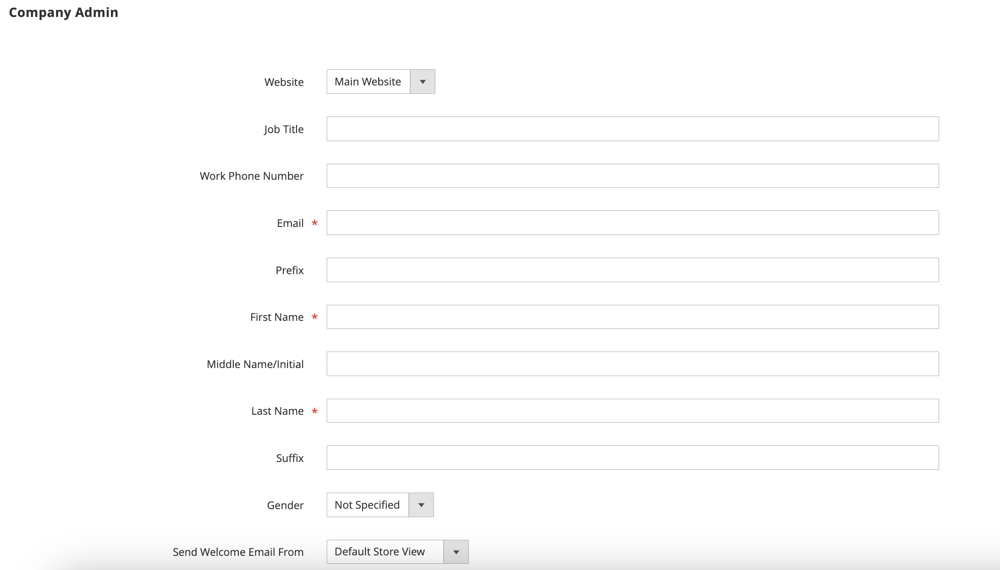

# 指派公司管理員

公司管理員最初是在公司帳戶首次建立時指派的，且只能由管理員的商店管理員修改。

- 每個公司只能有一個指派的管理員。
- 公司使用者只能是一個公司的管理員。
- 必須由「管理員」的存放區管理員完成指定公司管理員的變更。

## 變更指派的公司管理員

1. 在&#x200B;_管理員_&#x200B;側邊欄上，移至&#x200B;**[!UICONTROL Customers]** > **[!UICONTROL Companies]**。

   {width="700" zoomable="yes"}

1. 在清單中尋找公司，然後按一下&#x200B;**[!UICONTROL Edit]**。

1. 展開&#x200B;**[!UICONTROL Company Admin]**&#x200B;區段的。

   {width="700" zoomable="yes"}

1. 輸入新公司管理員的&#x200B;**[!UICONTROL Job Title]**。

   此動作會清除表單，且必要的&#x200B;_[!UICONTROL First Name]_和_[!UICONTROL Last Name]_&#x200B;欄位會反白顯示。

1. 輸入新公司管理員的&#x200B;**[!UICONTROL Email]**&#x200B;位址。

   如果系統在資料庫中找不到電子郵件地址，系統會提示您確認是否要取代公司管理員。

   - 如果新公司管理員的使用者帳戶不存在，則系統會建立`Company Admin`型別的帳戶。

   - 如果使用者帳戶存在於系統中，則會將其移至公司結構中的公司管理員位置。

1. 輸入&#x200B;**[!UICONTROL First Name]**&#x200B;和&#x200B;**[!UICONTROL Last Name]**，以及適用於新公司管理員的任何其他資訊。

1. 完成時，按一下&#x200B;**[!UICONTROL Save]**。

   前公司管理員的個別帳戶會保留在系統中，作為指派給預設使用者角色的有效使用者帳戶。 如果這是唯一與使用者帳戶關聯的公司，則帳戶型別會從&#x200B;*[!UICONTROL Company user]*&#x200B;變更為&#x200B;*[!UICONTROL Individual user]*。

   系統會將變更的電子郵件通知傳送給新的和以前的公司管理員。

