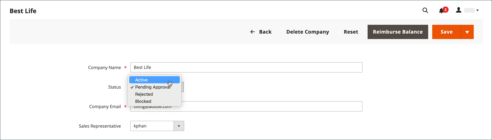

# 核准公司帳戶

從店面收到的建立公司要求的狀態為`Pending Approval`，直到該要求由店面管理員稽核並核准或拒絕為止。 公司帳戶的狀態可設為下列任一專案：

- [!UICONTROL Active]
- [!UICONTROL Pending Approval]
- [!UICONTROL Rejected]
- [!UICONTROL Blocked]

您也可以使用[動作控制項](account-company-manage.md)來核准多個公司要求。

{width="700" zoomable="yes"}

## 核准擱置中的公司帳戶

1. 在&#x200B;_管理員_&#x200B;側邊欄上，移至&#x200B;**[!UICONTROL Customers]** > **[!UICONTROL Companies]**。

   您可以使用格線上方的&#x200B;_[!UICONTROL Columns]_選取器來顯示&#x200B;**[!UICONTROL Status]**欄。

1. 在&#x200B;_[!UICONTROL Action]_欄中按一下&#x200B;**[!UICONTROL Edit]**。

1. 將&#x200B;**[!UICONTROL Company Status]**&#x200B;設為`Active`。

   {width="700" zoomable="yes"}

1. 提示確認時，按一下&#x200B;**[!UICONTROL Change status]**。

   公司管理員會收到電子郵件通知，告知公司目前為有效狀態。

1. 如果適用，請將&#x200B;**[!UICONTROL Sales Representative]**&#x200B;設定為特定的管理員使用者帳戶。

1. 展開 **[!UICONTROL Account Information]**&#x200B;區段，並使用&#x200B;**[!UICONTROL Comment]**&#x200B;欄位輸入有關帳戶的備註。

   從店面看不見註解。

1. 完成時，按一下&#x200B;**[!UICONTROL Save]**。

   系統會傳送確認電子郵件給公司及公司管理員，確認已核准公司帳戶。

## 公司狀態

| 狀態 | 說明 |
|------------------|--------------------------------------------------------------------------------------------------------------------------------------------|
| [!UICONTROL Active] | 公司已獲得核准，並可由公司管理員從店面管理。 |
| [!UICONTROL Pending Approval] | 建立公司帳戶的請求已從店面提交，但尚未稽核。 |
| [!UICONTROL Rejected] | 建立公司帳戶的請求被商店管理員拒絕。 |
| [!UICONTROL Blocked] | 公司帳戶已無法正常運作。 客戶可以從店面存取帳戶，但無法進行購買。 |

{style="table-layout:auto"}
