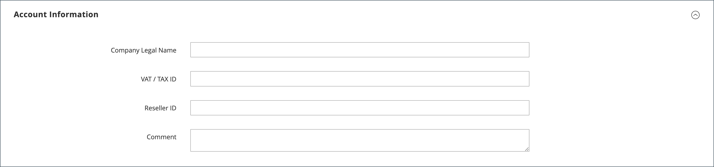

# 建立公司帳戶

公司帳戶可讓B2B企業在Adobe Commerce中管理其購買、使用者和信用。 本主題涵蓋建立、設定和啟用公司帳戶的完整程式。

## 公司帳戶建立概觀

公司帳戶可透過兩種方法建立，每種方法都適用於不同的業務案例：

* **店面註冊** — 企業的自助服務帳戶要求
* **管理員建立** — 銷售輔助帳戶設定，包含預先設定的詳細資訊

所有公司帳戶在生效前都需要管理員核准，以確保適當的審查和設定。

## 先決條件

在建立公司帳戶之前，請先確定符合下列要求：

* **系統需求：**
   * 已在您的Adobe Commerce安裝中啟用[B2B功能](enable-basic-features.md)
   * 已啟用公司註冊以建立店面
   * 已為核准工作流程設定電子郵件通知

* **業務需求：**
   * 已建立核准程式和原則
   * 已指派銷售代表（針對管理員建立的帳戶）
   * 會定義信用政策（若使用公司信用）
   * 已設定客戶群組和共用目錄

* **管理存取權：**
   * 適用於公司管理的許可權
   * 存取客戶和公司管理區段

系統會將[公司管理員](account-company-admin.md)角色指派給從店面設定公司帳戶的人員。 商店管理員在管理員中核准公司帳戶建立請求後，公司管理員可以設定帳戶密碼並登入該帳戶。

## 方法1：客戶從店面建立帳戶

**何時使用此方法：**

* 建議使用自助式企業註冊
* 客戶隨時擁有所有必要的業務資訊
* 標準核准工作流程就足夠了
* 不需要特殊設定或預先填入

>[!IMPORTANT]
>
>若要支援此方法（允許客戶從店面註冊其公司），請確定已啟用[B2B功能](enable-basic-features.md)。

1. 在店面標題的右上角，客戶按一下&#x200B;**[!UICONTROL Create an Account]**&#x200B;並選擇&#x200B;**[!UICONTROL Create New Company Account]**。

   {width="700" zoomable="yes"}

   >[!NOTE]
   >
   >如果訪客登入已註冊的使用者帳戶，他們可以導覽至「_[!UICONTROL Customer Profile]_>**[!UICONTROL Company Structure]**>**[!UICONTROL Create a Company Account]**」以建立公司帳戶。

1. 在&#x200B;_[!UICONTROL Company Information]_區段中，客戶執行下列動作：

   * 完成必填欄位：

      * **[!UICONTROL Company Name]**
      * **[!UICONTROL Company Email]**

   * 完成其餘欄位（如適用）：

      * **[!UICONTROL Company Legal Name]**
      * **[!UICONTROL VAT/TAX ID]**
      * **[!UICONTROL Reseller ID]**

   {width="700" zoomable="yes"}

1. 完成&#x200B;_[!UICONTROL Legal Address]_區段中的必填欄位。

   * **[!UICONTROL Street Address]**
   * **[!UICONTROL City]**
   * **[!UICONTROL Country]**
   * **[!UICONTROL State/Province]**
   * **[!UICONTROL ZIP/Postal Code]**
   * **[!UICONTROL Phone Number]**

   {width="700" zoomable="yes"}

1. 在&#x200B;_[!UICONTROL Company Administrator]_區段中，執行下列動作：

   * 輸入公司管理員的&#x200B;**[!UICONTROL Email address]**。

     公司管理員的電子郵件地址可以與公司電子郵件地址相同，也可以是不同的電子郵件地址。 如果您輸入不同的電子郵件地址，則除了公司管理員帳戶外，系統還會建立公司使用者帳戶。

   * 輸入公司管理員的&#x200B;**[!UICONTROL First Name]**&#x200B;和&#x200B;**[!UICONTROL Last Name]**。

   * 選擇性地完成下列欄位：

      * **[!UICONTROL Job Title]**
      * **[!UICONTROL Work Phone Number]**
      * **[!UICONTROL Gender]**

   

1. 如果此店面功能已啟用reCAPTCHA，則完成驗證。

1. 當資訊完成時，請選取&#x200B;**[!UICONTROL Submit]**。

   當商家核准建立公司帳戶的請求時，系統會傳送電子郵件通知給公司管理員。

   {width="500"}

   設定密碼後，公司管理員可以[登入](../customers/customer-sign-in.md)帳戶。

## 方法2：商家從管理員建立帳戶

**何時使用此方法：**

* 偏好使用銷售輔助帳戶建立
* 從現有業務關係預先填入帳戶明細
* 需要自訂設定（信用額度、特殊定價）
* 需要立即啟用而不需要核准工作流程

從管理員建立公司的程式基本上與從店面建立公司的程式相同，但有其他欄位。

{width="700" zoomable="yes"}

1. 在&#x200B;_管理員_&#x200B;側邊欄上，移至&#x200B;**[!UICONTROL Customers]** > **[!UICONTROL Companies]**。

1. 按一下&#x200B;**[!UICONTROL Add New Company]**&#x200B;並執行下列動作：

   * 填入下列必填欄位：

      * **[!UICONTROL Company Name]**
      * **[!UICONTROL Company Email]**

   * 如果您尚未準備好讓帳戶上線，請將&#x200B;**[!UICONTROL Status]**&#x200B;設為`Pending Approval`。 （預設為`Active`。）

   * 如果適用，請選擇要管理帳戶的&#x200B;**[!UICONTROL Sales Representative]**&#x200B;的管理員帳戶。

1. 在&#x200B;_[!UICONTROL Account Information]_區段中，執行下列動作：

   * 視情況填入下列欄位：

      * **[!UICONTROL Company Legal Name]**
      * **[!UICONTROL VAT/TAX ID]**
      * **[!UICONTROL Reseller ID]**

   * 針對&#x200B;**[!UICONTROL Comment]**，請輸入可能需要的任何有關客戶的其他資訊。

     註解只會從管理員處顯示。

   {width="700" zoomable="yes"}

1. 當您最初建立公司時，展開&#x200B;_[!UICONTROL Company Hierarchy]_格線時會顯示為空白。 儲存公司後，您可以將其納入公司階層。 請參閱[公司管理](manage-companies.md)。

1. 在&#x200B;_[!UICONTROL Legal Address]_區段中，完成下列必填欄位：

   * **[!UICONTROL Street Address]**
   * **[!UICONTROL City]**
   * **[!UICONTROL Country]**
   * **[!UICONTROL ZIP/Postal Code]**
   * **[!UICONTROL Phone Number]**

1. 在&#x200B;_[!UICONTROL Company Admin]_區段中，執行下列動作：

   * 填入下列必填欄位：

      * **[!UICONTROL Email]**
      * **[!UICONTROL First Name]**
      * **[!UICONTROL Last Name]**

   * 完成名稱的下列選擇性部分，這些部分可能比其他部分更適用於某些客戶名稱，並可由您自行使用：

      * **[!UICONTROL Prefix]**
      * **[!UICONTROL Middle Name/Initial]**
      * **[!UICONTROL Suffix]**

   * 如果資訊可用，請填寫其餘欄位以說明公司管理員：

      * **[!UICONTROL Website]**
      * **[!UICONTROL Job Title]**
      * **[!UICONTROL Work Phone Number]**
      * **[!UICONTROL Gender]**
      * **[!UICONTROL Send Welcome Email From]**

   {width="700" zoomable="yes"}

1. 在&#x200B;_[!UICONTROL Company Credit]_區段（顯示客戶的信用活動摘要）中，請完成區段下半部的欄位（如適用）：

   * **[!UICONTROL Credit Currency]**
   * **[!UICONTROL Credit Limit]**
   * **[!UICONTROL Allow to Exceed Credit Limit]**
   * **[!UICONTROL Reason for Change]**

   {width="700" zoomable="yes"}

1. 在&#x200B;_[!UICONTROL Advanced Settings]_區段中，執行下列動作：

   >[!NOTE]
   >
   >客戶群組指派會決定公司及其員工可以使用哪個共用目錄。 依預設，系統會將公司指派給設定為預設的客戶群組。

   * 您可以將公司及其員工的&#x200B;**[!UICONTROL Customer Group]**&#x200B;指派變更為可存取不同共用目錄或標準客戶群組的群組。 在變更群組之前，系統會提示您確認。

     {width="600"}

   * 若要允許公司員工從其帳戶產生報價，請將&#x200B;**[!UICONTROL Allow Quotes]**&#x200B;設為`Yes`。

   * 如果您想要允許公司員工從其帳戶建立並使用採購單，請將&#x200B;**[!UICONTROL Enable Purchase Orders]**&#x200B;設為`Yes`。

   * 若要變更公司可用的&#x200B;**[!UICONTROL Applicable Payment Methods]**，請清除「**[!UICONTROL Use config settings]**」核取方塊並選擇下列其中一項：

     | 選項 | 說明 |
     |-------------------------------|-----------------------------------------------------------------------------------------------------------------------------------------------------------------------------------------------------------------------------------------|
     | `B2B Payment Methods` | （預設）為B2B訂單啟用設定為預設[的所有](../configuration-reference/general/b2b-features.md#default-b2b-payment-methods)付款方法。 |
     | `All Enabled Payment Methods` | 讓所有[啟用的付款方法](../configuration-reference/sales/payment-methods.md)都可供與公司帳戶相關聯的客戶帳戶使用。 |
     | `Selected Payment Methods` | 可讓您選取與公司帳戶相關聯之客戶帳戶的可用付款方法。 若要選取多種付款方式，請按住Ctrl鍵(PC)或Command鍵(Mac)並選取每個選項。 |

     {style="table-layout:auto"}

   * 若要變更公司可用的&#x200B;**[!UICONTROL Applicable Shipping Methods]**，請清除「**[!UICONTROL Use config settings]**」核取方塊並選擇下列其中一項：

     | 選項 | 說明 |
     |--------------------------------|----------------------------------------------------------------------------------------------------------------------------------------------------------------------------------------------------------------------------------------------------|
     | `B2B Shipping Methods` | （預設）針對B2B訂單，啟用設定為預設[的所有](../configuration-reference/general/b2b-features.md#default-b2b-shipping-methods)送貨方法。 |
     | `All Enabled Shipping Methods` | 讓所有[啟用的送貨方法](../configuration-reference/sales/delivery-methods.md)都可供與公司帳戶相關聯的客戶帳戶使用。 |
     | `Selected Shipping Methods` | 可讓您選取與公司帳戶相關聯之客戶帳戶可用的送貨方法。 若要選取多種送貨方法，請按住Ctrl鍵(PC)或Command鍵(Mac)並選取每個選項。 |

     {style="table-layout:auto"}

1. 完成後，選取&#x200B;**[!UICONTROL Save]**。

   當建立公司帳戶的請求獲得商家核準時，會向公司管理員的電子郵件地址傳送一封電子郵件通知。

   設定密碼後，公司管理員可以[登入](../customers/customer-sign-in.md)帳戶。

## 帳戶建立後

建立公司帳戶後，便會發生下列程式：

### 1.核准工作流程

* **擱置狀態** — 新帳戶等待系統管理員檢閱
* **稽核程式** — 儲存管理員驗證業務資訊並核准/拒絕要求
* **狀態更新** — 公司會收到有關核准狀態變更的電子郵件通知

### 2.帳戶啟用

* **歡迎電子郵件** — 已核准的公司管理員會收到安裝指示
* **密碼設定** — 管理員建立帳戶存取的安全密碼
* **初始登入** — 首次存取公司儀表板和功能

### 3.公司管理員的後續步驟

啟用後，公司管理員應：

* **[設定公司結構](account-company-structure.md)** — 設定部門和使用者階層
* **[管理公司使用者](account-company-users.md)** — 新增員工並指派角色
* **[設定採購單](purchase-order-flow.md)** — 視需要設定核准工作流程
* **[檢閱信用設定](credit-company.md)** — 瞭解並管理公司信用（若已啟用）

## 常見問題和疑難排解

### 帳戶建立問題

**登錄檔單無法提交**

* 確認所有必填欄位均已正確完成
* 檢查電子郵件地址是否有效且唯一
* 確保已啟用B2B功能並允許公司註冊
* 清除瀏覽器快取，然後再試一次

**公司名稱已存在**

* 選擇唯一的公司名稱
* 如果您認為發生錯誤，請聯絡管理員
* 考慮新增位置或業務單位識別碼

**電子郵件地址問題**

* 使用企業電子郵件地址，而非個人電子郵件地址
* 確保公司管理員電子郵件可供存取
* 檢查網域是否未被電子郵件篩選器封鎖

### 核准和啟用問題

**未收到核准電子郵件**

* 檢查垃圾郵件/垃圾郵件資料夾
* 驗證在註冊期間輸入的電子郵件地址是否正確
* 請連絡商店管理員，以手動檢查核准狀態
* 工作日允許24到48小時處理

**核准後無法設定密碼**

* 使用核准電子郵件中提供的確切連結
* 檢查啟用連結是否已過期
* 向管理員請求新的啟用電子郵件

**啟用後的存取問題**

* 確認您透過正確的公司帳戶入口網站登入
* 檢查您的帳戶狀態為「使用中」
* 確定您使用的是公司管理員認證
* 如果許可權似乎不正確，請聯絡支援人員

## 安全性最佳實務

建立和管理公司帳戶時：

* **使用強式密碼** — 需要公司管理員的複雜密碼
* **驗證業務資訊** — 在核准程式期間驗證公司詳細資訊
* **監視帳戶活動** — 定期檢視公司使用者存取權和許可權
* **保護敏感資料** — 確保信用和財務資訊受到適當保護

## 公司帳戶使用者介面參考

### 按鈕列

| 按鈕 | 說明 |
|---------------------------|------------------------------------------------------------------|
| [!UICONTROL Back] | 返回「公司」頁面而不儲存變更。 |
| [!UICONTROL Reset] | 將原始值還原到任何有未儲存變更的欄位。 |
| [!UICONTROL Save] | 儲存對公司的變更，並保持設定檔開啟。 |
| [!UICONTROL Save & Close] | 儲存對公司所做的變更並關閉設定檔。 |

{style="table-layout:auto"}

### 欄位說明

| 欄位 | 說明 |
|-----------------------------------|---------------------------------------------------------------------------------------------------------------------------------------------------------------------------------------------------------------------------------------------------------------------------------------------------------------------------------------------------------------------------------------------------------------------------------------------------------------------------------------------------------------------------------------------------------------------------------------------------------------------------------------------------------------------------------------------------------------------------------------------------------------------------------------------------------------------------------------------------------------------------------------------------------------------------------|
| [!UICONTROL Company Name] | 公司名稱是在第一次建立公司帳戶時輸入的，可以是完整法律名稱的縮寫版本。 |
| [!UICONTROL Status] | （僅限管理員）指出公司帳戶的目前狀態。 選項：  **[!UICONTROL Active]**— 公司帳戶已由存放區管理員核准。 公司管理員和相關成員可以從店面登入帳戶並進行購買。 **[!UICONTROL Pending Approval]** — 已提交開啟公司帳戶的要求，但尚未由商店管理員核准。  **[!UICONTROL Rejected]**— 已提交開啟公司帳戶的要求，但未獲得商店管理員的核准。 用於提交請求的初始登入認證會被封鎖。 **&#x200B;已封鎖&#x200B;**— 公司成員可以登入並存取目錄，但無法進行購買。 商店管理員可能會封鎖信譽不佳的公司帳戶。 帳戶上的區塊可由存放區管理員隨時移除。 |
| [!UICONTROL Company Email] | 與公司帳戶相關聯的電子郵件地址。 |
| [!UICONTROL Sales Representative] | （僅限管理員）公司帳戶主要聯絡人的管理員使用者。 |

{style="table-layout:auto"}

#### [!UICONTROL Account Information]

| 欄位 | 說明 |
|---------------------------------|-----------------------------------------------------------------------------------------------------------------------------------------------------------------------------------------------------------------------------------------------------------------------------------------------------------------------------------------------------------------------------------------------------------------------------------------------------------------|
| [!UICONTROL Company Legal Name] | 公司的完整法定名稱。 |
| [!UICONTROL VAT / TAX ID] | 某些管轄區為報稅目的而指派給公司的[增值稅](../stores-purchase/vat.md)編號。 若要設定要出現在店面的客戶VAT/稅務ID，請參閱[建立新帳戶選項](../configuration-reference/customers/customer-configuration.md)。  **_注意:_**&#x200B;公司管理員和其他公司使用者在其客戶帳戶中沒有個別的VAT/TAX ID號碼。 |
| [!UICONTROL Reseller ID] | 指定給公司以申報稅捐的轉售編號。 |
| [!UICONTROL Comment] | （僅限管理員）這些公司帳戶的相關附註僅供管理員參考和檢視。 |

{style="table-layout:auto"}

#### [!UICONTROL Company Hierarchy]

| 欄位 | 說明 |
|-----------------------------------|------------------------------------------------------------------------------------------------------------------------------------------------------|
| [!UICONTROL Company ID] | 公司的ID號碼。 |
| [!UICONTROL Company Name] | 公司的全名。  正在編輯的公司行中出現`current company indicator`。 |
| [!UICONTROL Company Email] | 與公司帳戶相關聯的電子郵件地址。 |
| [!UICONTROL Phone Number] | 公司的主要電話號碼。 |
| [!UICONTROL Country] | 公司註冊經營業務的國家/地區。 |
| [!UICONTROL State/Province] | 公司註冊經營所在州或省。 |
| [!UICONTROL City] | 公司註冊經營業務的城市。 |
| [!UICONTROL Group/Shared Catalog] | （僅限管理員）顯示指派給公司的[客戶群組](../customers/customer-groups.md)或[共用目錄](catalog-shared.md)。 |
| [!UICONTROL Company Admin] | 公司管理員的完整名稱。 |
| [!UICONTROL Action] | 公司明細的可能動作清單。 |

{style="table-layout:auto"}

#### [!UICONTROL Legal Address]

| 欄位 | 說明 |
|------------------------------|-----------------------------------------------------------------------------|
| [!UICONTROL Street Address] | 公司註冊經營業務的街道地址。 |
| [!UICONTROL City] | 公司註冊經營業務的城市。 |
| [!UICONTROL Country] | 公司註冊經營業務的國家/地區。 |
| [!UICONTROL State/Province] | 公司註冊經營所在州或省。 |
| [!UICONTROL ZIP/Postal Code] | 公司註冊以進行業務的郵遞區號。 |
| [!UICONTROL Phone Number] | 公司的主要電話號碼。 |

{style="table-layout:auto"}

#### [!UICONTROL Company Admin]

| 欄位 | 說明 |
|--------------------------------------|---------------------------------------------------------------------------------------------------------------------------------------------------------------------------------------------------------------------------------------------------|
| [!UICONTROL Website] | 決定公司管理員所屬的網站。 |
| [!UICONTROL Job Title] | 管理公司帳戶的公司管理員的職稱。 |
| [!UICONTROL Work Phone Number] | 管理公司帳戶的公司管理員的電話號碼。 |
| [!UICONTROL Email] | 公司管理員的電子郵件地址可與公司電子郵件地址相同。 如果您輸入不同的電子郵件地址，系統除了為公司帳戶外，還會為公司管理員建立單獨的個人帳戶。 |
| [!UICONTROL Prefix] | 如果適用，與公司管理員名稱關聯的前置詞（例如`Mr.`、`Ms.`、`Mrs.`或`Dr.`）。 視設定而定，輸入欄位可能是文字欄位或清單。 |
| [!UICONTROL First Name] | 公司管理員的名字。 |
| [!UICONTROL Middle Name/Initial] | 公司管理員的中間名或首字母。 |
| [!UICONTROL Last Name] | 公司管理員的姓氏。 |
| [!UICONTROL Suffix] | 如果適用，則為與公司管理員名稱（例如`Jr.`、`Sr.`或`III.`）相關聯的尾碼。 視設定而定，輸入欄位可能是文字欄位或清單。 |
| [!UICONTROL Gender] | 公司管理員的性別。 選項： `Male` / `Female` / `Not Specified` |
| [!UICONTROL Send Welcome Email From] | 系統傳送歡迎電子郵件時所使用的存放區檢視。 |

{style="table-layout:auto"}

#### [!UICONTROL Company Credit]

| 欄位 | 說明 |
|-------------------------------------------|-----------------------------------------------------------------------------------------------------------------------------------------------------------------------------------------|
| [!UICONTROL Credit Currency] | （僅限管理員）商店接受以公司信用購買時使用的貨幣。 |
| [!UICONTROL Credit Limit] | （僅限管理員）延伸至公司帳戶的信用額度。 |
| [!UICONTROL Allow to Exceed Credit Limit] | （僅限管理員）指出公司是否有權超過信用額度。 選項： `Yes` / `No` |
| [!UICONTROL Reason for Change] | （僅限管理員）說明允許或不允許公司超過信用額度原因的備註。 只有在超出信用額度的許可權變更時，此欄位才會生效。 |

{style="table-layout:auto"}

#### [!UICONTROL Advanced Settings]

您可以為個別公司設定進階設定。 如果您建立公司階層，您可以透過為父公司設定設定並將這些設定套用至所有或選取的子公司來簡化設定組態，而不是個別設定每個子公司。 如需詳細資訊，請參閱[管理公司階層](manage-company-hierarchy.md)。

| 欄位 | 說明 |
|------------------------------------------|--------------------------------------------------------------------------------------------------------------------------------------------------------------------------------------------------------------------------|
| [!UICONTROL Customer Group] | （僅限管理員）顯示指派給公司的[客戶群組](../customers/customer-groups.md)或[共用目錄](catalog-shared.md)。 |
| [!UICONTROL Allow Quotes] | （僅限管理員）決定公司成員是否可以代表公司準備及提交可協商的報價。 |
| [!UICONTROL Enable Purchase Orders] | （僅限管理員）決定公司成員是否可以代表公司提交訂單作為[採購單](account-dashboard-my-purchase-orders.md)。 |
| 適用的付款方法 | （僅限管理員）指出適用於公司購買的付款方法。 選項： `B2B Payment Methods` / `All Enabled Payment Methods` / `Selected Payment Methods` |
| [!UICONTROL Payment Methods] | （僅限管理員）如果您啟用特定付款方法，系統就會啟用。 若要讓公司帳戶可使用多種付款方法，請按住Ctrl鍵(PC)或Command鍵(Mac)並選取每個選項。 |
| [!UICONTROL Applicable Shipping Methods] | （僅限管理員）指出可供公司購買的送貨方法。 選項： `B2B Shipping Methods` / `All Enabled Shipping Methods` / `Selected Shipping Methods` |
| [!UICONTROL Shipping Methods] | （僅限管理員）如果您啟用特定送貨方法，就會變成使用中。 若要讓公司帳戶可使用多種送貨方法，請按住Ctrl鍵(PC)或Command鍵(Mac)並選取每個選項。 |

{style="table-layout:auto"}

>[!MORELIKETHIS]
>
>* [啟用B2B功能](enable-basic-features.md) — 設定基本的B2B功能
>* [公司帳戶結構](account-company-structure.md) — 從店面組織使用者和部門
>* [管理公司使用者](account-company-users.md) — 從店面新增並設定員工帳戶
>* [公司管理員角色](account-company-admin.md) — 瞭解管理員職責
>* [管理公司](manage-companies.md) — 公司管理的管理概觀
>* [公司信用管理](credit-company.md) — 設定並管理管理員的公司信用
>* [採購單工作流程](purchase-order-flow.md) — 從管理員設定核准流程
>* [公司角色和許可權](account-company-roles-permissions.md) — 從管理員控制使用者存取層級
>* [B2B組態參考](../configuration-reference/general/b2b-features.md) — 詳細的系統設定
