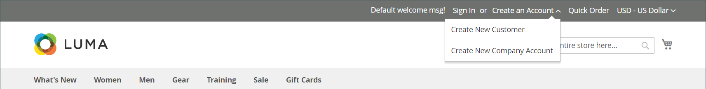

# 建立公司帳戶

公司帳戶可由客戶從店面設定，或從管理員設定。 建立公司帳戶的所有請求都必須先由商店管理員核准，帳戶才能生效。

After the request to create a company account is approved, the company administrator can set an account password and log in to the account.

## Method 1: Customer creates the account from the storefront

>[!IMPORTANT]
>
>

1. **[!UICONTROL Create an Account]****[!UICONTROL Create New Company Account]**

   {width="700" zoomable="yes"}

   >[!NOTE]
   >
   >如果訪客登入已註冊的使用者帳戶，他們可以導覽至「_[!UICONTROL Customer Profile]_>**[!UICONTROL Company Structure]**>**[!UICONTROL Create a Company Account]**」以建立公司帳戶。

1. 在&#x200B;_[!UICONTROL Company Information]_區段中，客戶執行下列動作：

   - 完成必填欄位：

      - **[!UICONTROL Company Name]**
      - **[!UICONTROL Company Email]**

   - 完成其餘欄位（如適用）：

      - **[!UICONTROL Company Legal Name]**
      - **[!UICONTROL VAT/TAX ID]**
      - **[!UICONTROL Reseller ID]**

   {width="700" zoomable="yes"}

1. 完成&#x200B;_[!UICONTROL Legal Address]_區段中的必填欄位。

   - **[!UICONTROL Street Address]**
   - **[!UICONTROL City]**
   - **[!UICONTROL Country]**
   - **[!UICONTROL State/Province]**
   - **[!UICONTROL ZIP/Postal Code]**
   - **[!UICONTROL Phone Number]**

   {width="700" zoomable="yes"}

1. 在&#x200B;_[!UICONTROL Company Administrator]_區段中，執行下列動作：

   - 輸入公司管理員的&#x200B;**[!UICONTROL Email address]**。

     公司管理員的電子郵件地址可以與公司電子郵件地址相同，也可以是不同的電子郵件地址。 如果輸入了不同的電子郵件地址，則會建立公司使用者帳戶以及公司管理員帳戶。

   - 輸入公司管理員的&#x200B;**[!UICONTROL First Name]**&#x200B;和&#x200B;**[!UICONTROL Last Name]**。

   - Optionally completes the following fields:

      - **[!UICONTROL Job Title]**
      - **[!UICONTROL Gender]**

   

1. 如果此店面功能已啟用reCAPTCHA，則完成驗證。

1. 當資訊完成時，請選取&#x200B;**[!UICONTROL Submit]**。

   當建立公司帳戶的請求獲得商家核準時，會向公司管理員傳送電子郵件通知。

   {width="500"}

   

## Method 2: Merchant creates the account from the Admin

The process of creating a company from the Admin is essentially the same as from the storefront, but with additional fields.

{width="700" zoomable="yes"}

1. __**[!UICONTROL Customers]****[!UICONTROL Companies]**

1. 按一下&#x200B;**[!UICONTROL Add New Company]**&#x200B;並執行下列動作：

   - 填入下列必填欄位：

      - **[!UICONTROL Company Name]**
      - **[!UICONTROL Company Email]**

   - 如果您尚未準備好讓帳戶上線，請將&#x200B;**[!UICONTROL Status]**&#x200B;設為`Pending Approval`。 （預設為`Active`。）

   - **[!UICONTROL Sales Representative]**

1. _[!UICONTROL Account Information]_

   - 視情況填入下列欄位：

      - **[!UICONTROL Company Legal Name]**
      - **[!UICONTROL VAT/TAX ID]**
      - **[!UICONTROL Reseller ID]**

   - 針對&#x200B;**[!UICONTROL Comment]**，請輸入可能需要的任何有關客戶的其他資訊。

     註解只會從管理員處顯示。

   {width="700" zoomable="yes"}

1. 初次建立公司時，展開&#x200B;_[!UICONTROL Company Hierarchy]_格線時它是空的。 儲存公司後，您可以將其納入公司階層。 

1. 在&#x200B;_[!UICONTROL Legal Address]_區段中，完成下列必填欄位：

   - **[!UICONTROL Street Address]**
   - **[!UICONTROL City Country]**
   - **[!UICONTROL ZIP/Postal Code]**
   - **[!UICONTROL Phone Number]**

1. 在&#x200B;_[!UICONTROL Company Admin]_區段中，執行下列動作：

   - 填入下列必填欄位：

      - **[!UICONTROL Email]**
      - **[!UICONTROL First Name]**
      - **[!UICONTROL Last Name]**

   - 完成名稱的下列選擇性部分，這些部分可能比其他部分更適用於某些客戶名稱，並可由您自行使用：

      - **[!UICONTROL Prefix]**
      - **[!UICONTROL Middle Name/Initial]**
      - **[!UICONTROL Suffix]**

   - 如果資訊可用，請填寫其餘欄位以說明公司管理員：

      - **[!UICONTROL Website]**
      - **[!UICONTROL Job Title]**
      - **[!UICONTROL Gender]**
      - **[!UICONTROL Send Welcome Email From]**

   {width="700" zoomable="yes"}

1. 在&#x200B;_[!UICONTROL Company Credit]_區段（顯示客戶的信用活動摘要）中，請完成區段下半部的欄位（如適用）：

   - **[!UICONTROL Credit Currency]**
   - **[!UICONTROL Credit Limit]**
   - **[!UICONTROL Allow to Exceed Credit Limit]**
   - **[!UICONTROL Reason for Change]**

   {width="700" zoomable="yes"}

1. 在&#x200B;_[!UICONTROL Advanced Settings]_區段中，執行下列動作：

   >[!NOTE]
   >
   >客戶群組指派會決定公司及其員工可以使用哪個共用目錄。 依預設，公司會指派給設定為預設的客戶群組。

   - 您可以將公司及其員工的&#x200B;**[!UICONTROL Customer Group]**&#x200B;指派變更為可存取不同共用目錄或標準客戶群組的群組。 在變更群組之前，系統會提示您確認。

     {width="600"}

   - 若要允許公司員工從其帳戶產生報價，請將&#x200B;**[!UICONTROL Allow Quotes]**&#x200B;設為`Yes`。

   - 如果您想要允許公司員工從其帳戶建立並使用採購單，請將&#x200B;**[!UICONTROL Enable Purchase Orders]**&#x200B;設為`Yes`。

   - 若要變更公司可用的&#x200B;**[!UICONTROL Applicable Payment Methods]**，請清除「**[!UICONTROL Use config settings]**」核取方塊並選擇下列其中一項：

     | Option | 說明 |
     |-------------------------------|-----------------------------------------------------------------------------------------------------------------------------------------------------------------------------------------------------------------------------------------|
     | `B2B Payment Methods` | （預設）為B2B訂單啟用設定為預設](../configuration-reference/general/b2b-features.md#default-b2b-payment-methods)的所有[付款方法。 |
     | `All Enabled Payment Methods` | 讓所有[啟用的付款方法](../configuration-reference/sales/payment-methods.md)都可供與公司帳戶相關聯的客戶帳戶使用。 |
     | `Selected Payment Methods` | 可讓您選取與公司帳戶相關聯之客戶帳戶的可用付款方法。 若要選取多種付款方式，請按住Ctrl鍵(PC)或Command鍵(Mac)並選取每個選項。 |

     {style="table-layout:auto"}

   - **[!UICONTROL Applicable Shipping Methods]****[!UICONTROL Use config settings]**

     | Option | 說明 |
     |--------------------------------|----------------------------------------------------------------------------------------------------------------------------------------------------------------------------------------------------------------------------------------------------|
     | `B2B Shipping Methods` |  |
     | `All Enabled Shipping Methods` |  |
     | `Selected Shipping Methods` | 可讓您選取與公司帳戶相關聯之客戶帳戶可用的送貨方法。 若要選取多種送貨方法，請按住Ctrl鍵(PC)或Command鍵(Mac)並選取每個選項。 |

     {style="table-layout:auto"}

1. 完成後，選取&#x200B;**[!UICONTROL Save]**。

   當建立公司帳戶的請求獲得商家核準時，會向公司管理員的電子郵件地址傳送一封電子郵件通知。

   設定密碼後，公司管理員可以[登入](../customers/customer-sign-in.md)帳戶。

## 按鈕列

| 按鈕 | 說明 |
|---------------------------|------------------------------------------------------------------|
| [!UICONTROL Back] | 返回「公司」頁面而不儲存變更。 |
| [!UICONTROL Reset] | 將原始值還原到任何有未儲存變更的欄位。 |
| [!UICONTROL Save] | 儲存對公司的變更，並保持設定檔開啟。 |
| [!UICONTROL Save & Close] | 儲存對公司所做的變更並關閉設定檔。 |

{style="table-layout:auto"}

## Field descriptions

| 欄位 | 說明 |
|-----------------------------------|---------------------------------------------------------------------------------------------------------------------------------------------------------------------------------------------------------------------------------------------------------------------------------------------------------------------------------------------------------------------------------------------------------------------------------------------------------------------------------------------------------------------------------------------------------------------------------------------------------------------------------------------------------------------------------------------------------------------------------------------------------------------------------------------------------------------------------------------------------------------------------------------------------------------------------|
| [!UICONTROL Company Name] | 公司名稱是在第一次建立公司帳戶時輸入的，可以是完整法律名稱的縮寫版本。 |
| [!UICONTROL Status] | （僅限管理員）指出公司帳戶的目前狀態。 選項：  **[!UICONTROL Active]**— 公司帳戶已由存放區管理員核准。 The company administrator and associated members can log in the account from the storefront and make purchases. **[!UICONTROL Pending Approval]** **[!UICONTROL Rejected]**The initial login credentials that were used to submit the request are blocked. ****The store administrator might block a company account that is not in good standing. The block on the account can be removed by the store administrator at any time. |
| [!UICONTROL Company Email] | The email address that is associated with the company account. |
| [!UICONTROL Sales Representative] | (Admin Only) The Admin user who is the primary contact for the company account. |

{style="table-layout:auto"}

### [!UICONTROL Account Information]

| 欄位 | 說明 |
|---------------------------------|-----------------------------------------------------------------------------------------------------------------------------------------------------------------------------------------------------------------------------------------------------------------------------------------------------------------------------------------------------------------------------------------------------------------------------------------------------------------|
| [!UICONTROL Company Legal Name] | The full legal name of the company. |
| [!UICONTROL VAT / TAX ID] |   **__** |
| [!UICONTROL Reseller ID] | 指定給公司以申報稅捐的轉售編號。 |
| [!UICONTROL Comment] | （僅限管理員）這些公司帳戶的相關附註僅供管理員參考和檢視。 |

{style="table-layout:auto"}

### [!UICONTROL Company Hierarchy]

| 欄位 | 說明 |
|-----------------------------------|------------------------------------------------------------------------------------------------------------------------------------------------------|
| [!UICONTROL Company ID] | 公司的ID號碼。 |
| [!UICONTROL Company Name] | 公司的全名。  `current company indicator` |
| [!UICONTROL Company Email] | The email address that is associated with the company account. |
| [!UICONTROL Phone Number] | The primary phone number of the company. |
| [!UICONTROL Country] | The country where the company is registered to conduct business. |
| [!UICONTROL State/Province] | The state or province where the company is registered to conduct business. |
| [!UICONTROL City] | 公司註冊經營業務的城市。 |
| [!UICONTROL Group/Shared Catalog] | （僅限管理員）表示指派給公司的[客戶群組](../customers/customer-groups.md)或[共用目錄](catalog-shared.md)。 |
| [!UICONTROL Company Admin] | 公司管理員的完整名稱。 |
| [!UICONTROL Action] | 公司明細的可能動作清單。 |

{style="table-layout:auto"}

### [!UICONTROL Legal Address]

| 欄位 | 說明 |
|------------------------------|-----------------------------------------------------------------------------|
| [!UICONTROL Street Address] | 公司註冊經營業務的街道地址。 |
| [!UICONTROL City] | 公司註冊經營業務的城市。 |
| [!UICONTROL Country] | 公司註冊經營業務的國家/地區。 |
| [!UICONTROL State/Province] | 公司註冊經營所在州或省。 |
| [!UICONTROL ZIP/Postal Code] | 公司註冊以進行業務的郵遞區號。 |
| [!UICONTROL Phone Number] | The primary phone number of the company. |

{style="table-layout:auto"}

### [!UICONTROL Company Admin]

| 欄位 | 說明 |
|--------------------------------------|---------------------------------------------------------------------------------------------------------------------------------------------------------------------------------------------------------------------------------------------------|
| [!UICONTROL Website] | 決定公司管理員所屬的網站。 |
| [!UICONTROL Job Title] | 管理公司帳戶的公司管理員的職稱。 |
| [!UICONTROL Email] | 公司管理員的電子郵件地址可與公司電子郵件地址相同。 If a different email address is entered, a separate individual account is created for the company administrator, in addition to the company account. |
| [!UICONTROL Prefix] | `Mr.``Ms.``Mrs.``Dr.`Depending on the configuration, the input field might be a text field or list. |
| [!UICONTROL First Name] | The first name of the company administrator. |
| [!UICONTROL Middle Name/Initial] | The middle name or initial of the company administrator. |
| [!UICONTROL Last Name] | The last name of the company administrator. |
| [!UICONTROL Suffix] | 如果適用，則為與公司管理員名稱（例如`Jr.`、`Sr.`或`III.`）相關聯的尾碼。 視設定而定，輸入欄位可能是文字欄位或清單。 |
| [!UICONTROL Gender] | 公司管理員的性別。 選項： `Male` / `Female` / `Not Specified` |
| [!UICONTROL Send Welcome Email From] | 要從中傳送歡迎電子郵件的商店檢視。 |

{style="table-layout:auto"}

### [!UICONTROL Company Credit]

| 欄位 | 說明 |
|-------------------------------------------|-----------------------------------------------------------------------------------------------------------------------------------------------------------------------------------------|
| [!UICONTROL Credit Currency] | （僅限管理員）商店接受以公司信用購買時使用的貨幣。 |
| [!UICONTROL Credit Limit] | （僅限管理員）延伸至公司帳戶的信用額度。 |
| [!UICONTROL Allow to Exceed Credit Limit] | （僅限管理員）指出公司是否有權超過信用額度。 選項： `Yes` / `No` |
| [!UICONTROL Reason for Change] | （僅限管理員）說明允許或不允許公司超過信用額度原因的備註。 只有在超出信用額度的許可權變更時，此欄位才會生效。 |

{style="table-layout:auto"}

### [!UICONTROL Advanced Settings]

| Field | 說明 |
|------------------------------------------|--------------------------------------------------------------------------------------------------------------------------------------------------------------------------------------------------------------------------|
| [!UICONTROL Customer Group] | （僅限管理員）表示指派給公司的[客戶群組](../customers/customer-groups.md)或[共用目錄](catalog-shared.md)。 |
| [!UICONTROL Allow Quotes] | （僅限管理員）決定公司成員是否可以代表公司準備及提交可協商的報價。 |
| [!UICONTROL Enable Purchase Orders] | （僅限管理員）決定公司成員是否可以代表公司提交訂單作為[採購單](account-dashboard-my-purchase-orders.md)。 |
| 適用的付款方法 | (Admin Only) Indicates the payment methods that are available for company purchases. `B2B Payment Methods``All Enabled Payment Methods``Selected Payment Methods` |
| [!UICONTROL Payment Methods] | （僅限管理員）如果已啟用特定付款方法，就會變成使用中。 若要讓公司帳戶可使用多種付款方法，請按住Ctrl鍵(PC)或Command鍵(Mac)並選取每個選項。 |
| [!UICONTROL Applicable Shipping Methods] | （僅限管理員）指出可供公司購買的送貨方法。 選項： `B2B Shipping Methods` / `All Enabled Shipping Methods` / `Selected Shipping Methods` |
| [!UICONTROL Shipping Methods] | （僅限管理員）啟用特定送貨方法後會變成使用中。 若要讓公司帳戶可使用多種付款方法，請按住Ctrl鍵(PC)或Command鍵(Mac)並選取每個選項。 |

{style="table-layout:auto"}
