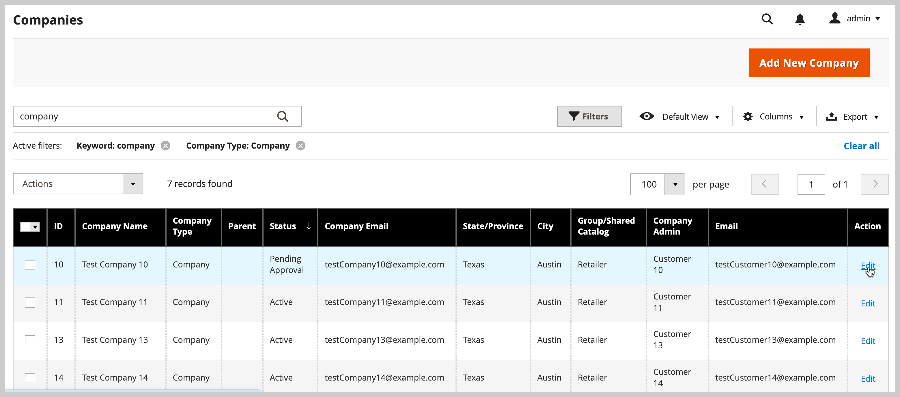

# 管理公司帳戶

_[!UICONTROL Companies]_頁面列出所有目前的公司帳戶，無論狀態為何。 任何待核准的請求都會顯示在清單頂端。

{width="700" zoomable="yes"}

使用&#x200B;*[!UICONTROL Columns]*&#x200B;控制項來自訂格線中顯示的欄。 使用搜尋和篩選功能自訂檢視中顯示的公司。

- 使用&#x200B;_[!UICONTROL Search]_在&#x200B;**公司**網格中尋找公司。 搜尋會索引&#x200B;**公司名稱**和&#x200B;**父系**欄。

- 使用[!UICONTROL Filter]自訂檢視以包含符合特定條件的記錄。 例如，如果B2B網站設定為同時管理單一公司帳戶和[公司階層](manage-companies.md)，您可以依`[!UICONTROL Company Type - Company]`篩選，以僅顯示單一公司，或依`[!UICONTROL Company Type - Parent]`篩選，以僅顯示每個階層的父公司。

_[!UICONTROL Actions]_For example, rather than approving each individual company request, you can select multiple requests to activate the accounts in a single action. 

## Company role resources

[角色資源](../systems/permissions-user-roles.md#role-resources)設定決定以下能力：

- 新增公司
- 刪除公司
- 套用餘額補助
- 檢視公司

## Manage company accounts from the Companies grid

**[!UICONTROL Customers]****[!UICONTROL Companies]***[!UICONTROL Companies]*

您可以個別管理帳戶或分組管理帳戶。

- 選取公司帳戶記錄之&#x200B;**[!UICONTROL Action]**&#x200B;欄中的&#x200B;**[!UICONTROL Edit]**，檢視或變更個別公司帳戶的組態設定。

  {width="675" zoomable="yes"}

- 使用網格上方[!UICONTROL Actions]控制項可用的選項，檢視或變更所選公司帳戶群組**

  {width="675" zoomable="yes"}

如需套用每個動作的指示，請參閱下列章節。

### 啟用公司帳戶

1. 從&#x200B;**[!UICONTROL Actions]**&#x200B;控制項選取&#x200B;**[!UICONTROL Set Active]**。

1. 提示確認時，按一下&#x200B;**[!UICONTROL OK]**。

### 設定作用中/非作用中

帳戶為非作用中的客戶無法登入或從他們的帳戶購買產品。 設定客戶帳戶為有效或非有效的方法有兩種：

方法1：來自客戶方格&#x200B;**的**

1. 在&#x200B;_管理員_&#x200B;側邊欄上，前往&#x200B;[!UICONTROL **客戶**] > [!UICONTROL **所有客戶**]。

1. 從&#x200B;**[!UICONTROL Actions]**&#x200B;功能表中，選取下列其中一項：

   - **[!UICONTROL Active]**
   - **[!UICONTROL Inactive]**

1. 出現提示時，選取&#x200B;**[!UICONTROL OK]**&#x200B;以套用變更。

方法2： **從帳戶編輯頁面**

1. 在&#x200B;_管理員_&#x200B;側邊欄上，前往&#x200B;[!UICONTROL **客戶**] > [!UICONTROL **所有客戶**]。

1. 在網格中，尋找要編輯的客戶記錄。

1. 在右邊的&#x200B;_動作_&#x200B;欄中，選取&#x200B;[!UICONTROL **編輯**]。

1. 選取&#x200B;[!UICONTROL **帳戶資訊**]&#x200B;標籤。

1. 將&#x200B;[!UICONTROL **客戶活動**]&#x200B;設定為`Yes`或`No`。

1. 按一下&#x200B;[!UICONTROL **儲存客戶**]。

### 封鎖公司帳戶

Users who are associated with a blocked company account can log in and access the catalog, but cannot make purchases. A company with an account that is not in good standing might be blocked temporarily until the matter is resolved.

1. **[!UICONTROL Actions]****[!UICONTROL Block]**

1. **[!UICONTROL OK]**

### Delete company accounts

已刪除的公司帳戶無法還原。 與公司相關聯的使用者帳戶狀態已設定為`Inactive`，且公司ID已從使用者帳戶的設定檔中移除。 有關公司活動和交易的資訊會保留在系統中。

1. 從&#x200B;**[!UICONTROL Actions]**&#x200B;控制項選取&#x200B;**[!UICONTROL Delete]**。

1. 提示確認時，按一下&#x200B;**[!UICONTROL OK]**。

### 變更公司設定

**

>[!NOTE]
>
>從[公司階層檢視](manage-company-hierarchy.md#change-company-settings)管理具有父系和關聯子系公司的公司組織的進階設定組態。

1. 從&#x200B;**[!UICONTROL Actions]**&#x200B;控制項選取&#x200B;**[!UICONTROL Change company settings]**。

   在&#x200B;*[!UICONTROL Change company settings]*&#x200B;表單上，初始組態設定設為預設值。

1. 若要變更每個組態設定，請選取&#x200B;**[!UICONTROL Change]**&#x200B;核取方塊以啟用設定。 接著，視需要更新設定。

   {width="675" zoomable="yes"}

1. 更新組態設定後，請選取&#x200B;**[!UICONTROL Apply Changes]**。

1. 出現提示時，請選取&#x200B;**[!UICONTROL Change settings]**&#x200B;以更新所選公司的組態。

>[!TIP]
>
>您可以在公司帳戶記錄的&#x200B;**[!UICONTROL Action]**&#x200B;欄中選取&#x200B;**[!UICONTROL Edit]**，以變更單一公司的進階設定組態。

### 轉換信用貨幣

所選公司帳戶中的貸方會轉換為所選貨幣的目前匯率。

1. 從&#x200B;**[!UICONTROL Actions]**&#x200B;控制項選取&#x200B;**[!UICONTROL Convert Currency]**。

1. 提示確認時，按一下&#x200B;**[!UICONTROL OK]**。

1. 選擇要用於所選公司帳戶的&#x200B;**[!UICONTROL Credit Currency]**。

   金額會根據目前的轉換率重新計算（如果有的話）。 如果無法取得，您可以手動輸入自訂轉換率。 對於所選公司使用的銷退折讓貨幣，系統會顯示所需的兌換計算。

1. **[!UICONTROL Proceed]**

## Edit a company account

****

1. 在第一欄中，選取要編輯之公司帳戶的核取方塊。

1. 從&#x200B;**[!UICONTROL Actions]**&#x200B;控制項選取&#x200B;**[!UICONTROL Edit]**。

   每個可更新的值都會顯示在文字方塊中。

   {width="675" zoomable="yes"}

1. Update any of the following values as needed:

   - **[!UICONTROL Company Name]**

   - **[!UICONTROL Company Email]**

   - **[!UICONTROL Phone Number]**

1. **[!UICONTROL Save]**

****

1. In the grid, find the company record to be edited.

1. 從&#x200B;_[!UICONTROL Action]_欄選取&#x200B;**[!UICONTROL Edit]**。

1. 對公司資訊進行必要的變更。

   如需欄位說明，請參閱[建立公司帳戶](account-company-create.md)。

1. 完成時，按一下&#x200B;**[!UICONTROL Save]**。

## 指派銷售代表

銷售代表是[管理員使用者](../systems/permissions.md)，被指派為公司帳戶的聯絡人，並接收所有與公司相關的自動化[電子郵件訊息](../b2b/enable-basic-features.md#configure-company-email-options)。 每個公司帳戶只能指派一名銷售代表，但單一銷售代表可以管理多個公司帳戶。 預設的Admin使用者帳戶會指派為銷售代表，除非指派的是不同的Admin使用者。

公司帳戶和報價頁中的公司成員可以看到所指派銷售代表的名稱和電子郵件地址。

1. 在&#x200B;_管理員_&#x200B;側邊欄上，移至&#x200B;**[!UICONTROL Customers]** > **[!UICONTROL Companies]**。

1. 在格線中尋找公司，並以編輯模式開啟。

1. 將&#x200B;**[!UICONTROL Sales Representative]**&#x200B;設定為您要指派為公司連絡人的管理員使用者。

1. 完成時，按一下&#x200B;**[!UICONTROL Save]**。

   被指派的銷售代表會收到指派的電子郵件通知。

## 更新公司設定檔

公司設定檔可由公司管理員從店面維護，也可由店面管理員從管理員維護。

{width="700" zoomable="yes"}

1. 在&#x200B;_管理員_&#x200B;側邊欄上，移至&#x200B;**[!UICONTROL Customers]** > **[!UICONTROL Companies]**。

1. 在網格中尋找公司，然後按一下&#x200B;_[!UICONTROL Action]_欄中的&#x200B;**[!UICONTROL Edit]**。

1. Update the field values in each section as needed using the field descriptions for reference.

1. **[!UICONTROL Save]**

## Company account demo

You can learn about managing company accounts by watching this video:

>[!VIDEO](https://video.tv.adobe.com/v/344447?quality=12)

## Company management

公司建立後，具有適當許可權的Admin使用者可以使用[!UICONTROL Company Hierarchy]區段，透過編輯指定的母公司並指派相關公司來建立母公司組織。

如果已將公司新增至階層，[!UICONTROL Company Hierarchy]格線會顯示父公司和格線中所有指派的公司。

如需詳細資訊，請參閱[管理公司階層](manage-company-hierarchy.md)。

## 公司選項和欄

The following sections provide a reference for the available actions, options, and displayed information available for managing company accounts.

### 動作控制選項

| 選項 | 說明 |
|--------------------------------------|---------------------------------------------------------------------------------------------------------------------------------------------------------------------------------------------------------------------------------------------------------------------------------|
| [!UICONTROL Set Active] | 將所有選取的公司記錄的狀態設定為`Active`。 公司管理員會收到設定密碼的指示，這樣他們就可以從店面存取帳戶並管理公司。 |
| [!UICONTROL Block] | 限制信譽不佳的公司帳戶，同時保留帳戶。 Company members can log in and access the catalog, but they cannot place orders on behalf of the company. |
| [!UICONTROL Delete] | 刪除選取的公司帳戶。 `Inactive`有關公司活動和交易的資訊會保留在系統中。 |
| [!UICONTROL Edit] | 允許從網格編輯所選公司記錄的某些值。 依預設，公司名稱、公司電子郵件和電話號碼值可供快速編輯。 |
| [!UICONTROL Change company settings] | 開啟&#x200B;*變更公司設定*&#x200B;表單以更新[進階設定](account-company-create.md#advanced-settings)設定，並將變更套用至選取的公司。 |
| [!UICONTROL Convert Credit] | 根據指定貨幣的匯率換算所選公司的記帳貸方。 |

{style="table-layout:auto"}

### 欄說明

#### 預設欄配置

| 欄 | 說明 |
|-----------------------------------|--------------------------------------------------------------------------------------------------------------------------------------------------------------------------------------------------------------------------------------------------------------------------------------------------------------------------------------------------------------------------------------------------------------------------------------------------------------------------|
| [!UICONTROL Select] | 用來選取作為動作主體的公司記錄或使用欄標題中的選取控制項來選取/取消選取所有專案的核取方塊。 |
| [!UICONTROL ID] | 提交建立公司的請求時指派的唯一數值識別碼。 |
| [!UICONTROL Company Name] | 公司名稱是在第一次建立公司帳戶時輸入的，可以是完整法律名稱的縮寫版本。 |
| [!UICONTROL Company Type] | [公司](manage-companies.md)的型別。 選項：  **[!UICONTROL Company]**— 根據預設，新公司會建立為單一公司。 **[!UICONTROL Parent]** — 公司是其他公司的母公司。  **[!UICONTROL Child]**— 此公司與母公司相關。 |
| [!UICONTROL Parent] | 顯示此特定公司明細的母公司。 |
| [!UICONTROL Company Email] | The email address that is associated with the company account. |
| [!UICONTROL Phone Number] | The primary phone number of the company. |
| [!UICONTROL Country] | The country where the company is registered to conduct business. |
| [!UICONTROL State Province] | 公司註冊經營所在州或省。 |
| [!UICONTROL City] | 公司註冊經營業務的城市。 |
| [!UICONTROL Group/Shared Catalog] | 欄名稱取決於組態中是否已啟用共用目錄。 選項：  **[!UICONTROL Customer Group]**— 如果未在組態中啟用共用目錄，請指定公司所屬之[客戶群組](../customers/customer-groups.md)的名稱。 **[!UICONTROL Shared Catalog]** |
| [!UICONTROL Outstanding Balance] | The outstanding balance on the company account. the column is blank if the company does not have a credit history, and its credit limit is zero. |
| [!UICONTROL Company Admin] | The first and last name of the company administrator. |
| [!UICONTROL Job Title] | The job title of the company administrator. |
| [!UICONTROL Email] | 公司管理員的電子郵件地址。 |
| [!UICONTROL Action] | **[!UICONTROL Edit]** — 以編輯模式開啟公司帳戶。 |

{style="table-layout:auto"}

#### 其他欄

變更格線的[資料行配置](../getting-started/admin-grid-controls.md)即可使用下列資料行。

| 欄 | 說明 |
|---------------------------------|--------------------------------------------------------------------------------------------------------------------------------------------------------------------------------------------------------------------------------------------------------------------------------------------------------------------------------------------------------------------------------------------------------------------------------------------------------------------------------------------------------------------------------------------------------------------------------------------------------------------------------------------------------------------------------------------------------------------------------------------------------------------------------------------------------------------------------------------------------------------------------------------------------------------------------------------------------|
| [!UICONTROL Company Legal Name] | 公司的完整法定名稱。 |
| [!UICONTROL Street Address] | The street address where the company is registered to conduct business. |
| [!UICONTROL ZIP] | The ZIP or postal code where the company  is registered to conduct business. |
| [!UICONTROL Reseller ID] | 指定給公司以申報稅捐的轉售編號。 |
| [!UICONTROL VAT/TAX ID] | 某些管轄區為報稅目的而指派給公司的[增值稅](../stores-purchase/vat.md)編號。 若要設定要出現在店面的客戶VAT/稅務ID，請參閱[建立新帳戶選項](../configuration-reference/customers/customer-configuration.md)。 |
| [!UICONTROL Credit Limit] | 延伸至公司帳戶的信用額度。 |
| [!UICONTROL Credit Currency] | The currency that is accepted by the store for purchases on company credit. |
| [!UICONTROL Status] |  **[!UICONTROL Active]**The company administrator and associated members can log in the account from the storefront and make purchases. **[!UICONTROL Pending Approval]** **[!UICONTROL Rejected]**The initial login credentials that were used to submit the request are blocked. **[!UICONTROL Blocked]** The store administrator might block a company account that is not in good standing. The block on the account can be removed by the store administrator at any time. |
| [!UICONTROL Gender] | The gender of the company administrator. Options: Male / Female / Not Specified |
| [!UICONTROL Comment] | Notes about the company account for reference and visible only from the Admin. |

{style="table-layout:auto"}

### Button bar

| 按鈕 | 說明 |
|--------------------------------|---------------------------------------------------------------------------------------------------------------------------------------------------------------------------------------------------------------------------------------------------------------------|
| [!UICONTROL Back] | 返回「公司」頁面而不儲存變更。 |
| [!DNL Delete Company] | 刪除公司帳戶。 與公司相關聯的使用者帳戶狀態已設定為`Inactive`，且公司ID已從使用者帳戶的設定檔中移除。 有關公司活動和交易的資訊會保留在系統中。 |
| [!DNL Reset] | Restores the original values to any fields with unsaved changes. |
| [!DNL Reimburse Balance] | 允許管理員根據採購單編號，從商店貸方償還餘額。 |
| [!DNL Save] | 儲存對公司的變更並保持設定檔開啟。 |
| [!UICONTROL Save & Close] | 儲存對公司所做的變更並關閉設定檔。 |

{style="table-layout:auto"}

### 欄位說明

| 欄位 | 說明 |
|-----------------------------------|--------------------------------------------------------------------------------------------------------------------------------------------------------------------------------------------------------------------------------------------------------------------------------------------------------------------------------------------------------------------------------------------------------------------------------------------------------------------------------------------------------------------------------------------------------------------------------------------------------------------------------------------------------------------------------------------------------------------------------------------------------------------------------------------------------------------------------------------------------------------------------------------------------------------------------------------------------|
| [!UICONTROL Company Name] | 公司名稱是在第一次建立公司帳戶時輸入的，可以是完整法律名稱的縮寫版本。 |
| [!UICONTROL Status] | 表示公司帳戶的[狀態](account-company-approve.md)。 選項：  **[!UICONTROL Active]**— 公司帳戶已由存放區管理員核准。 公司管理員和相關成員可以從店面登入帳戶並進行購買。 **[!UICONTROL Pending Approval]** — 已提交開啟公司帳戶的要求，但尚未由商店管理員核准。  **[!UICONTROL Rejected]**— 已提交開啟公司帳戶的要求，但未獲得商店管理員的核准。 用於提交請求的初始登入認證會被封鎖。 **[!UICONTROL Blocked]** — 公司成員可以登入並存取目錄，但無法進行購買。 商店管理員可能會封鎖信譽不佳的公司帳戶。 帳戶上的區塊可由存放區管理員隨時移除。 |
| [!UICONTROL Company Email] | 與公司帳戶相關聯的電子郵件地址。 |
| [!UICONTROL Sales Representative] | 公司帳戶主要聯絡人的管理員使用者。 |

{style="table-layout:auto"}

#### [!UICONTROL Account Information]

| 欄位 | 說明 |
|---------------------------------|----------------------------------------------------------------------------------------------------------------------------|
| [!UICONTROL Company Legal Name] | 公司的完整法定名稱。 |
| [!UICONTROL VAT / TAX ID] | 針對稅捐申報目的而指定給公司的稅捐或[加值稅](../stores-purchase/vat.md)編號。 |
| [!UICONTROL Reseller ID] | 指定給公司以申報稅捐的轉售編號。 |
| [!UICONTROL Comment] | 這些關於公司帳戶的附註僅供管理員參考和檢視。 |

{style="table-layout:auto"}

#### [!UICONTROL Company Hierarchy]

| 欄 | 說明 |
|-----------------------------|------------------------------------------------------------------------------------------------------------------------------------------------------|
| [!UICONTROL Company ID] | The ID number of the company. |
| [!UICONTROL Company Name] | The full name of the company.  正在編輯的公司行中出現`current company indicator`。 |
| [!UICONTROL Company Email] | 與公司帳戶相關聯的電子郵件地址。 |
| [!UICONTROL Phone Number] | 公司的主要電話號碼。 |
| [!UICONTROL State/Province] | 公司註冊經營所在州或省。 |
| [!UICONTROL City] | 公司註冊經營業務的城市。 |
| [!UICONTROL Customer Group] |  |
| [!UICONTROL Company Admin] | 公司管理員的完整名稱。 |
| [!UICONTROL Action] | The list of possible actions for that company line. |

{style="table-layout:auto"}

#### [!UICONTROL Legal Address]

| Columns | 說明 |
|-----------------------------|------------------------------------------------------------------------------------------------------------------------------------------------------|
| [!UICONTROL Street Address] | The street address where the company is registered to conduct business. |
| [!UICONTROL City] | 公司註冊經營業務的城市。 |
| [!UICONTROL Country] | 公司註冊經營業務的國家/地區。 |
| [!UICONTROL State/Province] | 公司註冊經營所在州或省。 |
| [!UICONTROL ZIP/Postal Code] | 公司註冊以進行業務的郵遞區號。 |
| [!UICONTROL Phone Number] | 公司的主要電話號碼。 |

{style="table-layout:auto"}

#### [!UICONTROL Company Admin]

| Field | 說明 |
|----------------------------------|--------------------------------------------------------------------------------------------------------------------------------------------------------------------------------------------------------------------------------------------------|
| [!UICONTROL Website] | 設定公司帳戶的[網站範圍](../getting-started/websites-stores-views.md)。 預設為&#x200B;*[!UICONTROL Main Website]*。 |
| [!UICONTROL Job Title] | 管理公司帳戶的公司管理員的職稱。 |
| [!UICONTROL Email] | The email address of the company administrator can be the same as the company email address. If a different email address is entered, a separate individual account is created for the company administrator in addition to the company account. |
| [!UICONTROL Prefix] | `Mr.``Ms.``Mrs.``Dr.`Depending on the configuration, the input field might be a text field or list. |
| [!UICONTROL First Name] | The first name of the company administrator. |
| [!UICONTROL Middle Name/Initial] | The middle name or initial of the company administrator. |
| [!UICONTROL Last Name] | The last name of the company administrator. |
| [!UICONTROL Suffix] | `Jr.``Sr.``III`Depending on the configuration, the input field might be a text field or list. |
| [!UICONTROL Gender] | The gender of the company administrator. `Male``Female``Not Specified` |
| [!UICONTROL Send Welcome Email From] | *[!UICONTROL Default Store View]* |

{style="table-layout:auto"}

#### [!UICONTROL Company Credit]

| Field | 說明 |
|-------------------------------------------|--------------------------------------------------------------------------------------------------------------------------------------------------------------------------------|
| [!UICONTROL Credit Currency] | 商店接受以公司信用購買的貨幣。 |
| [!UICONTROL Credit Limit] | 延伸至公司帳戶的信用額度。 |
| [!UICONTROL Allow to Exceed Credit Limit] | 表示公司是否有權超過信用額度。 選項：是/否 |
| [!UICONTROL Reason for Change] | A note that explains the circumstances when the company can or cannot exceed the credit limit. 只有在超出信用額度的許可權變更時，此欄位才會生效。 |

{style="table-layout:auto"}

#### [!UICONTROL Advanced Settings]

| 欄位 | 說明 |
|-----------------------------------------|------------------------------------------------------------------------------------------------------------------------------------------------------------------------------------------------------|
| [!UICONTROL Customer Group] | 表示指派給公司的[客戶群組](../customers/customer-groups.md)或[共用目錄](catalog-shared.md)。 |
| [!UICONTROL Allow Quotes] | 決定公司成員是否可以代表公司準備及提交可協商的報價。 |
| [!UICONTROL Enable Purchase Orders] | 決定公司是否允許採購單。 For purchase orders to function for company member accounts, the company administrator must also enable this feature on the storefront. |
| [!UICONTROL Applicable Payment Methods] | 表示公司購買時可用的付款方法。 選項： `B2B Payment Methods` / `All Enabled Payment Methods` / `Specific Payment Methods` |
| [!UICONTROL Payment Methods] | （僅限管理員）在指定特定付款方式時，系統才會啟用。 若要選取多種付款方式，請按住Ctrl鍵(PC)或Command鍵(Mac)，然後按一下每個選項。 |

{style="table-layout:auto"}
