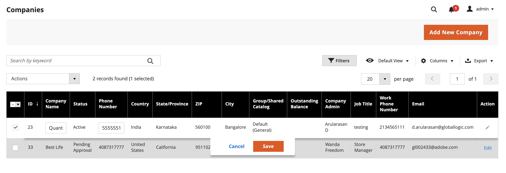

# 管理公司帳戶

此 _[!UICONTROL Companies]_頁面會列出所有目前的公司帳戶，無論狀態為何。 任何待核准的請求都會顯示在清單頂端。 標準 [工作區控制項](../getting-started/admin-workspace.md) 可用於篩選清單、變更 [欄配置](../getting-started/admin-grid-controls.md)、儲存檢視或匯出資料。

此 _[!UICONTROL Actions]_格線上方的控制項可用來將動作套用至多個公司記錄。 例如，與其核准每個個別的公司請求，您可以選取多個請求，並在單一動作中啟用帳戶。 可用的動作取決於 [許可權](../systems/permissions.md) 用於指派給管理員使用者帳戶的角色。

使用 _[!UICONTROL Search]_函式以尋找中的公司&#x200B;**公司**依關鍵字的格線。 它會透過搜尋中的指定關鍵字來尋找公司&#x200B;**公司名稱**和&#x200B;**父級**欄。 篩選依據&#x200B;**公司型別**顯示母公司及其相關公司，或只顯示子公司。

{width="700" zoomable="yes"}

## 公司角色資源

此 [角色資源](../systems/permissions-user-roles.md#role-resources) 設定會決定：

- 新增公司
- 刪除公司
- 套用餘額補助
- 檢視公司

必須為以下設定這些角色資源： [使用者角色](../systems/permissions-user-roles.md) 指定給管理員使用者帳戶的使用者。

## 套用動作

下列動作可套用至單一或多個記錄。

1. 在 _管理員_ 側欄，前往 **[!UICONTROL Customers]** > **[!UICONTROL Companies]**.

1. 在網格的第一欄中，選取要更新之每筆記錄的核取方塊，然後依照要套用之動作的指示進行：

### 啟用公司帳戶

1. 設定 **[!UICONTROL Actions]** 控制項至 `Set Active`.

1. 提示確認時，按一下 **[!UICONTROL OK]**.

### 設定作用中/非作用中

帳戶為非作用中的客戶無法登入或從他們的帳戶購買產品。 設定客戶帳戶為有效或非有效的方法有兩種：

方法1： **從客戶格線**

1. 在 _管理員_ 側欄，前往 [!UICONTROL **客戶**] > [!UICONTROL **所有客戶**].

1. 設定 [!UICONTROL **動作**] 控制下列其中一項：

   - `Active`
   - `Inactive`

1. 提示確認時，按一下 **[!UICONTROL OK]**.

方法2： **從帳戶編輯頁面**

1. 在 _管理員_ 側欄，前往 [!UICONTROL **客戶**] > [!UICONTROL **所有客戶**].

1. 在網格中，尋找要編輯的客戶記錄。

1. 在 _動作_ 欄，按一下 [!UICONTROL **編輯**].

1. 選取 [!UICONTROL **帳戶資訊**] 標籤。

1. 設定 [!UICONTROL **客戶活動**] 至 `Yes` 或 `No`.

1. 按一下 [!UICONTROL **儲存客戶**].

### 封鎖公司帳戶

與被封鎖公司帳戶相關聯的使用者可以登入並存取目錄，但無法進行購買。 帳戶狀況不佳的公司可能會暫時遭到封鎖，直到問題解決為止。

1. 設定 **[!UICONTROL Actions]** 控制項至 `Block`.

1. 提示確認時，按一下 **[!UICONTROL OK]**.

### 刪除公司帳戶

已刪除的公司帳戶無法還原。 與公司相關聯的使用者帳戶狀態已設為 `Inactive` 且公司ID會從使用者帳戶的設定檔中移除。 有關公司活動和交易的資訊會保留在系統中。

1. 設定 **[!UICONTROL Actions]** 控制項至 `Delete`.

1. 提示確認時，按一下 **[!UICONTROL OK]**.

### 轉換信用貨幣

所選公司帳戶中的貸方會轉換為所選貨幣的目前匯率。

1. 設定 **[!UICONTROL Actions]** 控制項至 `Convert Currency`.

1. 提示確認時，按一下 **[!UICONTROL OK]**.

1. 選擇 **[!UICONTROL Credit Currency]** 用於選取的公司帳戶。

   金額會根據目前的轉換率重新計算（如果有的話）。 如果無法取得，您可以手動輸入自訂轉換率。 對於所選公司使用的銷退折讓貨幣，系統會顯示所需的兌換計算。

1. 按一下 **[!UICONTROL Proceed]** 以完成轉換。

### 編輯公司帳戶

方法1： **快速編輯**

1. 在第一欄中，選取要編輯之公司帳戶的核取方塊。

1. 設定 **[!UICONTROL Actions]** 欄至 `Edit`.

   每個可更新的值都會顯示在文字方塊中。

   {width="700" zoomable="yes"}

1. 視需要更新下列任何值：

   - **[!UICONTROL Company Name]**

   - **[!UICONTROL Company Email]**

   - **[!UICONTROL Phone Number]**

1. 按一下 **[!UICONTROL Save]**.

方法2： **完整編輯**

1. 在網格中，尋找要編輯的公司記錄。

1. 按一下 **[!UICONTROL Edit]** 在 _[!UICONTROL Action]_欄。

1. 對公司資訊進行必要的變更。

如需欄位說明，請參閱 [建立公司帳戶](account-company-create.md).

1. 完成後，按一下 **[!UICONTROL Save]**.

## 指派銷售代表

銷售代表是 [管理員使用者](../systems/permissions.md) 獲指派為公司帳戶聯絡人的使用者，負責接收所有自動傳送的郵件 [電子郵件訊息](../b2b/enable-basic-features.md#configure-company-email-options) 與公司有關聯。 每個公司帳戶只能指派一名銷售代表，但單一銷售代表可以管理多個公司帳戶。 預設的Admin使用者帳戶會指派為銷售代表，除非指派的是不同的Admin使用者。

公司帳戶和報價頁中的公司成員可以看到所指派銷售代表的名稱和電子郵件地址。

1. 在 _管理員_ 側欄，前往 **[!UICONTROL Customers]** > **[!UICONTROL Companies]**.

1. 在格線中尋找公司，並以編輯模式開啟。

1. 設定 **[!UICONTROL Sales Representative]** 指派給您要指派為公司聯絡視窗的管理員使用者。

1. 完成後，按一下 **[!UICONTROL Save]**.

   被指派的銷售代表會收到指派的電子郵件通知。

## 更新公司設定檔

公司設定檔可由公司管理員從店面維護，也可由店面管理員從管理員維護。

{width="700" zoomable="yes"}

1. 在 _管理員_ 側欄，前往 **[!UICONTROL Customers]** > **[!UICONTROL Companies]**.

1. 在格線中尋找公司，然後按一下 **[!UICONTROL Edit]** 在 _[!UICONTROL Action]_欄。

1. 視需要更新每個區段中的欄位值，使用欄位說明作為參考。

1. 完成後，按一下 **[!UICONTROL Save]**.

## 公司帳戶示範

您可以觀看此影片，瞭解如何管理公司帳戶：

>[!VIDEO](https://video.tv.adobe.com/v/344447?quality=12)

## 公司管理

[!BADGE 1.5.0測試版]{type=Informative url="/help/b2b/release-notes.md" tooltip="僅供測試版計畫參與者使用"}

公司建立後，具有適當許可權的管理員使用者可以使用 [!UICONTROL Company Hierarchy] 區段，藉由編輯指定的母公司並指派相關公司來建立母公司組織。

如果已將公司新增至階層，則 [!UICONTROL Company Hierarchy] 格線會顯示母公司和格線中所有已指派的公司。

另請參閱 [管理公司階層](assign-companies.md) 以取得詳細資訊。

## 公司選項和欄

以下各節提供可用於管理公司帳戶的可用動作、選項和顯示資訊的參考。

### 動作控制選項

| 選項 | 說明 |
|--- |--------------------------------------------------------------------------------------------------------------------------------------------------------------------------------------------------------------------------------------------------------------------------------|
| [!UICONTROL Set Active] | 將所有選取的公司記錄的狀態設為 `Active`. 公司管理員會收到設定密碼的指示，這樣他們就可以從店面存取帳戶並管理公司。 |
| [!UICONTROL Block] | 限制信譽不佳的公司帳戶，同時保留帳戶。 公司成員可以登入並存取目錄，但他們不能代表公司下訂單。 |
| [!UICONTROL Delete] | 刪除選取的公司帳戶。 與已刪除公司相關聯的使用者帳戶狀態已設為 `Inactive` 且公司ID會從使用者帳戶的設定檔中移除。 有關公司活動和交易的資訊會保留在系統中。 |
| [!UICONTROL Edit] | 允許從網格編輯所選公司記錄的某些值。 依預設，公司名稱、公司電子郵件和電話號碼值可供快速編輯。 |
| [!UICONTROL Convert Credit] | 根據指定貨幣的匯率換算所選公司的記帳貸方。 |

{style="table-layout:auto"}

### 欄說明

#### 預設欄配置

| 欄 | 說明 |
|-----------------------------------|--------------------------------------------------------------------------------------------------------------------------------------------------------------------------------------------------------------------------------------------------------------------------------------------------------------------------------------------------------------------------------------------------------------------------------------------------------------------------|
| [!UICONTROL Select] | 用來選取作為動作主體的公司記錄或使用欄標題中的選取控制項來選取/取消選取所有專案的核取方塊。 |
| [!UICONTROL ID] | 提交建立公司的請求時指派的唯一數值識別碼。 |
| [!UICONTROL Company Name] | 公司名稱是在第一次建立公司帳戶時輸入的，可以是完整法律名稱的縮寫版本。 |
| [!UICONTROL Company Type] | 型別 [公司](manage-companies.md). 選項：  **[!UICONTROL Company]**— 根據預設，新公司會建立為單一公司。 **[!UICONTROL Parent]**  — 公司是其他公司的母公司。  **[!UICONTROL Child]**— 此公司與母公司相關。 |
| [!UICONTROL Parent] | 顯示此特定公司明細的母公司。 |
| [!UICONTROL Company Email] | 與公司帳戶相關聯的電子郵件地址。 |
| [!UICONTROL Phone Number] | 公司的主要電話號碼。 |
| [!UICONTROL Country] | 公司註冊經營業務的國家/地區。 |
| [!UICONTROL State Province] | 公司註冊經營所在州或省。 |
| [!UICONTROL City] | 公司註冊經營業務的城市。 |
| [!UICONTROL Group/Shared Catalog] | 欄名稱取決於組態中是否已啟用共用目錄。 選項：  **[!UICONTROL Customer Group]**— 如果組態中未啟用共用目錄，則指定 [客戶群組](../customers/customer-groups.md) 公司所屬的。 **[!UICONTROL Shared Catalog]**  — 如果組態中啟用了共用目錄，請指定指派給客戶的共用目錄名稱。 |
| [!UICONTROL Outstanding Balance] | 公司帳戶上的未結餘額。 如果公司沒有信用記錄，且其信用額度為零，則該欄為空白。 |
| [!UICONTROL Company Admin] | 公司管理員的名字和姓氏。 |
| [!UICONTROL Job Title] | 公司管理員的職稱。 |
| [!UICONTROL Email] | 公司管理員的電子郵件地址。 |
| [!UICONTROL Action] | **[!UICONTROL Edit]**  — 以編輯模式開啟公司帳戶。 |

{style="table-layout:auto"}

#### 其他欄

下列欄可透過變更 [欄配置](../getting-started/admin-grid-controls.md) 格線的。

| 欄 | 說明 |
|---------------------------------|--------------------------------------------------------------------------------------------------------------------------------------------------------------------------------------------------------------------------------------------------------------------------------------------------------------------------------------------------------------------------------------------------------------------------------------------------------------------------------------------------------------------------------------------------------------------------------------------------------------------------------------------------------------------------------------------------------------------------------------------------------------------------------------------------------------------------------------------------------------------------------------------------------------------------------------------------------|
| [!UICONTROL Company Legal Name] | 公司的完整法定名稱。 |
| [!UICONTROL Street Address] | 公司註冊經營業務的街道地址。 |
| [!UICONTROL ZIP] | 公司註冊以進行業務的郵遞區號。 |
| [!UICONTROL Reseller ID] | 指定給公司以申報稅捐的轉售編號。 |
| [!UICONTROL VAT/TAX ID] | 此 [加值稅](../stores-purchase/vat.md) 某些管轄區針對稅捐申報目的而指定給公司的編號。 若要設定客戶VAT/稅務ID以顯示於店面，請參閱 [建立新帳戶選項](../configuration-reference/customers/customer-configuration.md). |
| [!UICONTROL Credit Limit] | 延伸至公司帳戶的信用額度。 |
| [!UICONTROL Credit Currency] | 商店接受以公司信用購買的貨幣。 |
| [!UICONTROL Status] | 指示 [狀態](account-company-approve.md) 公司帳戶的ID。 選項：  **[!UICONTROL Active]**— 公司帳戶由商店管理員核准。 公司管理員和相關成員可以從店面登入帳戶並進行購買。 **[!UICONTROL Pending Approval]**  — 已提交開啟公司帳戶的請求，但尚未獲得商店管理員的核准。  **[!UICONTROL Rejected]**— 已提交開啟公司帳戶的請求，但未獲商店管理員核准。 用於提交請求的初始登入認證會被封鎖。 **[!UICONTROL Blocked]**  — 公司成員可以登入並存取目錄，但無法進行購買。 商店管理員可能會封鎖信譽不佳的公司帳戶。 帳戶上的區塊可由存放區管理員隨時移除。 |
| [!UICONTROL Gender] | 公司管理員的性別。 選項：男性/女性/未指定 |
| [!UICONTROL Comment] | 公司帳戶的相關備註以供參考，且僅供管理員檢視。 |

{style="table-layout:auto"}

### 按鈕列

| 按鈕 | 說明 |
|--------------------------------|---------------------------------------------------------------------------------------------------------------------------------------------------------------------------------------------------------------------------------------------------------------------|
| [!UICONTROL Back] | 返回「公司」頁面而不儲存變更。 |
| [!UICONTROL Login as Customer] | 允許管理員使用者 [以客戶身分登入店面](../customers/login-as-customer.md) 並協助處理訂單。 |
| [!DNL Delete Company] | 刪除公司帳戶。 與公司相關聯的使用者帳戶狀態已設為 `Inactive` 且公司ID會從使用者帳戶的設定檔中移除。 有關公司活動和交易的資訊會保留在系統中。 |
| [!DNL Reset] | 將原始值還原到任何有未儲存變更的欄位。 |
| [!DNL Reimburse Balance] | 允許管理員根據採購單編號，從商店貸方償還餘額。 |
| [!DNL Save] | 儲存對公司的變更並保持設定檔開啟。 |
| [!UICONTROL Save & Close] | 儲存對公司所做的變更並關閉設定檔。 |

{style="table-layout:auto"}

### 欄位說明

| 欄位 | 說明 |
|-----------------------------------|--------------------------------------------------------------------------------------------------------------------------------------------------------------------------------------------------------------------------------------------------------------------------------------------------------------------------------------------------------------------------------------------------------------------------------------------------------------------------------------------------------------------------------------------------------------------------------------------------------------------------------------------------------------------------------------------------------------------------------------------------------------------------------------------------------------------------------------------------------------------------------------------------------------------------------------------------------|
| [!UICONTROL Company Name] | 公司名稱是在第一次建立公司帳戶時輸入的，可以是完整法律名稱的縮寫版本。 |
| [!UICONTROL Status] | 指示 [狀態](account-company-approve.md) 公司帳戶的ID。 選項：  **[!UICONTROL Active]**— 公司帳戶由商店管理員核准。 公司管理員和相關成員可以從店面登入帳戶並進行購買。 **[!UICONTROL Pending Approval]**  — 已提交開啟公司帳戶的請求，但尚未獲得商店管理員的核准。  **[!UICONTROL Rejected]**— 已提交開啟公司帳戶的請求，但未獲商店管理員核准。 用於提交請求的初始登入認證會被封鎖。 **[!UICONTROL Blocked]**  — 公司成員可以登入並存取目錄，但無法進行購買。 商店管理員可能會封鎖信譽不佳的公司帳戶。 帳戶上的區塊可由存放區管理員隨時移除。 |
| [!UICONTROL Company Email] | 與公司帳戶相關聯的電子郵件地址。 |
| [!UICONTROL Sales Representative] | 公司帳戶主要聯絡人的管理員使用者。 |

{style="table-layout:auto"}

#### [!UICONTROL Account Information]

| 欄位 | 說明 |
|---------------------------------|----------------------------------------------------------------------------------------------------------------------------|
| [!UICONTROL Company Legal Name] | 公司的完整法定名稱。 |
| [!UICONTROL VAT / TAX ID] | 稅捐或 [加值稅](../stores-purchase/vat.md) 為申報稅捐而指定給公司的編號。 |
| [!UICONTROL Reseller ID] | 指定給公司以申報稅捐的轉售編號。 |
| [!UICONTROL Comment] | 這些關於公司帳戶的附註僅供管理員參考和檢視。 |
| **[!UICONTROL Legal Address]** |                                                                                                                            |
| [!UICONTROL Street Address] | 公司註冊經營業務的街道地址。 |
| [!UICONTROL City] | 公司註冊經營業務的城市。 |
| [!UICONTROL Country] | 公司註冊經營業務的國家/地區。 |
| [!UICONTROL State/Province] | 公司註冊經營所在州或省。 |
| [!UICONTROL ZIP/Postal Code] | 公司註冊以進行業務的郵遞區號。 |
| [!UICONTROL Phone Number] | 公司的主要電話號碼。 |

{style="table-layout:auto"}

#### [!UICONTROL Company Hierarchy]

[!BADGE 1.5.0測試版]{type=Informative url="/help/b2b/release-notes.md" tooltip="僅供測試版計畫參與者使用"}

| 欄 | 說明 |
|-----------------------------|------------------------------------------------------------------------------------------------------------------------------------------------------|
| [!UICONTROL Company ID] | 公司的ID號碼。 |
| [!UICONTROL Company Name] | 公司的全名。  A `current company indicator` 會出現在正在編輯的公司明細中。 |
| [!UICONTROL Company Email] | 與公司帳戶相關聯的電子郵件地址。 |
| [!UICONTROL Phone Number] | 公司的主要電話號碼。 |
| [!UICONTROL State/Province] | 公司註冊經營所在州或省。 |
| [!UICONTROL City] | 公司註冊經營業務的城市。 |
| [!UICONTROL Customer Group] | （僅限管理員）指出 [客戶群組](../customers/customer-groups.md) 或 [共用目錄](catalog-shared.md) 指派給公司的資訊。 |
| [!UICONTROL Company Admin] | 公司管理員的完整名稱。 |
| [!UICONTROL Action] | 公司明細的可能動作清單。 |

{style="table-layout:auto"}

#### [!UICONTROL Company Admin]

| 欄位 | 說明 |
|----------------------------------|--------------------------------------------------------------------------------------------------------------------------------------------------------------------------------------------------------------------------------------------------|
| [!UICONTROL Job Title] | 管理公司帳戶的公司管理員的職稱。 |
| [!UICONTROL Email] | 公司管理員的電子郵件地址可與公司電子郵件地址相同。 如果輸入了不同的電子郵件地址，則除了公司帳戶外，還會為公司管理員建立單獨的個人帳戶。 |
| [!UICONTROL Prefix] | 適用的話，會加上與公司管理員名稱關聯的前置詞(例如 `Mr.`， `Ms.`， `Mrs.`，或 `Dr.`)。 視設定而定，輸入欄位可能是文字欄位或清單。 |
| [!UICONTROL First Name] | 公司管理員的名字。 |
| [!UICONTROL Middle Name/Initial] | 公司管理員的中間名或首字母。 |
| [!UICONTROL Last Name] | 公司管理員的姓氏。 |
| [!UICONTROL Suffix] | 如果適用，即為與公司管理員名稱關聯的尾碼(例如 `Jr.`， `Sr.`，或 `III`)。 視設定而定，輸入欄位可能是文字欄位或清單。 |
| [!UICONTROL Gender] | 公司管理員的性別。 選項： `Male` / `Female` / `Not Specified` |

{style="table-layout:auto"}

#### [!UICONTROL Company Credit]

| 欄位 | 說明 |
|-------------------------------------------|----------------------------------------------------------------------------------------------------------------------------------------------------------------------------|
| [!UICONTROL Credit Currency] | 商店接受以公司信用購買的貨幣。 |
| [!UICONTROL Credit Limit] | 延伸至公司帳戶的信用額度。 |
| [!UICONTROL Allow to Exceed Credit Limit] | 表示公司是否有權超過信用額度。 選項：是/否 |
| [!UICONTROL Reason for Change] | 說明為何允許或不允許公司超過信用額度的備註。 只有在超出信用額度的許可權變更時，此欄位才會生效。 |

{style="table-layout:auto"}

#### [!UICONTROL Advanced Settings]

| 欄位 | 說明 |
|-----------------------------------------|------------------------------------------------------------------------------------------------------------------------------------------------------------------------------------------------------|
| [!UICONTROL Customer Group] | 指示 [客戶群組](../customers/customer-groups.md) 或 [共用目錄](catalog-shared.md) 指派給公司的資訊。 |
| [!UICONTROL Allow Quotes] | 決定公司成員是否可以代表公司準備及提交可協商的報價。 |
| [!UICONTROL Enable Purchase Orders] | 決定公司是否允許採購單。 若要讓採購單適用於公司成員帳戶，公司管理員也必須在店面啟用此功能。 |
| [!UICONTROL Applicable Payment Methods] | 表示公司購買時可用的付款方法。 選項： `B2B Payment Methods` / `All Enabled Payment Methods` / `Specific Payment Methods` |
| [!UICONTROL Payment Methods] | （僅限管理員）在指定特定付款方式時，系統才會啟用。 若要選取多種付款方式，請按住Ctrl鍵(PC)或Command鍵(Mac)，然後按一下每個選項。 |

{style="table-layout:auto"}
