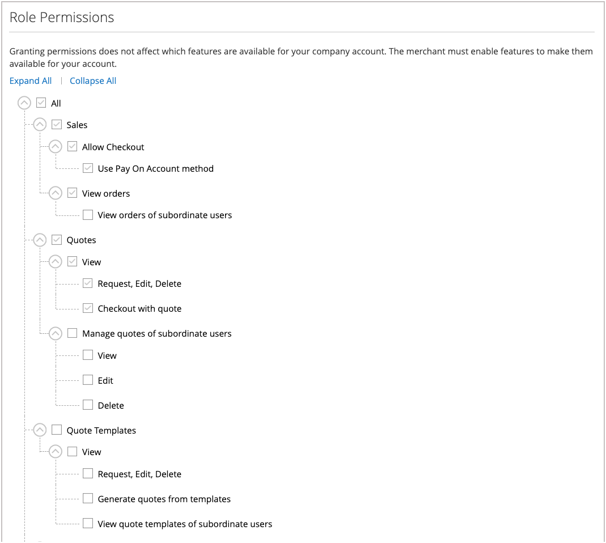

# 公司角色和許可權

您可以為具有各種許可權層級的公司使用者設定角色，以存取銷售資訊和資源。 依預設，公司管理員是具有完整許可權的&#x200B;*超級使用者*。 如果使用者沒有存取頁面的許可權，就會顯示[拒絕存取](../content-design/pages.md#access-denied)頁面。

具有預設角色的{width="700" zoomable="yes"}

系統有一個預先定義的預設使用者角色，您可以以&#x200B;*形式使用*&#x200B;或進行修改以符合您的需求。 您可以視需要建立儘可能多的角色，以符合您的公司結構和組織責任，例如：

- **預設使用者** — 預設使用者擁有與銷售和報價相關的活動的完整存取權，以及公司設定檔和信用資訊的僅檢視存取權。

- **資深購買者** — 資深購買者可能擁有所有「銷售」和「報價」資源的存取權，以及公司設定檔、使用者和團隊、付款資訊和公司信用額的僅限檢視許可權。

- **助理購買者** — 助理購買者可能有使用&#x200B;**[!UICONTROL Checkout with quote]**&#x200B;下訂單的許可權，以及檢視公司設定檔中的訂單、報價和資訊的許可權。

## 管理角色和許可權

從公司管理員的店面帳戶管理公司角色。

**若要開啟角色和許可權：**

1. 以公司管理員身分登入店面。

1. 在左側面板中，選取&#x200B;**[!UICONTROL Roles and Permissions]**。

1. 完成下列其中一項作業。

### 建立角色

1. 按一下&#x200B;**[!UICONTROL Add New Role]**。

   {width="600" zoomable="yes"}

1. 輸入描述性&#x200B;**[!UICONTROL Role Name]**。

1. 在&#x200B;**[!UICONTROL Role Permissions]**&#x200B;底下，執行下列任一項作業：

   - 選取指派給角色的使用者有權存取之每個資源或活動的核取方塊。

   - 選取&#x200B;**[!UICONTROL All]**&#x200B;核取方塊，並清除指派給角色的使用者無權存取之每個資源或活動的核取方塊。

1. 按一下&#x200B;**[!UICONTROL Save Role]**。

1. 重複這些步驟，視需要建立多個角色。

### 修改角色

1. 找到您要修改的角色，然後按一下&#x200B;**[!UICONTROL Actions]**&#x200B;欄中的&#x200B;**[!UICONTROL Edit]**。

1. 對名稱和許可權設定進行必要的變更。

1. 完成時，按一下&#x200B;**[!UICONTROL Save Role]**。

### 複製角色

1. 找到您要複製的角色，然後按一下&#x200B;**[!UICONTROL Actions]**&#x200B;欄中的&#x200B;**[!UICONTROL Duplicate]**。

1. 對名稱和許可權設定進行必要的變更。

1. 完成時，按一下&#x200B;**[!UICONTROL Save Role]**。

### 刪除角色

1. 在角色清單中，找到要刪除的角色。

   只能刪除未指派使用者的角色。

1. 按一下&#x200B;**[!UICONTROL Actions]**&#x200B;欄中的&#x200B;**[!UICONTROL Delete]**。

1. 提示確認時，按一下&#x200B;**[!UICONTROL OK]**。

## 角色清單動作 {#actions}

| 動作 | 說明 |
| --- | --- |
| [!UICONTROL Duplicate] | 建立所選角色的復本。 重複角色的名稱已新增`- Duplicated`到結尾。 |
| [!UICONTROL Edit] | 變更名稱和許可權集。 |
| [!UICONTROL Delete] | 刪除角色。 只能刪除未指派使用者的角色。 |

{style="table-layout:auto"}

## 角色許可權

B2B功能是由&#x200B;**許可權** （ACL資源）所控制。 當公司使用者開啟頁面或在店面執行動作時，應用程式會檢查其角色是否包含所需許可權。

公司管理員可以選取&#x200B;**[!UICONTROL Edit]**，然後選取或清除&#x200B;**[!UICONTROL Role Permissions]**&#x200B;清單中的許可權，來更新角色的許可權設定。

{width="700" zoomable="yes"}

當您&#x200B;**在公司帳戶中建立或編輯公司角色**&#x200B;時，請指派這些資源。 有權管理角色的使用者可以開啟角色表單並設定許可權樹狀結構。

角色許可權會以樹狀結構組織，包含主要選項和從屬選項。 選取主要選項會自動選取所有從屬選項。 清除主要選項會自動清除所有從屬選項。 您也可以個別選取或清除從屬選項。

### 所有許可權

| 許可權標籤 | 說明 |
| --- | --- |
| 全部 | 指派給此店面角色的&#x200B;**所有**&#x200B;許可權的根節點。 |

### 銷售許可權

| 許可權標籤 | 說明 |
| --- | --- |
| 銷售 | 公司使用者簽出和訂單可見性的父級。 |
| 允許簽出 | 在結帳時下訂單。 |
| 使用分期付款方式 | 使用&#x200B;**帳戶付款** （公司信用額度）在結帳時使用。 |
| 檢視訂單 | 檢視使用者自己的訂單。 |
| 檢視下屬使用者的訂單 | 檢視階層中此使用者下方的使用者所下的訂單。 |

### 引號許可權

公司許可權樹狀結構中的父節點： **引號**。

| 許可權標籤 | 說明 |
| --- | --- |
| 引號 | 店面可轉讓報價動作的上層。 |
| 檢視（引號） | 檢視可協商的報價。 |
| 請求，編輯，刪除 | 根據商業規則要求新報價、編輯報價及刪除報價。 |
| 使用引號結帳 | 使用核准的報價完成結帳。 |
| 管理從屬使用者的報價 | 下屬引號上動作的父代。 |
| 檢視（下屬的引號） | 檢視下屬的引號。 |
| 編輯（下屬的引號） | 編輯下屬的引號。 |
| 刪除（下屬的引號） | 刪除下屬的引號。 |

### 報價範本

父節點： **報價範本** （在公司樹狀結構中的&#x200B;**報價**&#x200B;下）。

| 許可權標籤 | 說明 |
| --- | --- |
| 報價範本 | 店面報價範本功能的上層。 |
| 檢視（範本） | 檢視報價範本。 |
| 請求，編輯，刪除 | 建立、更新、取消和管理報價範本。 |
| 從範本產生報價 | 從範本產生可協商的報價。 |
| 管理下屬使用者的報價範本 | 從屬範本動作的父系。 |
| 檢視（下屬的範本） | 檢視下屬的報價範本。 |
| 編輯（下屬的範本） | 編輯下屬的報價範本。 |
| 刪除（下屬的範本） | 刪除下屬的報價範本。 |

### 訂單核准

父節點： **訂單核准**。 採購單和核准規則許可權會巢狀內嵌在樹狀結構的此分支下。

### 採購單

| 許可權標籤 | 說明 |
| --- | --- |
| 訂單核准 | 採購單與核准功能的上層。 |
| 檢視我的採購單 | 檢視此使用者建立的採購單。 |
| 下屬的檢視 | 檢視階層中此使用者下方的使用者之採購單。 |
| 檢視所有公司 | 檢視整個公司的採購單。 |
| 自動核准在此角色中建立的採購單 | 當規則允許時，自動核准此角色中的使用者建立的採購單。 |

### 採購單規則

| 許可權標籤 | 說明 |
| --- | --- |
| 核准採購單，而不需要其他核准 | 即使通常需要其他核准，仍核准採購單（根據核准規則）。 |
| 檢視核准規則 | 檢視採購單核准規則。 |
| 建立、編輯和刪除 | 建立、編輯和刪除核准規則。 |

### 公司設定檔和連絡人

公司設定檔區段的店面許可權。 巢狀&#x200B;**Edit**&#x200B;專案只適用於角色樹狀結構中位於其上方的&#x200B;**檢視**&#x200B;許可權。

| 許可權標籤 | 說明 |
| --- | --- |
| 公司設定檔 | 以群組方式存取公司設定檔區域。 |
| 帳戶資訊（檢視） | 檢視公司帳戶資訊。 |
| 編輯 | 編輯公司帳戶資訊（位於帳戶資訊下）。 |
| 合法地址（檢視） | 檢視公司合法地址。 |
| 編輯 | 編輯公司合法地址（在「合法地址」下）。 |
| 連絡人（檢視） | 檢視公司連絡人。 |
| 付款資訊（檢視） | 檢視公司設定檔的付款資訊。 |
| 送貨資訊（檢視） | 檢視公司設定檔的送貨資訊。 |

## 公司使用者管理

| 許可權標籤 | 說明 |
| --- | --- |
| 公司使用者管理 | 角色和使用者或團隊的父級。 |
| 檢視角色和許可權 | 檢視公司角色及其許可權。 |
| 管理角色和許可權 | 建立或編輯角色並指派許可權。 |
| 檢視使用者和團隊 | 檢視公司使用者和團隊。 |
| 管理使用者和團隊 | 新增、編輯或移除使用者和團隊。 |

## 公司評價

| 許可權標籤 | 說明 |
| --- | --- |
| 公司評價 | 存取公司信用區域。 |
| 檢視（信用記錄） | 檢視公司信用記錄和相關餘額資訊。 |

## 指派角色給公司使用者

定義所需的角色後，請為每個公司使用者指派角色。

**指派角色：**

1. 以公司管理員身分登入店面。

1. 在左側面板中，選取&#x200B;**[!UICONTROL Company Users]**。

   {width="700" zoomable="yes"}

1. 在清單中尋找使用者並按一下&#x200B;**[!UICONTROL Edit]**。

1. 為使用者選取適當的&#x200B;**[!UICONTROL User Role]**。

   {width="700" zoomable="yes"}

1. 按一下&#x200B;**[!UICONTROL Save]**。

>[!MORELIKETHIS]
>
>- [管理公司使用者](account-company-users.md)
>- [公司帳戶結構](account-company-structure.md)
>- [公司系統管理員角色](account-company-admin.md)
>- [管理公司](manage-companies.md)
>- [啟用B2B功能](enable-basic-features.md)
