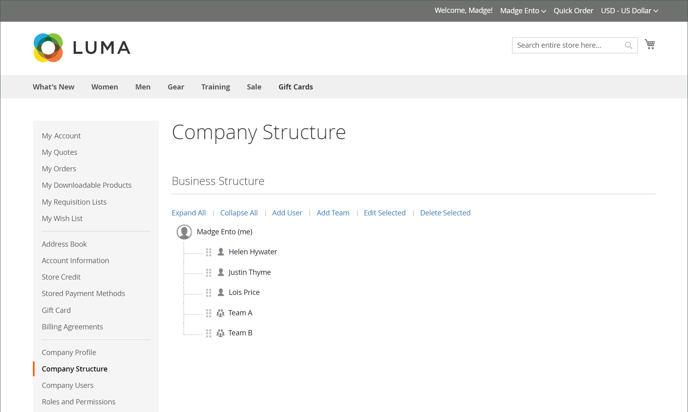

# 公司帳戶結構

可以設定公司帳戶以反映業務結構。 最初，公司結構僅包含公司管理員，但可展開以包含使用者團隊。 使用者可與專案團隊建立關聯，或在公司內部門與細分的階層內進行組織。

{width="500"}

在店面上的公司管理員帳戶儀表板中，公司結構以樹狀結構表示，最初僅由公司管理員組成。

{width="700" zoomable="yes"}

對於商家，完整的公司結構會反映在管理員內的&#x200B;_公司_&#x200B;和&#x200B;_客戶_&#x200B;網格中。 「公司」格線會列出所有公司，無論其狀態為何。

{width="700" zoomable="yes"}

下列範例顯示具有每個公司之初始公司管理員帳戶的[!UICONTROL Customers]網格。

{width="700" zoomable="yes"}

建立帳戶之後，公司管理員可以定義具有[團隊](account-company-structure.md)的公司結構、設定[公司使用者](account-company-users.md)，並為每個使用者建立[角色和許可權](account-company-roles-permissions.md)。

>[!NOTE]
>
>新增公司使用者時，公司使用者最初會新增至根公司結構（隸屬於公司管理員）。 如果公司管理員在公司內執行多個角色，請為每個角色分別建立具有不同電子郵件地址的公司使用者帳戶。

## 公司結構圖示

| 圖示 | 說明 |
| ---- | ----------------- |
|  | 代表公司結構中的公司管理員。 |
|  | 代表公司結構中的專案團隊。 |
|  | 代表公司結構中的使用者。 |
|  | 將專案團隊移至公司結構中的另一個位置。 |
|  | 在公司結構中展開專案團隊。 |
|  | 摺疊公司結構中的專案團隊。 |

{style="table-layout:auto"}

## 建立公司團隊

公司帳戶的結構應反映採購組織，無論是簡單且扁平的組織，還是擁有不同團隊的複雜組織（適用於公司的每個細分部門與部門）。

如果商店[已設定](enable-basic-features.md)以允許公司管理自己的帳戶，則設定公司結構是公司管理員在帳戶核准後要完成的首要任務之一。 在公司帳戶中，公司結構以樹狀結構表示，公司管理員位於頂端。

{width="450"}

1. 公司管理員登入其帳戶。

1. 在左側面板中選擇&#x200B;**[!UICONTROL Company Structure]**。

1. 在&#x200B;**[!UICONTROL Business Structure]**&#x200B;下，按一下&#x200B;**[!UICONTROL Add Team]**&#x200B;並執行下列動作：

   - 輸入&#x200B;**[!UICONTROL Team Title]**&#x200B;和&#x200B;**[!UICONTROL Description]**。

     「團隊標題」可以是任何可代表公司結構的專案，例如團隊、辦公室或公司內的部門

     {width="700" zoomable="yes"}

   - 完成後，按一下&#x200B;**[!UICONTROL Save]**。

   - 建立所需數量的團隊。

1. 若要建立團隊階層，管理員會執行下列動作：

   - 選取父系團隊，然後按一下&#x200B;**[!UICONTROL Add Team]**。

     {width="600" zoomable="yes"}

   - 輸入&#x200B;**[!UICONTROL Team Title]**&#x200B;和&#x200B;**[!UICONTROL Description]**。

   - 按一下&#x200B;**[!UICONTROL Save]**。

1. 重複這些步驟，視需要建立任意數目的專案團隊或部門與細分。

   {width="600" zoomable="yes"}

## 移動團隊

當公司管理員使用公司結構時，可以將團隊或部門拖曳到結構中的其他位置。

1. 公司管理員會找到要移動的團隊。

1. 按一下並將團隊拖曳到公司結構中的新位置。

## 刪除團隊

>[!NOTE]
>
>在刪除團隊之前，建議您確定已選取正確的團隊 — 無法還原已刪除的團隊。

1. 公司管理員會選取要刪除的團隊。

1. 按一下&#x200B;**[!UICONTROL Delete Selected]**。

1. 提示確認時，按一下&#x200B;**[!UICONTROL Delete]**。

## 展開或收合專案團隊結構

當公司管理員使用公司結構時，他們可以摺疊或展開樹狀結構：

- 按一下&#x200B;**[!UICONTROL Collapse All]**&#x200B;或&#x200B;**[!UICONTROL Expand All]**。

- 按一下以摺疊團隊，或按一下以展開團隊。

## 將使用者指派給團隊

第一次將團隊和使用者新增到[公司結構](account-company-structure.md)時，它們會放置在公司管理員下的相同層級。

{width="700" zoomable="yes"}

| 控制 | 說明 |
|--- |--- |
| [!UICONTROL Collapse All / Expand All] | 摺疊或展開業務結構樹狀結構 |
| [!UICONTROL Add User] | 在目前團隊下方建立使用者 |
| [!UICONTROL Add Team] | 建立團隊 |
| [!UICONTROL Edit Selected / Remove from Structure] | 編輯使用者資訊或從企業樹狀結構中移除使用者。 如需詳細資訊，請參閱[管理公司使用者帳戶](account-company-users.md)。 |

{style="table-layout:auto"}

1. 在左側面板中，公司管理員選擇&#x200B;**[!UICONTROL Company Structure]**。

1. 若要將使用者指派給現有的團隊，他們會將使用者（）拖曳到適當的團隊下。

   {width="700" zoomable="yes"}
