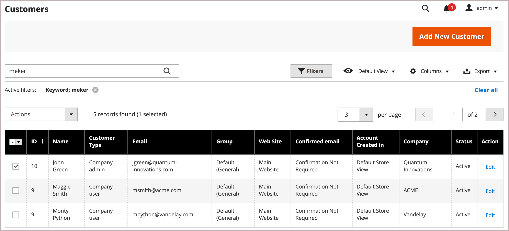

# 公司帳戶結構

可以設定公司帳戶以反映業務結構。 最初，公司結構僅包含公司管理員，但可展開以包含使用者團隊。 使用者可與專案團隊建立關聯，或在公司內部門與細分的階層內進行組織。

{width="500"}

在公司管理員的帳戶儀表板中，公司結構以樹狀結構表示，最初僅由公司管理員組成。

{width="600" zoomable="yes"}

帳戶建立並核准後，公司管理員可使用公司電子郵件地址或獲指派不同的電子郵件地址。

擔任公司管理員的人員在公司內可能擁有多個角色。 如果為公司管理員輸入了單獨的電子郵件地址，則初始的公司結構包括公司管理員以及公司管理員名稱中的個人使用者帳戶。 在這種情況下，公司管理員可以以公司或個人使用者的身分登入該帳戶。

{width="600" zoomable="yes"}

對於商家而言，完整的公司結構會反映在 _公司_ 和 _客戶_ 「管理員」中的網格。 「公司」格線會列出所有公司，無論其狀態為何。 下列範例顯示兩個公司的帳戶： _ACME_ 公司與 _Vendelay_ 公司。

{width="700" zoomable="yes"}

下列範例顯示 [!UICONTROL Customers] 以這些公司的初始公司管理員帳戶為網格。

{width="700" zoomable="yes"}

建立帳戶後，公司管理員必須定義的公司結構 [團隊](account-company-structure.md)，設定 [公司使用者](account-company-users.md)，並建立 [角色與許可權](account-company-roles-permissions.md) （每個）。

## 公司結構圖示

| 圖示 | 說明 |
| ---- | ----------------- |
|  | 代表公司結構中的公司管理員。 |
|  | 代表公司結構中的專案團隊。 |
|  | 代表公司結構中的使用者。 |
|  | 將專案團隊移至公司結構中的另一個位置。 |
|  | 在公司結構中展開專案團隊。 |
|  | 摺疊公司結構中的專案團隊。 |

{style="table-layout:auto"}

## 建立公司團隊

公司帳戶的結構應反映採購組織，無論是簡單且扁平的組織，還是擁有不同團隊的複雜組織（適用於公司的每個細分部門與部門）。

如果商店為 [已設定](enable-basic-features.md) 若要允許公司管理自己的帳戶，設定公司結構是公司管理員在帳戶核准後要完成的首要任務之一。 在公司帳戶中，公司結構以樹狀結構表示，公司管理員位於頂端。

{width="450"}

1. 公司管理員登入其帳戶。

1. 在左側面板中，選擇 **[!UICONTROL Company Structure]**.

1. 在 **[!UICONTROL Business Structure]**，點按 **[!UICONTROL Add Team]** 並執行下列動作：

   - 輸入 **[!UICONTROL Team Title]** 和 **[!UICONTROL Description]**.

     「團隊標題」可以是任何可代表公司結構的專案，例如團隊、辦公室或公司內的部門

     {width="700" zoomable="yes"}

   - 完成後，按一下 **[!UICONTROL Save]**.

   - 建立所需數量的團隊。

     {width="600" zoomable="yes"}

1. 若要建立團隊階層，請執行下列動作：

   - 選取父團隊，然後按一下 **[!UICONTROL Add Team]**.

     {width="600" zoomable="yes"}

   - 輸入 **[!UICONTROL Team Title]** 和 **[!UICONTROL Description]**.

   - 點擊數 **[!UICONTROL Save]**.

1. 重複這些步驟，視需要建立任意數目的專案團隊或部門與細分。

   {width="600" zoomable="yes"}

## 移動團隊

當公司管理員使用公司結構時，可以將團隊或部門拖曳到結構中的其他位置。

1. 公司管理員會找到要移動的團隊。

1. 按一下並將團隊拖曳到公司結構中的新位置。

## 刪除團隊

>[!NOTE]
>
>在刪除團隊之前，建議您確定已選取正確的團隊 — 無法還原已刪除的團隊。

1. 公司管理員會選取要刪除的團隊。

1. 點擊數 **[!UICONTROL Delete Selected]**.

1. 提示確認時，按一下 **[!UICONTROL Delete]**.

## 展開或收合專案團隊結構

當公司管理員使用公司結構時，他們可以摺疊或展開樹狀結構：

- 點按次數 **[!UICONTROL Collapse All]** 或 **[!UICONTROL Expand All]**.

- 點按次數  以摺疊專案團隊或  以展開團隊。

## 將使用者指派給團隊

首次將團隊和使用者新增到 [公司結構](account-company-structure.md)，即會放置在公司管理員下的相同層級。

{width="700" zoomable="yes"}

| 控制 | 說明 |
|--- |--- |
| [!UICONTROL Collapse All / Expand All] | 摺疊或展開業務結構樹狀結構 |
| [!UICONTROL Add User] | 在目前團隊下方建立使用者 |
| [!UICONTROL Add Team] | 建立團隊 |
| [!UICONTROL Edit Selected / Delete Selected] | 編輯或移除企業樹狀結構中的使用者 |

{style="table-layout:auto"}

1. 在左側面板中，公司管理員選擇 **[!UICONTROL Company Structure]**.

1. 若要將使用者指派給現有團隊，他們會拖曳()則為適當團隊下的使用者。

   {width="700" zoomable="yes"}
