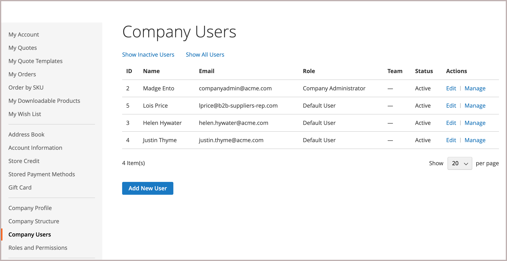

# 管理公司使用者帳戶

公司使用者由公司管理員指派，並可從 _[!UICONTROL Customers]_依客戶型別劃分的格線，_[!UICONTROL Company User]_. 這些個人通常是買家，擁有存取商店服務和資源的不同許可權等級。

公司管理員首先設定 [公司結構](account-company-structure.md)，然後視需要完成下列工作：

- 建立公司使用者並將使用者指派給團隊

- 定義角色和許可權，並將使用者指派給角色

>[!IMPORTANT]
>
>公司使用者只能由公司管理員新增、編輯或移除。 移除操作無法還原，因為使用者已從公司結構中移除。

## 新增公司使用者

1. 公司管理員從店面登入其帳戶。

1. 在左側面板中，選擇 **[!UICONTROL Company Users]**.

   {width="700" zoomable="yes"}

1. 點按次數 **[!UICONTROL Add New User]** 並執行下列動作：

   - 輸入 **[!UICONTROL Job Title]** ，則不會變更。

   - 選擇適當的 **[!UICONTROL User Role]** 已定義角色和許可權時。 否則，他們稍後可以返回以指派角色。

     {width="700" zoomable="yes"}

   - 視需要為使用者完成其餘欄位：

      - **[!UICONTROL First Name]** 和 **[!UICONTROL Last Name]**
      - **[!UICONTROL Email]**
      - **[!UICONTROL Phone Number]**

   根據預設， **[!UICONTROL Status]** 的帳號為 `Active`.

1. 完成後，按一下 **[!UICONTROL Save]**.

1. 重複此程式，視需要建立任意數目的公司使用者。

   新使用者會與「公司管理員」一起顯示在「公司使用者」清單中。

為了節省第一筆訂單的時間，公司管理員可以提醒每位公司使用者將預設的公司帳單和送貨地址新增至其 [通訊錄](../customers/account-dashboard-address-book.md).

## 編輯公司使用者

1. 公司管理員從店面登入其帳戶。

1. 在左側面板中，選擇 **[!UICONTROL Company Users]**.

1. 尋找要更新的使用者記錄，然後按一下 **[!UICONTROL Edit]**.

1. 進行必要的變更。

1. 完成後，按一下 **[!UICONTROL Save]**.

## 移除公司使用者

1. 公司管理員從店面登入其帳戶。

1. 在左側面板中，選擇 **[!UICONTROL Company Structure]**.

1. 選取公司結構中的公司使用者。

1. 點擊數 **[!UICONTROL Delete Selected]**.

   {width="600" zoomable="yes"}

1. 提示確認時，按一下 **[!UICONTROL Delete]**.

在「管理員」中，公司使用者會保留在 [客戶](../customers/customers-all.md) 格線，但具有 `Inactive` 狀態。

## 欄位說明

| 欄位 | 說明 |
|--------------|---------------|
| [!UICONTROL Job Title] | 公司使用者的職稱。 |
| [!UICONTROL User Role] | 此 [角色](account-company-roles-permissions.md) 已指派給公司使用者。 選項： `Default User` / （其他角色） |
| [!UICONTROL First Name] | 公司使用者的名字。 |
| [!UICONTROL Last Name] | 公司使用者的姓氏。 |
| [!UICONTROL Email] | 公司使用者的電子郵件地址。 |
| [!UICONTROL Phone Number] | 公司使用者的電話號碼。 |
| [!UICONTROL Status] | 公司使用者帳戶的狀態。 選項： `Active` / `Inactive` |

{style="table-layout:auto"}
