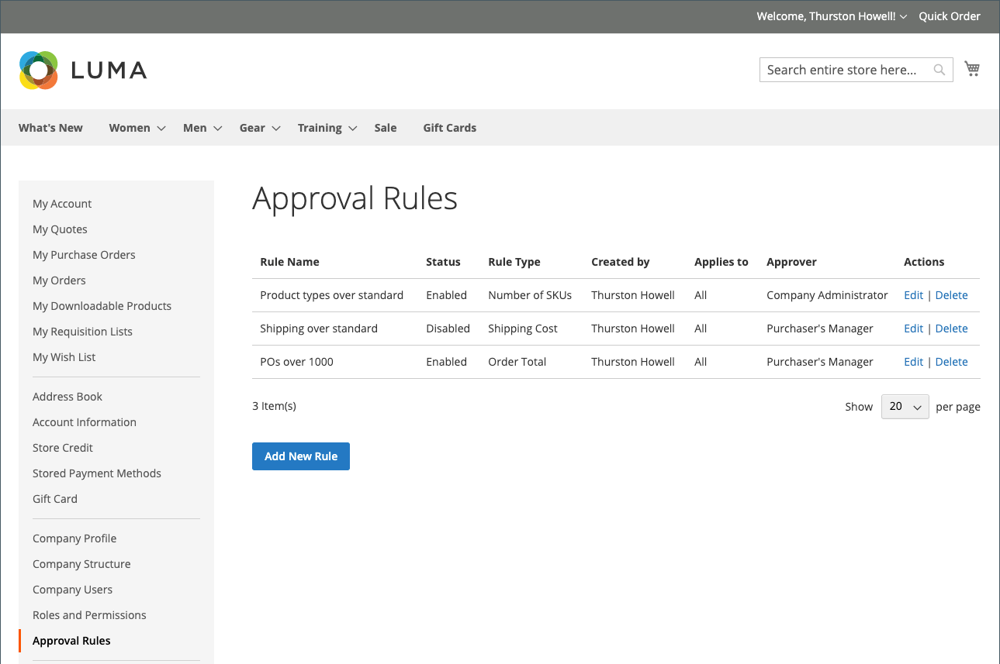

# 採購單核准規則

大多數公司都需要採購單的訂單核准。 透過為其公司帳戶新增核准規則，他們可以控制誰可以建立採購單以及可以花費多少。 例如：

* 任何小於X值的採購單都會自動核准。
* 超過X值但小於Q的採購單必須由Y核准。
* 任何超過X值的採購單都必須由Y和Z核准。
* 由Director層級或以上人員建立的採購單會自動獲得核准。

根據公司角色和許可權，使用者可以建立、編輯、刪除或檢視核准規則。

>[!IMPORTANT]
>
>核准規則設定需要已定義的 [公司結構](account-company-structure.md) 以便指定採購客戶經理的核准。

## 付款方法

採購單核准流程支援線上和離線付款方式。 採購單核准支援所有預設的離線付款方法。 對於線上付款，支援下列方法：

* PayPal Express
* Braintree付款

## 核准規則設定

使用必要的 [其角色的許可權](account-company-roles-permissions.md)，B2B客戶可以按一下「 」，設定核准規則以強制執行公司原則 **[!UICONTROL Approval Rules]** 位於其客戶帳戶的左側面板中。

{width="700" zoomable="yes"}

若要建立核准規則，客戶需完成下列步驟：

1. 點按次數 **[!UICONTROL Add New Rule]** 以建立規則。

1. 如有需要，將規則從 **[!UICONTROL Enabled]** 至 **[!UICONTROL Disabled]**.

   此規則已依預設啟用，但客戶可使用已停用的設定建立規則，然後在準備好強制執行時稍後再啟用。

1. 的 **[!UICONTROL Rule name]**，為規則輸入簡短但描述性的名稱，例如 `Orders less than $100`.

   規則名稱必須是唯一的。

1. 的 **[!UICONTROL Description]**，輸入規則的詳細說明。

1. 的 **[!UICONTROL Applies to]**，選擇一或多個用於套用規則的公司角色。

1. 選擇 **[!UICONTROL Rule Type]** 並定義規則。

   以下各節提供每種規則型別的詳細說明和範例。

   {width="700" zoomable="yes"}

1. 的 **[!UICONTROL Requires approval from]**，根據核准型別選擇一或多個需要的核准者。

   >[!NOTE]
   >
   >* 將角色指派為核准者時，請確保該角色中至少有一位使用者。
   >* 如果有兩個或更多使用者具有相同的核准者角色，則採購單的建立者無法核准它。 在此情況下，具有此核准者角色的任何其他使用者都需要手動核准。 但是，如果 `Auto-approve POs created within this role` 選項設定於 [角色許可權](account-company-roles-permissions.md)，則會自動核准採購單。
   >* 如果只有一位使用者具有核准者角色，且該使用者是建立者，則採購單一律會自動核准，即 `Auto-approve POs created within this role` 已忽略許可權設定。

1. 按一下 **[!UICONTROL Save]**.

### [!UICONTROL Order Total]

此規則型態用於根據訂單總計（包括稅捐）要求採購單核准。

1. 選擇 **[!UICONTROL Order Total amount]** 選項：

   * `is more than`
   * `is less than`
   * `is more than or equal to`
   * `is less than or equal to`

1. 選取貨幣型態並輸入金額。

{width="600" zoomable="yes"}

### [!UICONTROL Shipping Cost]

此規則型別用於根據送貨成本要求採購單核准，許多公司都會要求這樣做。

1. 設定 **[!UICONTROL Shipping cost value]**：

   * `is more than`
   * `is less than`
   * `is more than or equal to`
   * `is less than or equal to`

1. 設定所需的運費金額。

{width="600" zoomable="yes"}

### [!UICONTROL Number of SKUs]

此規則型別用於根據訂單中的SKU或唯一產品數量來要求採購單核准。 它控制不同專案型別的數量，而不是要訂購的專案數量。 例如，採購單可能包括：

* 兩件大白襯衫
* 三件中白襯衫

此範例指定五個專案，但有兩個不同的SKU。

1. 設定 **[!UICONTROL Number of SKUs]** 值：

   * `is more than`
   * `is less than`
   * `is more than or equal to`
   * `is less than or equal to`

1. 設定SKU的數量。

{width="600" zoomable="yes"}

## 編輯核准規則

若要修改現有的核准規則，客戶可以完成下列步驟：

1. 在其帳戶的側邊欄中，客戶選取 **[!UICONTROL Approval Rules]**.

1. 尋找要編輯的核准規則專案。

1. 點擊數 **[!UICONTROL Edit]**.

1. 進行所有需要的變更和點按 **[!UICONTROL Save]**.

## 刪除核准規則

若要移除現有的核准規則，客戶可以完成下列步驟：

1. 在其帳戶的側邊欄中，選取 **[!UICONTROL Approval Rules]**.

1. 尋找要刪除的核准規則專案。

1. 點擊數 **[!UICONTROL Delete]**.

1. 若要確認動作，請按一下 **[!UICONTROL OK]**.

## 採購單核准示範

觀看此影片，瞭解採購單核准：

>[!VIDEO](https://video.tv.adobe.com/v/344450?quality=12)
