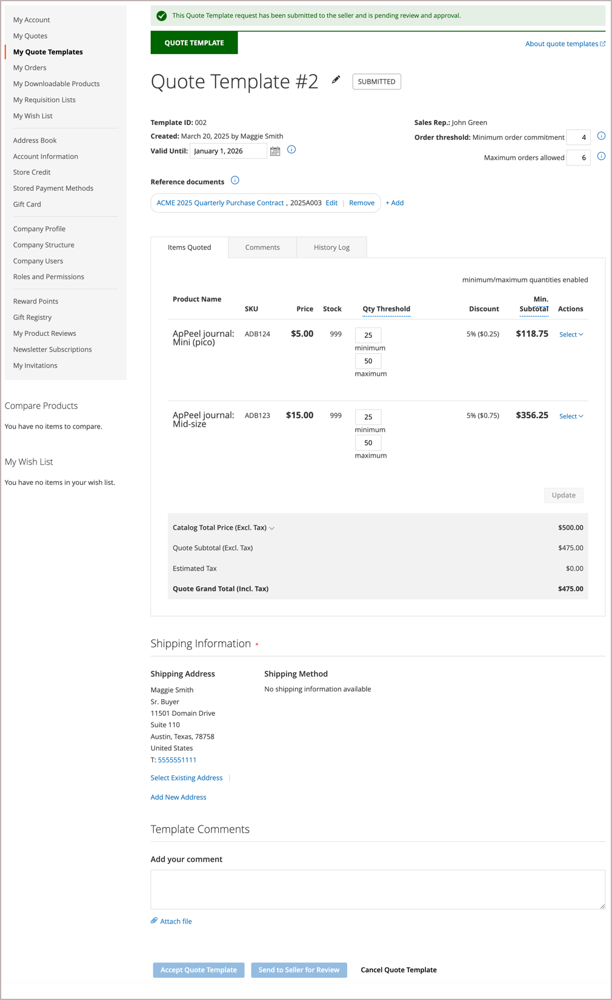

# [!UICONTROL My Quote Templates]

如果已啟用報價，客戶帳戶儀表板的&#x200B;_[!UICONTROL My Quotes Template]_區段會列出與客戶帳戶相關聯的所有報價範本。 視其許可權而定，只有代表公司進行採購的採購員才能請求報價範本，並協商重複產生訂單的報價定價與條款。

{width="700" zoomable="yes"}

報價範本清單會依狀態組織範本。

- **[!UICONTROL Active Quote Templates]**&#x200B;列出已交涉並核准使用的範本。 若這些選項是在議價處理期間設定的，則資訊會包含最小報價總計與下單。 採購員可以從範本產生連結的報價單，以根據報價單條款提交訂單。

- **[!UICONTROL In Review]**&#x200B;列出交涉程式中的範本，顯示目前狀態並提供開啟範本的連結。

- **[!UICONTROL Inactive]**&#x200B;列出已過期、已取消或因採購員已用完所允許的認可訂單數而不再有效的範本。

對於買方而言，*[!UICONTROL My Quotes Templates]*&#x200B;頁面是議價過程中買方與賣方之間所有通訊的焦點。

接受賣家所提供議定條款的買方可以接受範本，然後使用範本產生預先核准的連結報價單，以用來下訂單。

- 與管理報價範本相關的動作：

   - 取消範本
   - 傳送給賣家進行檢閱
   - 接受報價範本
   - 變更報價範本到期日
   - 新增送貨地址

- 在議價處理期間更新報價樣版明細的作業：

   - 複查料號訂價與更新。
   - 如果已設定報價範本的數量臨界值，請調整最小值和最大值。
   - 從[!UICONTROL Comments]和[!UICONTROL History]區段追蹤交涉程式。
   - 對於仍在複查的樣版，採購員可以移除料號來修改報價樣版。
   - 在條列專案與報價層級加入備註，與賣家溝通及協商。

  進行變更後，買方會將範本傳回給賣方進行稽核。

- 交涉期間的一般動作：

   - 將報價範本傳送給賣家以供檢閱
   - 接受報價範本
   - 取消以結束議價並關閉報價單

下列範例顯示買方已更新並傳回給賣方進行複查的報價範本。

{width="700" zoomable="yes"}

具有`Submitted`狀態的範本會被鎖定，直到賣家檢閱並更新範本並將它傳回給買家為止。

## 建立報價範本

採購員可以使用下列其中一種方法來開始報價樣版議價處理：

- 按一下&#x200B;**[!UICONTROL Create quote template]**&#x200B;動作，從現有報價建立範本。

- 從店面提交報價請求，並新增註解，要求銷售代表從報價請求建立報價範本。

## 檢視報價範本

1. 購買者登入其帳戶。

1. 在左側面板中選擇&#x200B;**[!UICONTROL My Quote Templates]**。

1. 在清單中尋找引號範本，然後按一下&#x200B;_[!UICONTROL Action]_欄中的&#x200B;**[!UICONTROL View]**。

## 新增送貨地址

採購員必須有出貨地址才能接受報價範本。

1. 購買者登入其帳戶。

1. 在左側面板中選擇&#x200B;**[!UICONTROL My Quote Templates]**。

1. 選取所需的報價範本。

1. 在&#x200B;**[!UICONTROL Shipping Information]**&#x200B;區段中，按一下&#x200B;**[!UICONTROL Add New Address]**。

1. 填寫新地址的詳細資料。

1. 按一下&#x200B;**[!UICONTROL Save Address]**。

買家新增地址後，就會將範本傳回賣家審查。 賣家提供送貨與交貨選項。 這些更新可能會影響議價報價的定價。 結帳時會鎖定送貨選項。

## 產生連結的報價

買家接受報價範本後，就可以使用&#x200B;**[!UICONTROL Generate a quote]**&#x200B;動作，從&#x200B;*[!UICONTROL My Quote Templates dashboard]*&#x200B;或報價範本中產生預先核准的連結報價。

連結的報價包含通知，表示已核准且已準備好結帳。 它也會在標題資訊中提供報價範本的連結。

{width="700" zoomable="yes"}

如果報價範本設定了訂單臨界值，則連結報價產生時，計數會增加。

採購員可以從連結的報價單完成下列動作：

- 如果報價已設定數量臨界值，請調整明細專案的訂單數量。
- 繼續結帳以提交訂單。
- 刪除或列印報價。
- 開啟用來產生報價的報價範本。

## 取消報價範本

從報價範本頁面，按一下&#x200B;**[!UICONTROL Cancel Quote Template]**。

報價範本已取消，且報價狀態變更為`Closed`。 已關閉的引號會保留在您的&#x200B;*[!UICONTROL Inactive]*&#x200B;引號清單中，並保留在Admin的&#x200B;_[!UICONTROL Quote Templates]_格線中。

