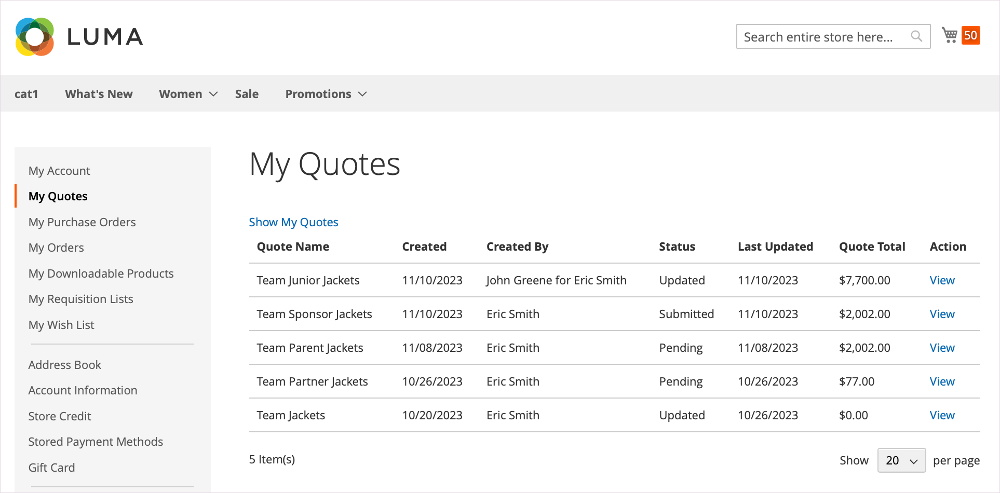

# [!UICONTROL My Quotes]

如果已啟用引號，則 _[!UICONTROL My Quotes]_客戶帳戶控制面板的區段會列出客戶提交的所有報價。 視其許可權而定，只有代表公司進行購買的購買者才能提交議價購買價格的要求。

{width="700" zoomable="yes"}

採購員開始處理的時間為 [提交請求](quote-request.md) 購物車的報價。 在交易期間，買賣雙方會交換電子郵件 [交涉程式](quote-price-negotiation.md). 對於購買者， [!UICONTROL My Quotes] 頁面是議價過程中買賣雙方所有通訊的焦點。 接受賣家議定價格的買家，可以直接從報價前往結帳頁面。 額外的折扣無法新增至議價的報價單。

採購員可在議價報價時完成下列作業：

* 複查料號訂價與更新
* 從追蹤交涉程式 [!UICONTROL Comments] 和 [!UICONTROL History] 區段
* 修改報價以移除專案
* 在條列專案與報價層級加入備註，與賣家溝通及協商
* 傳送報價給賣家以供稽核
* 如果條件可以接受，請將報價轉換為訂單
* 關閉報價
* 刪除報價
* [!BADGE 1.5.0 Beta版功能]{type=Informative url="/help/b2b/release-notes.md" tooltip="僅供測試版計畫參與者使用"}

下列範例顯示買方已更新報價單並傳回給賣家複查。

{width="700" zoomable="yes"}

引號與 `Updated` 狀態會鎖定，直到賣家傳回報價為止。

## 顯示引號

使用必要的 [其角色的許可權](account-company-roles-permissions.md)，與公司帳戶相關聯的客戶可檢視下列人員請求的報價單： [從屬使用者](account-company-structure.md). 公司管理員可檢視公司帳戶的所有報價。

1. 客戶登入店面的帳戶。

1. 點按次數 **[!UICONTROL My Quotes]** ，位於左側導覽器中。

1. 若要檢視已建立的所有引號，請按一下 **[!UICONTROL Show My Quotes]** 連結（僅針對公司管理員或具有從屬使用者的帳戶顯示）。

1. 若要檢視所有公司使用者的所有引號，請按一下 **[!UICONTROL Show All Quotes]**.

## 檢視報價

1. 客戶登入其帳戶。

1. 在左側面板中，選擇 **[!UICONTROL My Quotes]**.

1. 在清單中尋找引號，然後按一下 **[!UICONTROL View]** 在 _[!UICONTROL Action]_欄。

## 列印報價

1. 在右邊的未結引號中 _[!UICONTROL Items Quoted]_區段，客戶點按&#x200B;**[!UICONTROL Print]**.

1. 驗證 **[!UICONTROL Destination]** 作為印表機或PDF。

1. 點擊數 **[!UICONTROL Print]**.

## 取消報價請求

1. 在「專案報價」區段正上方的未結報價中，按一下 **[!UICONTROL Close quote]**.

   已取消請求，且報價狀態變更為 `Closed`. 已結束的報價會保留在您的報價清單中，並保留在 _[!UICONTROL Quotes]_從「管理員」中選取格線。

1. 若要從報價清單中移除已取消的報價，請按一下 **[!UICONTROL Delete]**.

1. 提示確認時，按一下 **[!UICONTROL OK]**.

   已結束的報價會從他們的報價清單中移除。 不過，它仍會列於 _[!UICONTROL Quotes]_在「管理員」中的格線，使用 `Closed` 狀態。

## 報價動作

| 動作 | 說明 |
|---------------|------------------------------------------------------------------------------------------------------------------------------------------------------------------------------------------------------------------------------|
| 重新命名 | [!BADGE 1.5.0 Beta版功能]{type=Informative url="/help/b2b/release-notes.md" tooltip="僅供測試版計畫參與者使用"} |
| 建立副本 | [!BADGE 1.5.0 Beta版功能]{type=Informative url="/help/b2b/release-notes.md" tooltip="僅供測試版計畫參與者使用"} |
| 關閉引號 | 當買家關閉報價後，報價單將無法重新開啟。 如果需要，購買者可以使用 [!UICONTROL Create Copy] 動作。 如果報價狀態為「 」，則此選項不可用 `Draft`. |
| 刪除報價 | 當採購員刪除報價單時，報價單會從系統中移除，並且不再可用。 |
| 列印 | 開啟列印表單，將報價儲存為PDF、檔案或列印至已設定的印表機。 |

## 欄說明

| 欄 | 說明 |
|-------------------------|-------------------------------------------------------------------------------------------------------------------------------------------------------------------------------------------------------------------------------------------------------------------------------------------------------------------------------------------------------------------------------------------------------------------------------------------------------------------------------------------------------------------------------------------------------------------------------------------------------------------------------------------------------------------------------------------------------------------------------------------------------------------------------------------------------------------------------------------------------------------------------------------------------------------------------------------------------------------------------------------------------------------------------------------------------------------------------------------------------------------------------------------------------------------------------------------------------------------------------------------------------------------------------------------------------------------------------------------------------------------------------------------------------------------------------------------------------------------------------------------------------------------------------------------------------------------------------------------------------------------------------------------------------------------------------------------------------------------------------------------------------------------------------------------------------------------------------------------------------------------------------------------------------------------------------------------------------------------------------------------------------------------------------------------------------------------------------------------------------------------------------------------------------------------------------------------------------------------------------------------------------------------------------------------------------------------------------------------------------------------------------------------------------------------------------------------------------------------------------------------------------------------------------------------|
| [!UICONTROL Quote Name] | 採購員指定給報價請求的名稱。 |
| [!UICONTROL Created] | 首次提交報價請求的日期。 |
| [!UICONTROL Created By] | 提交報價請求的買方名字與姓氏。 |
| [!UICONTROL Status] | 表示報價的狀態。 報價的狀態只能由買方或賣方執行動作來變更。  **[!UICONTROL Submitted]**— 賣家尚未開啟買家的報價請求。 在此狀態下，採購員仍可修改報價請求。 可用的動作： `View` / `Close` / `Edit Quantity` / `Delete SKU` / `Add Comments` / `Edit Shipping Address` **[!UICONTROL Pending]**  — 賣方已開啟請求，並正在稽核請求及準備回應。 可用的動作： `View` / `Close`  **[!UICONTROL Updated]**— 賣方已傳送回應給買方，且 _[!UICONTROL Proceed to Checkout]_按鈕已啟用。 在此狀態下，採購員可以繼續修改報價單。 可用的動作： `View` / `Send for Review` / `Proceed to Checkout` / `Delete Quote` / `Close` / `Edit Quantity` / `Delete SKU` / `Add comments` / `Edit Shipping Address` **[!UICONTROL Open]**— 採購員仍在更新報價單，而且_[!UICONTROL Proceed to Checkout]_ 按鈕已停用。 可用的動作： `View` / `Send for Review` / `Delete Quote` / `Edit quantity` / `Delete SKU` / `Add Comments` / `Edit Shipping Address`  **[!UICONTROL Ordered]**— 採購員已根據議定的報價提交訂單。 報價已鎖定，無法編輯。 可用動作：檢視 **[!UICONTROL Closed]**  — 採購員已結束交涉並取消報價單。 報價已鎖定，買方或賣方均無法編輯。 可用的動作： `View` / `Delete`  **[!UICONTROL Declined]**— 賣家已拒絕報價請求，或在洽談過程中提出變更建議。 可在工作流程的任何階段拒絕報價。 任何自訂訂訂訂價都會從報價中移除。 採購員可以繼續編輯報價單並重新提交，或以標準型錄價格進行採購。 可用的動作： `View` / `Send for Review` / `Delete Quote` / `Edit Quantity` / `Delete SKU` / `Add Comments` / `Edit Shipping Address` **[!UICONTROL Expired]**  — 報價的期限已過。 任何建議的價格都會重設。 採購員可以依據標準型錄價格完成採購，也可以啟動另一輪議價。 可用的動作： `View` / `Send for Review` / `Delete Quote` / `Edit Quantity` / `Delete SKU` / `Add Comments` / `Edit Shipping Address` |

{style="table-layout:auto"}
