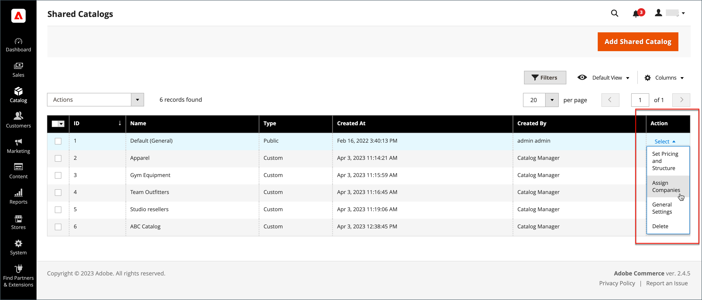

# 將公司指派至共用目錄

有兩種方式可將公司指派至共用目錄。 您可以從&#x200B;_[!UICONTROL Shared Catalogs]_&#x200B;網格進行指派，或編輯公司並指派共用目錄，就像選擇客戶群組一樣。

{width="700" zoomable="yes"}

## 方法1：從共用目錄指派公司

1. 在&#x200B;_管理員_&#x200B;側邊欄上，移至&#x200B;**[!UICONTROL Catalog]** > **[!UICONTROL Shared Catalogs]**。

1. 對於網格中要指派公司的共用目錄，請移至「**[!UICONTROL Action]**」欄，然後選取「**[!UICONTROL Assign Companies]**」。

   可用的公司清單會顯示在網格中。

1. 選取您要指派給共用目錄的公司，按一下&#x200B;**[!UICONTROL Actions]**&#x200B;功能表，然後選擇&#x200B;**[!UICONTROL Assign Catalog]**。

   {width="700" zoomable="yes"}

   或者，您可以按一下&#x200B;**[!UICONTROL Action]**&#x200B;欄中的&#x200B;**[!UICONTROL Assign]**，檢視未指派給目錄的任何公司。

1. 對您要指派給共用目錄的每個公司重複此動作。

   公司會指派至共用目錄。

1. 完成時，按一下&#x200B;**[!UICONTROL Save]**。

## 方法2：編輯公司

1. 在&#x200B;_管理員_&#x200B;側邊欄上，移至&#x200B;**[!UICONTROL Customers]** > **[!UICONTROL Companies]**。

1. 對於顯示在網格中的公司，請移至&#x200B;**[!UICONTROL Action]**&#x200B;欄，然後按一下&#x200B;**[!UICONTROL Edit]**。

   {width="700" zoomable="yes"}

1. 在公司頁面上，向下捲動並展開 **[!UICONTROL Advanced Settings]**&#x200B;區段。

1. 將&#x200B;**[!UICONTROL Customer Group]**&#x200B;設定為適當的共用目錄。

   變更共用目錄指定也會變更所有公司成員的客戶群組指定。

   {width="600"}

1. 提示確認時，按一下&#x200B;**[!UICONTROL Proceed]**，然後再按&#x200B;**[!UICONTROL Save]**。
