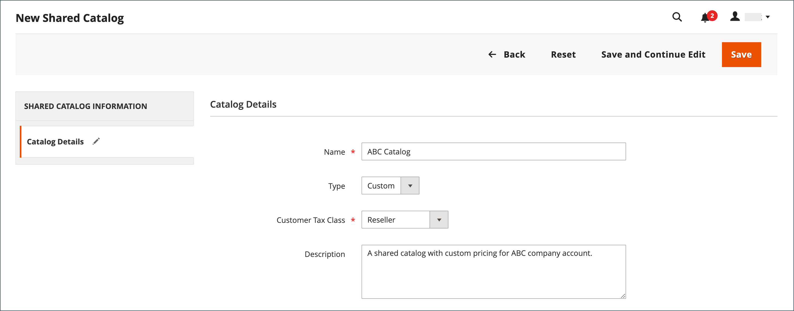

# 建立共用目錄

建立[共用目錄](catalog-shared.md)時，系統會自動建立具有相同名稱的[客戶群組](account-company-customer-group.md)。 例如，如果您建立名為&#x200B;_ABC目錄_&#x200B;的共用目錄，系統也會建立對應的&#x200B;_ABC目錄_&#x200B;客戶群組。 將公司指派給共用的自訂目錄，基本上與將公司指派給客戶群組相同。

新的共用目錄不包含產品、自訂定價或公司關聯。 公用目錄（在啟用共用目錄時建立的預設共用目錄）會自動指派給來賓，以及未與公司關聯的客戶。

{width="700" zoomable="yes"}

必須先設定共用目錄的下列方面，才能使用：

- 目錄範圍
- 產品選擇
- 自訂價格
- 公司指派

## 價格範圍

如果您安裝的是多站台，在建立共用目錄之前，請務必設定價格範圍。 [價格範圍](../catalog/catalog-price-scope.md)可以設為`Global`或`Website`。 不過，只能在設定程式開始時進行設定。 網站選擇器會出現在[共用目錄設定](catalog-shared-pricing-structure.md)的步驟2中。

{width="600" zoomable="yes"}

1. 在&#x200B;_管理員_&#x200B;側邊欄上，移至&#x200B;**[!UICONTROL Stores]** > _[!UICONTROL Settings]_>**[!UICONTROL Configuration]**。

1. 在左側面板中，展開&#x200B;**目錄**&#x200B;並在下方選擇&#x200B;**目錄**。

1. 展開&#x200B;**價格**&#x200B;區段的。

1. 將&#x200B;**目錄價格範圍**&#x200B;設定為`Website`。

   {width="600" zoomable="yes"}

1. 按一下&#x200B;**[!UICONTROL Save Config]**。

## 步驟1：建立共用目錄

建立共用目錄的方法有兩種。 您可以建立任一型別的共用目錄，或複製現有的共用目錄。 新的共用目錄未包含任何產品，且尚未指派給公司。

### 方法1：新增共用目錄

1. 在&#x200B;_管理員_&#x200B;側邊欄上，移至&#x200B;**[!UICONTROL Catalog]** > **[!UICONTROL Shared Catalogs]**。

1. 按一下右上角的&#x200B;**[!UICONTROL Add Shared Catalog]**&#x200B;並執行下列動作：

   - 輸入共用目錄的&#x200B;**[!UICONTROL Name]**。

     您指派的名稱會在整個「管理員」和「客戶」控制面板中使用（如果適用），以參考共用目錄。 它也會變成對應客戶群組的名稱。

   - 選取&#x200B;**[!UICONTROL Type]** ： `Custom`或`Public`。

   - 選擇適用於從共用目錄進行購買的適當&#x200B;**[!UICONTROL Customer Tax Class]**。

     如需稅捐類別設定與定義的詳細資訊，請參閱[稅捐類別](../stores-purchase/tax-class.md)。

     下列範例顯示特定批發客戶的新自訂目錄。

     {width="600" zoomable="yes"}

   - 輸入&#x200B;**[!UICONTROL Description]**

1. 完成時，按一下&#x200B;**[!UICONTROL Save]**。

   新目錄會出現在&#x200B;_[!UICONTROL Shared Catalogs]_&#x200B;格線中。

### 方法2：複製現有的共用目錄

重複的自訂型錄會保留原始的訂價模式與結構，但不會保留公司關聯。 也會以與重複目錄相同的名稱建立對應的客戶群組。 依照預設，重複的目錄為原始目錄的&#x200B;_重複_。

如果公用共用目錄重複，則重複的目錄型別會變更為`custom`。

1. 在&#x200B;_管理員_&#x200B;側邊欄上，移至&#x200B;**[!UICONTROL Catalog]** > **[!UICONTROL Shared Catalogs]**。

1. 對於網格中您要複製的共用目錄，請移至&#x200B;**[!UICONTROL Action]**&#x200B;欄並選取&#x200B;**[!UICONTROL General Settings]**。

1. 在頁面頂端的選項中，按一下&#x200B;**[!UICONTROL Duplicate]**。

   {width="600" zoomable="yes"}

1. 更新新目錄的下列欄位：

   - **[!UICONTROL Name]**
   - **[!UICONTROL Type]**
   - **[!UICONTROL Customer Tax Class]**
   - **[!UICONTROL Description]**

1. 完成時，按一下&#x200B;**[!UICONTROL Save]**。

   重複專案出現在&#x200B;_[!UICONTROL Shared Catalogs]_&#x200B;格線中，並具有唯一識別碼。

## 步驟2：完成設定

建立新的共用目錄後，必須設定適當的產品選擇、[公司指派](catalog-shared-assign-companies.md)和[類別許可權](../catalog/category-permissions.md)。 若要繼續，請參閱[設定價格與結構](catalog-shared-pricing-structure.md)。

>[!NOTE]
>
>**[B2B 1.3.0](release-notes.md#b2b-v130)和更新版本** — 當您建立共用目錄時，針對在目錄許可權設定中指派此存取權的客戶群組，目錄的每個[類別許可權](../catalog/category-permissions.md)都設為&#x200B;_[!UICONTROL Allow for the Display Product Prices]_&#x200B;和&#x200B;_[!UICONTROL Add to Cart]_。 以前，即使目錄許可權設為`Allow`，這些設定也會自動設為`Deny`。

## 共用目錄示範

若要觀看共用目錄管理的示範，請觀看此影片：

>[!VIDEO](https://video.tv.adobe.com/v/344446?quality=12&learn=on)

## 共用目錄頁面參考

### 按鈕列

| 按鈕 | 說明 |
|--- |--- |
| [!UICONTROL Back] | 返回「共用目錄」頁面而不儲存新的共用目錄。 |
| [!UICONTROL Reset] | 清除任何未儲存變更的形式，並還原原始目錄詳細資訊。 |
| [!UICONTROL Save and Continue Edit] | 儲存所有變更，並保持表單在編輯模式中開啟。 |
| [!UICONTROL Save] | 儲存變更、關閉表單，然後返回「共用目錄」頁面。 |

{style="table-layout:auto"}

### 目錄詳細資訊

| 欄位 | 說明 |
|--- |--- |
| [!UICONTROL Name] | 在整個管理員以及可用目錄的客戶帳戶中識別共用目錄。 目錄名稱應為描述性的，且長度不得超過32個字元。 您無法擁有兩個名稱相同的共用目錄。 字元數上限： 32 |
| [!UICONTROL Type] | **[!UICONTROL Custom]** — 識別具有自訂定價的目錄，該目錄僅供指派給該目錄的特定公司使用。 **[!UICONTROL Public]**— 識別可供所有來賓訪客及與公司無關之登入客戶使用的共用目錄。 安裝[!DNL Adobe Commerce B2B]時會建立預設的公用共用目錄，但必須由存放區管理員設定。 一次只能有一個公用共用目錄。 |
| [!UICONTROL Customer Tax Class] | 決定從型錄採購時所使用的稅捐類別。 這些選項包含所有可用的稅捐類別。 |
| [!UICONTROL Description] | 如何使用目錄的簡短說明。 |

{style="table-layout:auto"}

### 格線欄

| 欄位 | 說明 |
|--- |--- |
| [!UICONTROL ID] | 指派給共用目錄實體的唯一數值識別碼。 |
| [!UICONTROL Name] | 共用目錄的名稱。 |
| [!UICONTROL Type] | 指示共用目錄的型別。 可以是`Public`或`Custom`。 |
| [!UICONTROL Created At] | 在系統中建立共用目錄的日期。 |
| [!UICONTROL Created By] | 建立共用目錄之管理員使用者的名稱。 |
| [!UICONTROL Action] | 動作清單。 選項： `Set Pricing and Structure`、`Assign Companies`、`General Settings`、`Delete`。 |

{style="table-layout:auto"}
