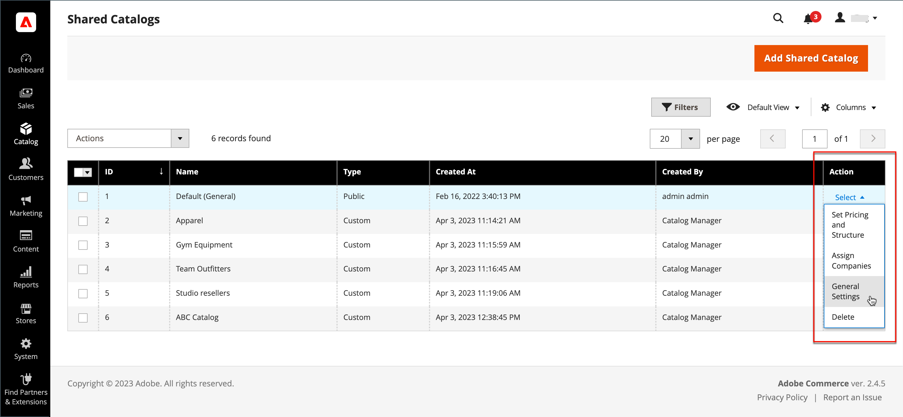

# 管理您的共用目錄

此 _[!UICONTROL Shared Catalogs]_頁面可讓您存取管理共用目錄所需的工具。 此頁面類似於標準管理員工作區，具有篩選器和動作控制項。 網格會列出所有共用目錄，包括預設的公用共用目錄，以及您設定的所有自訂目錄。

## 更新產品選擇

任何共用目錄中的產品選擇都可透過以下頁面輕鬆更新： _[!UICONTROL Action]_共用目錄格線的欄。 您所做的變更對任何關聯公司帳戶的成員可見。 此程式基本上與為新選擇產品相同 [目錄結構](catalog-shared-pricing-structure.md)，但無法變更設定的範圍。

1. 在 _管理員_ 側欄，前往 **[!UICONTROL Catalog]** > **[!UICONTROL Shared Catalogs]**.

1. 對於格線中的共用目錄，請移至 **[!UICONTROL Action]** 欄並選取 **[!UICONTROL Set Pricing and Structure]**.

   {width="700" zoomable="yes"}

1. 請依照中的指示操作 [步驟2：選擇產品](catalog-shared-pricing-structure.md#step-2-choose-the-products).

   您可以略過第一個專案，因為共用目錄第一次儲存後就無法變更其範圍。

如果您使用特定產品，則 _[!UICONTROL Products In Shared Catalog]_區段會列出產品可用的每個共用目錄。 若要深入瞭解，請參閱 [將產品新增至共用目錄](catalog-shared-product-add.md).

{width="600" zoomable="yes"}

## 更新自訂定價

任何共用目錄中的產品自訂定價，都可以從「共用目錄」網格的「動作」欄中輕鬆更新。 您所做的變更會在店面中向關聯公司或客戶群組的成員顯示。 此程式基本上與設定新產品的自訂定價相同 [共用目錄](catalog-shared-pricing-structure.md)，但無法變更設定的範圍。

1. 在 _管理員_ 側欄，前往 **[!UICONTROL Catalog]** > **[!UICONTROL Shared Catalogs]**.

1. 對於網格中要更新的共用目錄，請移至 **[!UICONTROL Action]** 欄並選取 **[!UICONTROL Set Pricing and Structure]**.

1. 在 _[!UICONTROL Catalog Structure]_頁面，按一下&#x200B;**[!UICONTROL Configure]**並執行下列任一項作業：

   - 在頁面頂端的進度指示器中，按一下 **[!UICONTROL Pricing]**.
   - 在右上角，按一下 **[!UICONTROL Next]**.

1. 請依照中的指示操作 [步驟3：設定自訂價格](catalog-shared-pricing-structure.md#step-3-set-custom-prices).

## 更新類別許可權

[類別許可權](../catalog/category-permissions.md) 會自動設為 `Allow` 適用於從類別樹狀結構新增至共用目錄的產品。 您稍後可視需要調整許可權或建立其他規則。

>[!NOTE]
>
>**[B2B版本1.3.0](release-notes.md#b2b-v130) 及更新版本**  — 建立共用目錄時，每一個 [類別許可權](../catalog/category-permissions.md) 目錄的「 」設為 `Allow` 針對 _[!UICONTROL Display Product Prices]_和_[!UICONTROL Add to Cart]_ 適用於在目錄許可權設定中指派此存取權的客戶群組。 之前，這些設定會自動設為 `Deny` 即使目錄許可權設定為 `Allow`.

>[!IMPORTANT]
>
>所有現有 [群組許可權設定](../configuration-reference/catalog/catalog.md#category-permissions) 被忽略 **_全部_** 目錄中的類別，當 **_[!UICONTROL Shared Catalog]_** 功能已啟用。 [!UICONTROL Shared Catalog] 完全控制啟用目錄時目錄中的所有類別許可權。

1. 在 _管理員_ 側欄，前往 **[!UICONTROL Catalog]** > **[!UICONTROL Categories]**.

1. 在類別樹狀結構中，選取您要更新的產品類別。

   若要包含所有產品，請選取樹狀結構中的最上層類別。

1. 向下捲動並展開  此 **[!UICONTROL Category Permissions]** 區段。

1. 按一下 **[!UICONTROL New Permission]** 並執行下列動作：

   {width="600" zoomable="yes"}

   - 選擇 **[!UICONTROL Customer Group]** 共用目錄的相關資訊，並視需要變更許可權設定。

     {width="600" zoomable="yes"}

   - 若要為其他客戶群組建立許可權規則，請按一下 **[!UICONTROL New Permissions]** 並重複此程式。

   - 若要刪除許可權規則，請按一下 _刪除_  圖示。

1. 完成後，按一下 **[!UICONTROL Save]**.

## 更新目錄詳細資訊

任何共用目錄的詳細資訊都可以從「共用目錄」網格的「動作」欄中輕鬆更新。 您所做的變更會反映在任何相關聯的公司帳戶中。

{width="700" zoomable="yes"}

1. 在 _管理員_ 側欄，前往 **[!UICONTROL Catalog]** > **[!UICONTROL Shared Catalogs]**.

1. 對於您要更新的共用目錄，請移至 **[!UICONTROL Action]** 欄並選取 **[!UICONTROL General Settings]**.

   {width="600" zoomable="yes"}

1. 視需要更新目錄詳細資訊。

   - 變更共用目錄的名稱，也會變更對應客戶群組的名稱。
   - 變更目錄型別 `Custom` 至 `Public` 將現有的公用目錄轉換為自訂目錄。 與原始公用型錄關聯的任何公司都會重新指派給取代者。 公用目錄無法轉換為自訂目錄。

1. 完成後，按一下 **[!UICONTROL Save]**.

## 共用目錄頁面參考

### 按鈕列

| 按鈕 | 說明 |
|--- |--- |
| [!UICONTROL Back] | 返回「共用目錄」頁面而不儲存新的共用目錄。 |
| [!UICONTROL Delete] | 刪除目錄，並將任何關聯公司及其成員重新指派給公用共用目錄。 |
| [!UICONTROL Reset] | 清除任何未儲存變更的形式，並還原原始目錄詳細資訊。 |
| [!UICONTROL Duplicate] | 建立 [目錄復本](catalog-shared-create.md). 對於自訂型錄，原始的訂價模型與結構，但不包含公司關聯。 如果公用共用目錄重複，則複製的目錄型別會變更為 `custom`. 也會以與重複目錄相同的名稱建立對應的客戶群組。 依預設，會將重複的目錄命名為 _重複：_ 原始目錄。 |
| [!UICONTROL Save and Continue Edit] | 儲存所有變更，並保持表單在編輯模式中開啟。 |
| [!UICONTROL Save] | 儲存變更、關閉表單，然後返回「共用目錄」頁面。 |

{style="table-layout:auto"}

### 目錄詳細資訊

| 欄位 | 說明 |
|--- |--- |
| [!UICONTROL Name] | 在整個管理員以及可用目錄的客戶帳戶中識別共用目錄。 目錄名稱應為描述性的，且長度不得超過32個字元。 您無法擁有兩個名稱相同的共用目錄。 字元數上限： 32 |
| [!UICONTROL Type] | **[!UICONTROL Custom]**  — 識別具有自訂定價的目錄，該目錄僅供指派給該目錄的特定公司使用。 **[!UICONTROL Public]**— 識別可供所有訪客使用的共用目錄，以及可供與公司無關聯的登入客戶使用。 安裝Adobe Commerce B2B時會建立「預設」公用共用目錄，但必須由管理員設定。 一次只能有一個公用共用目錄。 |
| [!UICONTROL Customer Tax Class] | 決定從型錄採購時所使用的稅捐類別。 這些選項包含所有可用的稅捐類別。 |
| [!UICONTROL Description] | 如何使用目錄的簡短說明。 |

{style="table-layout:auto"}
