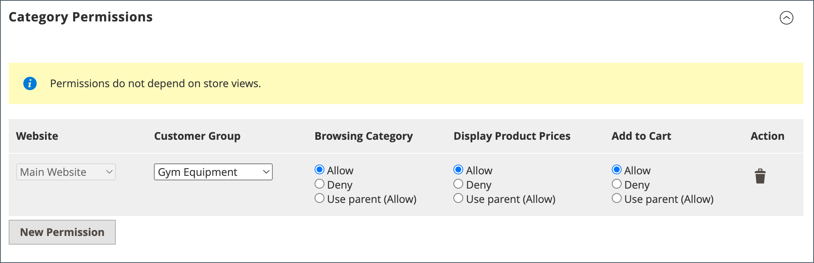
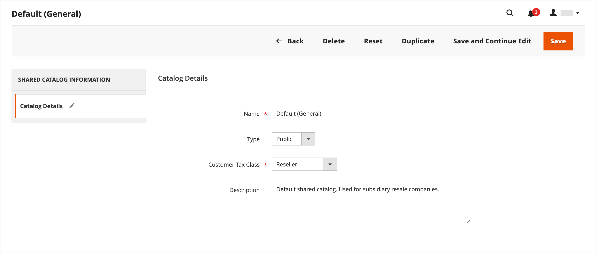

# 管理您的共用目錄

_[!UICONTROL Shared Catalogs]_&#x200B;頁面提供管理共用目錄所需工具的存取權。 此頁面類似於標準管理員工作區，具有篩選器和動作控制項。 網格會列出所有共用目錄，包括預設的公用共用目錄，以及您設定的所有自訂目錄。

## 更新產品選擇

任何共用目錄中的產品選取可以輕易地從共用目錄格線的&#x200B;_[!UICONTROL Action]_&#x200B;欄更新。 您所做的變更對任何關聯公司帳戶的成員可見。 此程式基本上與選擇新[目錄結構](catalog-shared-pricing-structure.md)的產品相同，只是無法變更組態範圍。

1. 在&#x200B;_管理員_&#x200B;側邊欄上，移至&#x200B;**[!UICONTROL Catalog]** > **[!UICONTROL Shared Catalogs]**。

1. 對於網格中的共用目錄，請移至&#x200B;**[!UICONTROL Action]**&#x200B;欄並選取&#x200B;**[!UICONTROL Set Pricing and Structure]**。

   {width="700" zoomable="yes"}

1. 依照[步驟2：選擇產品](catalog-shared-pricing-structure.md#step-2-choose-the-products)中的指示進行。

   您可以略過第一個專案，因為共用目錄第一次儲存後就無法變更其範圍。

如果您使用特定產品，_[!UICONTROL Products In Shared Catalog]_&#x200B;區段會列出該產品可用的每個共用目錄。 若要深入瞭解，請參閱[將產品新增至共用目錄](catalog-shared-product-add.md)。

{width="600" zoomable="yes"}

## 更新自訂定價

任何共用目錄中的產品自訂定價，都可以從「共用目錄」網格的「動作」欄中輕鬆更新。 您所做的變更會在店面中向關聯公司或客戶群組的成員顯示。 此程式基本上與設定新[共用目錄](catalog-shared-pricing-structure.md)的自訂訂訂價相同，只是無法變更設定的範圍。

1. 在&#x200B;_管理員_&#x200B;側邊欄上，移至&#x200B;**[!UICONTROL Catalog]** > **[!UICONTROL Shared Catalogs]**。

1. 對於網格中您要更新的共用目錄，請移至&#x200B;**[!UICONTROL Action]**&#x200B;欄並選取&#x200B;**[!UICONTROL Set Pricing and Structure]**。

1. 在&#x200B;_[!UICONTROL Catalog Structure]_&#x200B;頁面上，按一下&#x200B;**[!UICONTROL Configure]**&#x200B;並執行下列任一項作業：

   - 在頁面頂端的進度指示器中，按一下&#x200B;**[!UICONTROL Pricing]**。
   - 按一下右上角的&#x200B;**[!UICONTROL Next]**。

1. 遵循[步驟3：設定自訂價格](catalog-shared-pricing-structure.md#step-3-set-custom-prices)中的指示。

## 更新類別許可權

從類別樹狀結構新增至共用目錄的產品的[類別許可權](../catalog/category-permissions.md)會自動設為`Allow`。 您稍後可視需要調整許可權或建立其他規則。

>[!NOTE]
>
>**[B2B 1.3.0](release-notes.md#b2b-v130)和更新版本** — 當您建立共用目錄時，針對在目錄許可權設定中指派此存取權的客戶群組，_[!UICONTROL Display Product Prices]_&#x200B;的每個[類別許可權](../catalog/category-permissions.md)以及&#x200B;_[!UICONTROL Add to Cart]_&#x200B;都設定為`Allow`。 以前，即使目錄許可權設為`Allow`，這些設定也會自動設為`Deny`。

>[!IMPORTANT]
>
>啟用&#x200B;**_[!UICONTROL Shared Catalog]_**&#x200B;功能時，目錄中的&#x200B;**_所有_**&#x200B;類別會忽略所有現有的[群組許可權設定](../configuration-reference/catalog/catalog.md#category-permissions)。 [!UICONTROL Shared Catalog]在啟用時可完全控制目錄中的所有類別許可權。

1. 在&#x200B;_管理員_&#x200B;側邊欄上，移至&#x200B;**[!UICONTROL Catalog]** > **[!UICONTROL Categories]**。

1. 在類別樹狀結構中，選取您要更新的產品類別。

   若要包含所有產品，請選取樹狀結構中的最上層類別。

1. 向下捲動並展開 **[!UICONTROL Category Permissions]**&#x200B;區段。

1. 按一下&#x200B;**[!UICONTROL New Permission]**&#x200B;並執行下列動作：

   {width="600" zoomable="yes"}

   - 選擇與共用目錄相對應的&#x200B;**[!UICONTROL Customer Group]**，並視需要變更許可權設定。

     {width="600" zoomable="yes"}

   - 若要為其他客戶群組建立許可權規則，請按一下「**[!UICONTROL New Permissions]**」並重複此程式。

   - 若要刪除許可權規則，請按一下&#x200B;_刪除_ 圖示。

1. 完成時，按一下&#x200B;**[!UICONTROL Save]**。

## 更新目錄詳細資訊

任何共用目錄的詳細資訊都可以從「共用目錄」網格的「動作」欄中輕鬆更新。 您所做的變更會反映在任何相關聯的公司帳戶中。

{width="700" zoomable="yes"}

1. 在&#x200B;_管理員_&#x200B;側邊欄上，移至&#x200B;**[!UICONTROL Catalog]** > **[!UICONTROL Shared Catalogs]**。

1. 針對您要更新的共用目錄，請移至&#x200B;**[!UICONTROL Action]**&#x200B;欄並選取&#x200B;**[!UICONTROL General Settings]**。

   {width="600" zoomable="yes"}

1. 視需要更新目錄詳細資訊。

   - 變更共用目錄的名稱，也會變更對應客戶群組的名稱。
   - 將目錄型別從`Custom`變更為`Public`會將現有的公用目錄轉換為自訂目錄。 與原始公用型錄關聯的任何公司都會重新指派給取代者。 公用目錄無法轉換為自訂目錄。

1. 完成時，按一下&#x200B;**[!UICONTROL Save]**。

## 共用目錄頁面參考

### 按鈕列

| 按鈕 | 說明 |
|--- |--- |
| [!UICONTROL Back] | 返回「共用目錄」頁面而不儲存新的共用目錄。 |
| [!UICONTROL Delete] | 刪除目錄，並將任何關聯公司及其成員重新指派給公用共用目錄。 |
| [!UICONTROL Reset] | 清除任何未儲存變更的形式，並還原原始目錄詳細資訊。 |
| [!UICONTROL Duplicate] | 建立目錄[&#128279;](catalog-shared-create.md)的重複復本。 對於自訂型錄，原始的訂價模型與結構，但不包含公司關聯。 如果公用共用目錄重複，則重複的目錄型別會變更為`custom`。 也會以與重複目錄相同的名稱建立對應的客戶群組。 依照預設，重複的目錄為原始目錄的&#x200B;_重複_。 |
| [!UICONTROL Save and Continue Edit] | 儲存所有變更，並保持表單在編輯模式中開啟。 |
| [!UICONTROL Save] | 儲存變更、關閉表單，然後返回「共用目錄」頁面。 |

{style="table-layout:auto"}

### 目錄詳細資訊

| 欄位 | 說明 |
|--- |--- |
| [!UICONTROL Name] | 在整個管理員以及可用目錄的客戶帳戶中識別共用目錄。 目錄名稱應為描述性的，且長度不得超過32個字元。 您無法擁有兩個名稱相同的共用目錄。 字元數上限： 32 |
| [!UICONTROL Type] | **[!UICONTROL Custom]** — 識別具有自訂定價的目錄，該目錄僅供指派給該目錄的特定公司使用。 **[!UICONTROL Public]**— 識別可供所有來賓訪客及與公司無關之登入客戶使用的共用目錄。 安裝Adobe Commerce B2B時會建立「預設」公用共用目錄，但必須由管理員設定。 一次只能有一個公用共用目錄。 |
| [!UICONTROL Customer Tax Class] | 決定從型錄採購時所使用的稅捐類別。 這些選項包含所有可用的稅捐類別。 |
| [!UICONTROL Description] | 如何使用目錄的簡短說明。 |

{style="table-layout:auto"}
