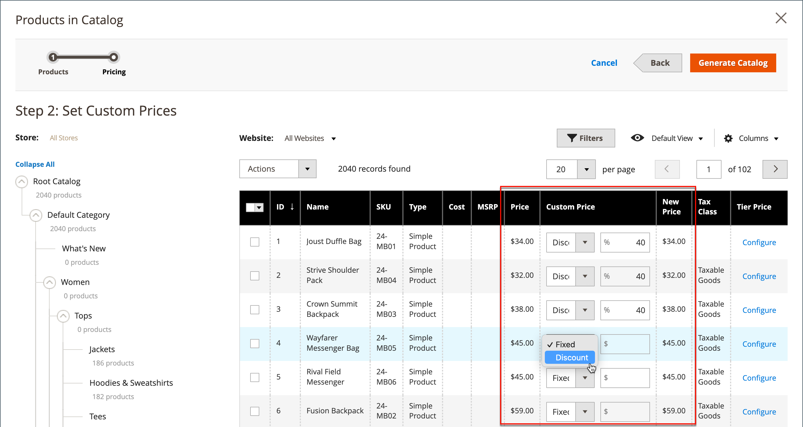
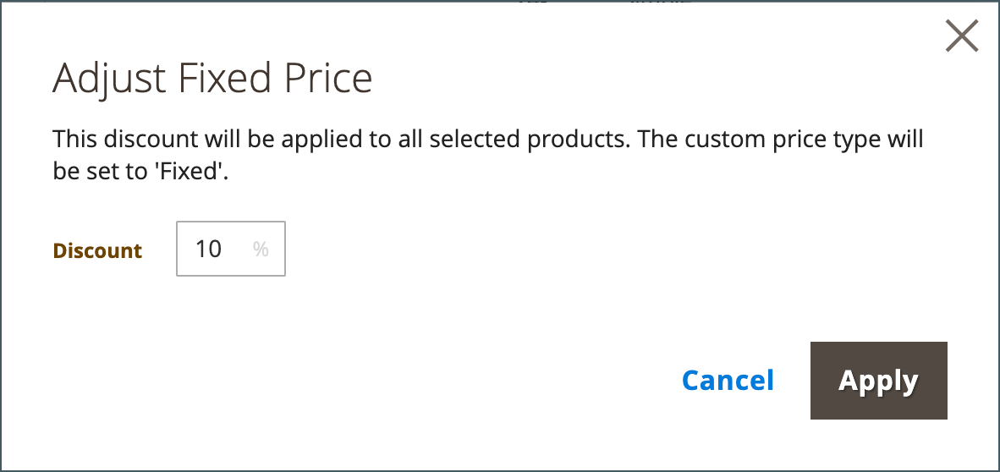
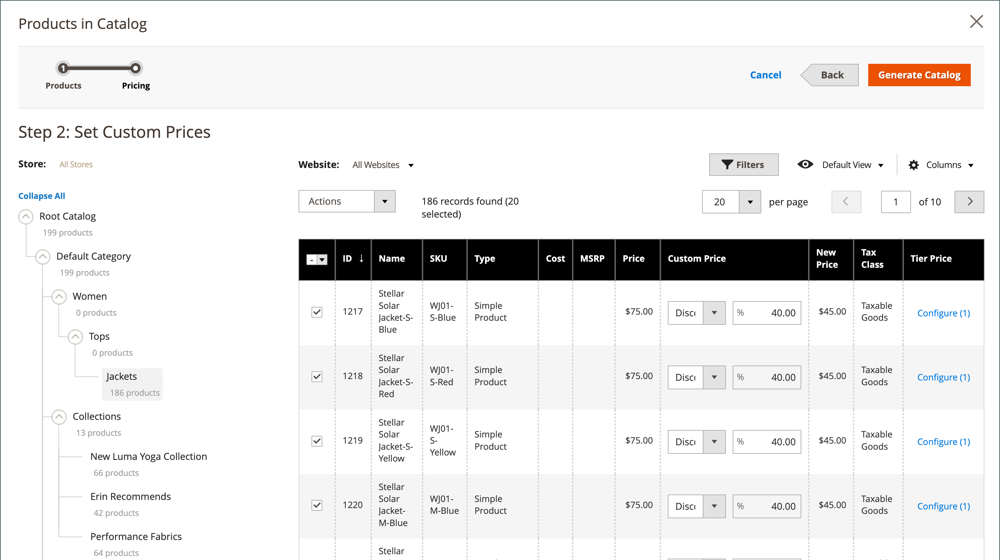

# 設定共用目錄定價與結構

設定共用型錄的定價與結構有兩個步驟。 您在程式中的目前位置會在頁面頂端的進度列中顯示一個數字。 您可以隨時按一下進度列來檢視程式中的其他步驟。 例如，如果您正在處理自訂定價，您可能想要返回產品選擇頁面以供參考。 只要按一下頁面頂端進度列中的&#x200B;**[!UICONTROL Products]**，然後按一下&#x200B;**[!UICONTROL Pricing]**&#x200B;以返回自訂訂訂價頁面。 您的工作在此過程中不會遺失。

目錄](./assets/shared-catalog-products-workspace.png){width="700" zoomable="yes"}中的。

## 步驟1：開啟共用型錄訂價與結構組態

1. 在&#x200B;_管理員_&#x200B;側邊欄上，移至&#x200B;**[!UICONTROL Catalog]** > **[!UICONTROL Shared Catalogs]**

1. 對於網格中的共用目錄，請移至&#x200B;_[!UICONTROL Action]_欄並按一下&#x200B;**[!UICONTROL Set Pricing and Structure]**。

   {width="700" zoomable="yes"}

1. 第一次設定共用目錄時，請按一下&#x200B;**[!UICONTROL Configure]**&#x200B;繼續下列步驟。

## 步驟2：選擇產品

此程式的第一個步驟是選擇要包含在共用目錄中的產品。 產品選擇頁面在左側顯示[類別樹狀結構](../catalog/category-create.md)，在右側顯示同步的產品格線。 如果按一下樹狀結構中的類別，該類別中的產品會出現在格線中。

從店面檢視共用目錄時，[頂端導覽](../catalog/navigation-top.md)中只會顯示具有選取產品的類別。 依預設，只有前三個類別層級會包含在店面導覽中，不包括根類別。

1. 使用&#x200B;**存放區**&#x200B;選擇器設定組態的[範圍](../catalog/introduction.md#product-scope)。

   只有在第一次儲存共用目錄之前，才能設定設定的範圍。 如果您稍後編輯產品選擇，將無法使用「商店」選擇器。

   {width="600" zoomable="yes"}

1. 在類別樹狀結構中，執行下列任一項作業：

   - 若要包含所有產品，請按一下&#x200B;**[!UICONTROL Select all]**&#x200B;或選取父類別的核取方塊。
   - 若要包含特定類別的產品，請選取您要包含的每個類別的核取方塊。
   - 若要包含或排除個別產品，請選取或取消選取產品的核取方塊。

   樹狀結構中每個類別下方的標籤法會顯示目前包含在共用目錄中的類別產品數量。 [根類別](../catalog/category-root.md)下方的標籤法會顯示目前為共用目錄選取之所有類別的產品總數。

1. 若要檢視格線中的類別產品，請按一下樹狀結構中的類別名稱。 選取類別時，會發生下列情況：

   - 格線第一欄的切換設定為每個所選產品的綠色&#x200B;_On_&#x200B;位置。
   - 如果將產品指派給多個類別，且未在其中選取產品，則該產品仍可透過其他類別使用，在使用[目錄搜尋](../catalog/search.md)時也可使用。
   - 系統會自動為選取的產品將[類別許可權](../catalog/category-permissions.md)設定為`Allow`。

1. 如有必要，請使用篩選條件和其他格線控制項來尋找要包含在共用目錄中的產品。

   您可以按一下第一欄中的切換，個別選取或省略個別產品。

   如果您選取的類別沒有產品，但連結至CMS內容或外部連結，則會顯示在店面的頂端導覽區域中。

   在儲存組態之前，您所做的類別設定不會永久記錄在資料庫中。 不過，當您處理結構和定價時，它們會暫時儲存。

1. 按一下&#x200B;**[!UICONTROL Next]**。

   {width="600" zoomable="yes"}的產品

## 步驟3：設定自訂價格

您可以個別設定每個產品的自訂價格，或使用&#x200B;_[!UICONTROL Action]_控制項將自訂價格設定為多個產品記錄的固定金額或百分比。

- **[!UICONTROL Fixed]**：指定最終產品價格。 例如，如果您輸入$10.00的固定價格，則對應公司的店面價格為$10.00。

  >[!NOTE]
  >
  >「基本價格」與輸入的「固定」值之間的最小值會用作最終產品價格。

  >[!NOTE]
  >
  >**_固定價格_**&#x200B;產品可自訂選項&#x200B;_不_&#x200B;受群組價格、層級價格、特殊價格或目錄價格規則影響。

- **[!UICONTROL Percentage]**：根據折扣百分比決定自訂價格。 例如，若要提供10%的折扣，請將自訂價格型別設定為`Percentage`並輸入`10`。 折扣的自訂價格是原始產品價格的90%。

若要針對下列產品型別將折扣設定為固定金額或百分比，請在格線中使用&#x200B;_[!UICONTROL Custom Price]_欄：

- [簡單](../catalog/product-create-simple.md) （包括可設定的產品變化）
- [組合](../catalog/product-create-bundle.md)
- [可下載](../catalog/product-create-downloadable.md)
- [虛擬](../catalog/product-create-virtual.md)

對於[可設定](../catalog/product-create-configurable.md)和[已分組](../catalog/product-create-grouped.md)的產品型別，以及[禮品卡](../catalog/product-gift-card-create.md)，自訂價格欄是空白的。

無法從&#x200B;_自訂價格_&#x200B;頁面變更網格中的產品選擇。 不過，您可以使用頁面頂端的進度指示器來返回上一個步驟，並變更產品選擇。

{width="600" zoomable="yes"}的產品

### 套用自訂價格

1. 若為多網站安裝，請將&#x200B;**[!UICONTROL Website]**&#x200B;設定為套用自訂價格的網站。

   {width="600" zoomable="yes"}

1. 使用下列其中一種方法，選取要套用自訂訂訂價的產品。

   - 使用類別樹狀結構來選取特定類別中的所有產品。
   - 將標頭中的&#x200B;_[!UICONTROL Mass Actions]_控制項設為`Select All`。
   - 選取個別產品的核取方塊。

   格線會顯示目前選取類別中的產品，您可以使用標準控制項來尋找產品並篩選清單。

   {width="600" zoomable="yes"}

1. 將&#x200B;**[!UICONTROL Actions]**&#x200B;設定為下列其中一項：

   - `Set Discount` — 將折扣百分比套用至所有選取的產品。 每個受影響的產品價格都會以&#x200B;**_折扣_**&#x200B;的價格顯示。
   - `Adjust Fixed Price` — 將固定價格折扣百分比套用至所有選取的產品。 每個受影響的產品價格會顯示為&#x200B;**_調整後的固定_**&#x200B;價格。

   {width="600" zoomable="yes"}

1. 出現提示時，輸入折扣或價格調整，然後按一下&#x200B;**[!UICONTROL Apply]**。

   {width="400"} 

   {width="400"}

   折扣會套用至所有選取的產品，且&#x200B;_自訂價格_&#x200B;欄會反映套用的折扣和金額型別。

   {width="600" zoomable="yes"}

### 套用層級價格

[層級定價](../catalog/product-price-tier.md)可讓您為共用目錄中的產品提供數量折扣。 網格的&#x200B;_Tier Price_&#x200B;欄包含特別套用至共用目錄的&#x200B;_進階定價_&#x200B;選項的連結。 如果產品已包含層級定價，則現有層級的數量會顯示在連結後的括弧中。

下列指示說明如何將層級定價套用至單一產品。 若要將層級價格套用至多個產品，請參閱[匯入層級價格](../systems/data-import-price-tier.md)。

1. 對於網格中的產品，請移至&#x200B;_層級價格_&#x200B;欄並按一下&#x200B;**[!UICONTROL Configure]**。

   {width="600" zoomable="yes"}

1. 在&#x200B;_進階定價_&#x200B;頁面上，按一下&#x200B;**[!UICONTROL Add Price]**&#x200B;並執行下列動作：

   {width="600" zoomable="yes"}

   - 將&#x200B;**[!UICONTROL Website]**&#x200B;設定為套用層級價格的網站。
   - 輸入必須購買才能獲得折扣的產品數量。
   - 將&#x200B;**[!UICONTROL Price]**&#x200B;設為下列折扣型別之一：
      - `Fixed`
      - `Discount`
   - 輸入折扣金額。
   - 若要輸入其他階層，請按一下[新增價格] ****，然後重複此程式以定義下一個階層。

   {width="600" zoomable="yes"}

1. 完成時，按一下&#x200B;**[!UICONTROL Done]**。

   在網格中，_[!UICONTROL Tier Price]_欄中的階層數會以括弧顯示。

   {width="600" zoomable="yes"}

## 儲存結構和定價

當自訂訂訂價格完成時，按一下&#x200B;**[!UICONTROL Generate Catalog]**，然後再按&#x200B;**[!UICONTROL Save]**。

共用目錄現在會儲存至資料庫。 其名稱會顯示在&#x200B;_[!UICONTROL Products]_格線的_[!UICONTROL Shared Catalog]_&#x200B;欄中。 下一步是[將共用目錄指派給公司](./catalog-shared-assign-companies.md)。
