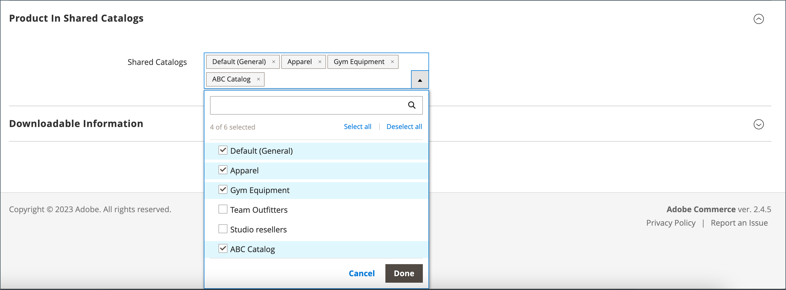

# 將產品新增至共用目錄

產品可以個別地或依類別以多個產品的群組新增到共用目錄中。

複雜產品（例如套件、群組或可設定）必須符合下列要求，才能從共用目錄中的店面顯示：

- 所有[關聯產品](../catalog/product-configurations.md)和選項都必須指派給相同的共用目錄，並在主要目錄中啟用。
- 對於[可設定](../catalog/product-create-configurable.md)和[已分組](../catalog/product-create-grouped.md)的產品，只會顯示啟用的關聯產品。
- 對於[套件](../catalog/product-create-bundle.md)產品，所有選項都必須包含在共用目錄中。

  {width="600" zoomable="yes"}的產品

## 方法1：新增單一產品

1. 在&#x200B;_管理員_&#x200B;側邊欄上，移至&#x200B;**[!UICONTROL Catalog]** > **[!UICONTROL Products]**。

1. 對於網格中您要新增的產品，請移至&#x200B;_[!UICONTROL Action]_欄，然後按一下&#x200B;**[!UICONTROL Edit]**。

1. 向下捲動，展開 _[!UICONTROL Product in Shared Catalogs]_區段，然後執行下列動作：

   - 選取產品應顯示之每個共用目錄的核取方塊。 若要選擇所有目錄，請按一下&#x200B;**[!UICONTROL Select all]**。

     {width="600" zoomable="yes"}

     每個選取的目錄名稱會顯示在&#x200B;_[!UICONTROL Shared Catalogs]_欄位中。

     {width="600" zoomable="yes"}

   - 按一下&#x200B;**[!UICONTROL Done]**&#x200B;以儲存設定。

1. 完成時，按一下&#x200B;**[!UICONTROL Save]**。

## 方法2：新增多個產品

1. 在&#x200B;_管理員_&#x200B;側邊欄上，移至&#x200B;**[!UICONTROL Catalog]** > **[!UICONTROL Shared Catalogs]**。

1. 對於網格中的共用目錄，請移至&#x200B;_[!UICONTROL Action]_欄並選取&#x200B;**[!UICONTROL Set Pricing and Structure]**。

1. 在類別樹狀結構中，執行下列任一項作業：

   - 若要包含所有產品，請按一下&#x200B;**[!UICONTROL Select all]**&#x200B;或選取父類別的核取方塊。
   - 若要包含特定類別的產品，請選取您要包含的每個類別的核取方塊。
   - 若要包含或排除個別產品，請選取或取消選取產品的核取方塊。

   樹狀結構中每個類別下方的標籤法會顯示目前包含在共用目錄中的類別產品數量。 [根類別](../catalog/category-root.md)下方的標籤法會顯示目前為共用目錄選取之所有類別的產品總數。

1. 若要檢視格線中的類別產品，請按一下樹狀結構中的類別名稱。

   選取類別時，會發生下列情況：

   - 格線第一欄的切換針對每個所選產品設定為`On`。
   - 如果將產品指派給多個類別，且其中一個類別中省略，則它仍可透過其他類別和[目錄搜尋](../catalog/search.md)取得。
   - 系統會自動為選取的產品將[類別許可權](../catalog/category-permissions.md)設定為`Allow`。
