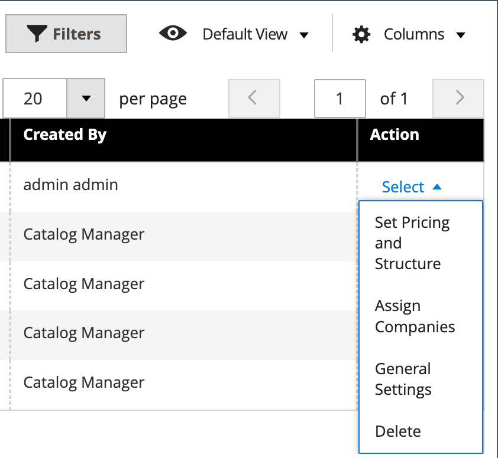

# 共用目錄概觀

Adobe Commerce B2B可讓您使用不同公司的自訂價格，維護閘道式&#x200B;_共用_&#x200B;目錄。 除了標準&#x200B;_主要_&#x200B;產品目錄之外，它還提供客戶存取兩種具有不同定價結構的共用目錄的許可權。

如果組態中啟用了[共用目錄功能](enable-basic-features.md)，管理員仍可看見原始主要目錄，但店面中只會看見預設（一般）的公用共用目錄。 此外，可以建立只對特定[公司](account-companies.md)帳戶成員可見的自訂目錄。

針對`Default (General)`公用共用目錄，您必須指派產品以在店面顯示目錄。 預設為空白，不包含任何產品。

>[!NOTE]
>
>**[B2B 1.3.0](release-notes.md#b2b-v130)和更新版本** — 當您建立共用目錄時，針對在目錄許可權設定中指派此存取權的客戶群組，目錄的每個[類別許可權](../catalog/category-permissions.md)都設為&#x200B;_[!UICONTROL Allow for the Display Product Prices]_&#x200B;和_[!UICONTROL Add to Cart]_。 以前，即使目錄許可權設為`Allow`，這些設定也會自動設為`Deny`。

>[!IMPORTANT]
>
>啟用&#x200B;**_[!UICONTROL Shared Catalog]_**&#x200B;功能時，目錄中的&#x200B;**_所有_**&#x200B;類別會忽略所有現有的[群組許可權設定](../configuration-reference/catalog/catalog.md#category-permissions)。 [!UICONTROL Shared Catalog]在啟用時可完全控制目錄中的所有類別許可權。

_[!UICONTROL Shared Catalogs]_&#x200B;頁面可讓您存取用來管理共用目錄的工具。 此頁面類似於標準[管理員工作區](../getting-started/admin-workspace.md)，具有篩選器和動作控制項。 網格會列出所有共用目錄，包括預設的公用共用目錄，以及您設定的所有自訂目錄。

{width="700" zoomable="yes"}

## 存取[!UICONTROL Shared Catalogs]頁面

在&#x200B;_管理員_&#x200B;側邊欄上，移至&#x200B;**[!UICONTROL Catalog]** > **[!UICONTROL Shared Catalogs]**。

## 動作控制項

左上角的[動作控制項](../getting-started/admin-actions-control.md)可與大量動作控制項搭配使用，以刪除選取的共用目錄，這些目錄已不再需要。 在網格中，_[!UICONTROL Actions]_&#x200B;欄包含管理共用目錄的完整工具選擇。

{width="350"}

| 控制 | 說明 |
|------|-----------|
| [[!UICONTROL Set Pricing and Structure]](catalog-shared-pricing-structure.md) | 決定共用目錄中可用的產品選擇和自訂價格。 |
| [[!UICONTROL Assign Companies]](catalog-shared-assign-companies.md) | 決定哪些公司可以存取共用目錄。 |
| [[!UICONTROL General Settings]](catalog-shared-manage.md) | 決定型錄明細資訊，包括名稱、型錄型態、客戶稅捐類別及摘要。 |
| [!UICONTROL Delete] | 刪除選取的共用目錄。 |

{style="table-layout:auto"}

## 欄說明

| 標題 | 說明 |
|--- |--- |
| [!UICONTROL Select] | 選取共用目錄記錄以套用動作。 標頭中的控制項可用來選取網格中的所有共用目錄記錄，或取消選取網格中的所有共用目錄記錄。 若要選取個別共用目錄，請選取核取方塊。 |
| [!UICONTROL ID] | 建立目錄時依序指派的唯一數值識別碼。 |
| [!UICONTROL Name] | 共用目錄的名稱。 依預設，可使用預設（一般）共用目錄。 |
| [!UICONTROL Type] | 識別共用目錄的型別為：  **[!UICONTROL Public]**— 安裝Adobe Commerce B2B時，會自動建立預設的公用共用目錄。 它最初會指派給`General`和`Not Logged In`客戶群組，且未與公司相關聯的來賓和個別登入客戶可看到它。 系統一次僅支援一個公用共用目錄。 **[!UICONTROL Custom]** — 自訂共用目錄包含的定價僅對指派的公司帳戶的登入關聯可見。 您可以視需要建立儘可能多的自訂共用目錄。 |
| [!UICONTROL Customer Tax Class] | 指定給對應客戶群組的稅捐類別。 此欄不會出現在預設格線中，但可以透過變更欄版面配置來新增。 |
| [!UICONTROL Created At] | 建立共用目錄的日期和時間。 |
| [!UICONTROL Created By] | 建立共用目錄之存放區管理員的名字和姓氏。 |
| [!UICONTROL Action] | 列出套用至所選目錄的動作。 選項： `Set Pricing and Structure` / `Assign Companies` / `General Settings` / `Delete` |

{style="table-layout:auto"}
