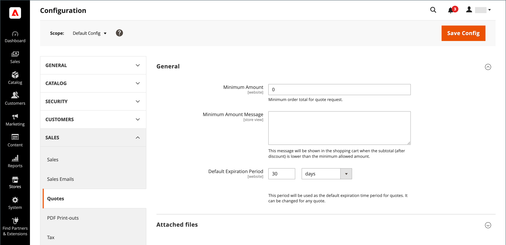

# 設定引號

如果在一般[B2B功能](enable-basic-features.md)中啟用了引號，您可以在Admin中設定對引號的支援。 報價組態會決定報價請求所需的最低訂單金額、報價存留期，以及附加檔案支援的檔案格式。

>[!NOTE]
>
>報價組態選項和使用報價議價功能的能力是使用[角色資源](../systems/permissions-user-roles.md#role-resources)來控制。 必須為指派給管理員使用者帳戶的管理員使用者角色選擇這些角色資源。 若要授與Admin中報價函式的存取權，請移至&#x200B;**[!UICONTROL System]** > _[!UICONTROL Permissions]_>**[!UICONTROL User Roles]**，選取角色，並導覽至_&#x200B;角色資源&#x200B;_樹狀結構中的[!UICONTROL Sales] > [!UICONTROL Operations] > [!UICONTROL Quotes]。

1. 在&#x200B;_管理員_&#x200B;側邊欄上，移至&#x200B;**[!UICONTROL Stores]** > _[!UICONTROL Settings]_>**[!UICONTROL Configuration]**。

1. 在左側面板中，展開&#x200B;**[!UICONTROL Sales]**&#x200B;並選擇&#x200B;**[!UICONTROL Quotes]**。

1. 展開 **[!UICONTROL General]**&#x200B;區段，然後執行下列動作：

   {width="700" zoomable="yes"}

   請參閱&#x200B;_組態參考_&#x200B;中的[引號](../configuration-reference/sales/quotes.md)，以取得引號功能選項及其功能的完整清單。

   - 在購物車中輸入必須滿足的&#x200B;**[!UICONTROL Minimum Amount]**，才能提交報價請求。

   - 針對&#x200B;**[!UICONTROL Minimum Amount Message]**，輸入當購物車總計不符合最低需求量時要顯示的訊息。

   - 針對&#x200B;**[!UICONTROL Default Expiration Period]**，輸入引號要保持有效的&#x200B;**[!UICONTROL days]**、**[!UICONTROL weeks]**&#x200B;或&#x200B;**[!UICONTROL months]**&#x200B;數目。

1. 展開 **[!UICONTROL Attached files]**&#x200B;區段，然後執行下列動作：

   - 針對&#x200B;**[!UICONTROL File formats for upload]**，輸入您支援附加至引號之檔案的每種檔案型別尾碼。

     以小寫輸入每個檔案尾碼，並以逗號分隔。

     依預設，支援下列格式： `doc`、`docx`、`xls`、`xlsx`、`pdf`、`txt`、`jpg`、`png`和`jpeg`

   - 針對&#x200B;**[!UICONTROL Maximum file size]**，輸入附加檔案的大小上限(MB)。

     您輸入的值可能會被伺服器設定覆寫。

     {width="600" zoomable="yes"}

1. 完成時，按一下&#x200B;**[!UICONTROL Save Config]**。
