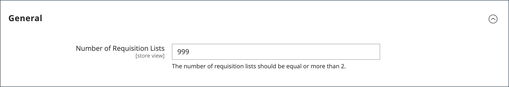

# 設定請購單清單上限

啟用請購單清單功能後，客戶可以建立多個經常採購的料號清單，並使用這些清單進行訂單下單。 它可供登入的使用者和來賓使用。 您可在下列情況下啟用請購單清單： [設定B2B功能](enable-basic-features.md).

客戶可以有多個清單，聚焦於來自不同廠商、購買者、團隊、行銷活動的產品，或簡化常見工作流程的任何其他產品。 [請購單清單功能](requisition-lists.md) 與希望清單類似，但有下列差異：

- 將專案傳送至購物車後，未清除請購單清單。 可多次使用。
- 請購單清單的使用者介面使用精簡檢視來顯示許多料號。

依預設，客戶最多可以維護其帳戶的999份請購單清單。 但您可以修改設定並指定較低的數字以減輕存放區的負載。

1. 在 _管理員_ 側欄，前往 **[!UICONTROL Stores]** > _[!UICONTROL Settings]_>**[!UICONTROL Configuration]**.

1. 在左側面板中，展開 **[!UICONTROL Customers]** 並選擇 **[!UICONTROL Requisition Lists]**.

   {width="600" zoomable="yes"}

1. 的 **[!UICONTROL Number of Requisition Lists]**，輸入每個客戶帳戶可維護的請購單清單數目上限。

   最小數量為 `2`，則最大值為 `999`.

1. 完成後，按一下 **[!UICONTROL Save Config]**.
