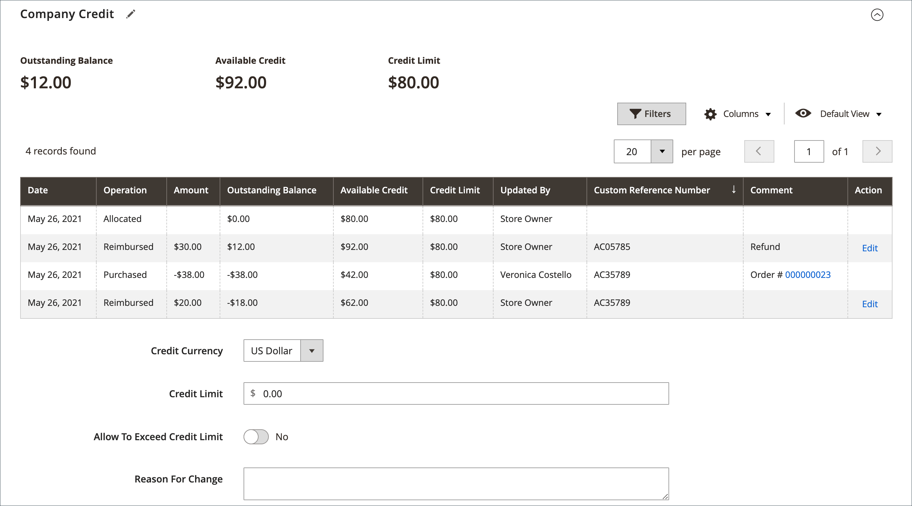
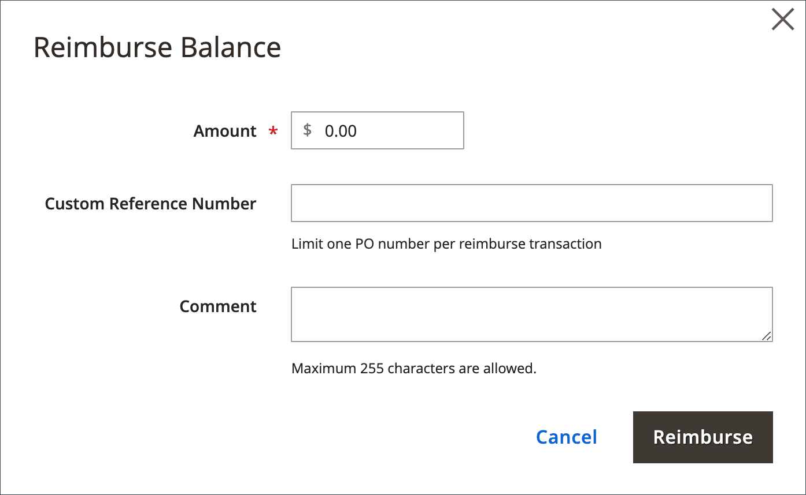

# 管理公司評價

公司信用可讓B2B企業根據預先核准的信用額度進行購買，而不需要立即付款。 當啟用[帳戶付款](../b2b/enable-basic-features.md#configure-payment-on-account)時，公司可以購買最高信用額度，並從帳戶儀表板檢視其信用狀態。

{width="700" zoomable="yes"}

公司業績可讓您：

* **延長信用期限** — 允許受信任的商業客戶以延期付款的帳戶方式購買
* **設定信用額度** — 透過為每個公司建立信用額度來控制財務風險
* **追蹤信用活動** — 即時監視所有信用交易、付款及未結餘額
* **簡化B2B交易** — 簡化已建立信用關係的公司的採購程式
* **支援複雜的工作流程** — 與採購單、報價單及核准程式整合

## 先決條件

在設定公司評分之前，請確定：

* 您的Adobe Commerce安裝已啟用B2B功能
* [帳戶](../b2b/enable-basic-features.md#configure-payment-on-account)付款已設定並啟用
* 公司帳戶已正確設定必要的業務資訊
* 您具有管理許可權，可管理公司信用設定
* 若以多種貨幣操作，則會設定貨幣設定

## 使用案例

公司評分適用於以下情況：

* **已建立的B2B關係** — 具有已證實的付款記錄的長期商務客戶
* **大型企業客戶** — 進行大量、定期採購，需要延長付款期限的公司
* **季節性業務** — 具有週期性現金流、需要彈性付款時間的公司
* **公司採購** — 具有集中採購但分散式付款處理的組織
* **供應鏈合作夥伴** — 需要信用設施的經銷商、經銷商和通路合作夥伴

## 瞭解公司信用設定

您可以為每個公司設定檔設定下列信用相關引數：

* **信用貨幣** — 所有信用交易與餘額的貨幣
* **信用額度** — 公司隨時可缺的最大金額
* **允許超過信用額度** — 公司是否可以下單超過可用信用額度
* **變更原因** — 記錄信用設定修改的檔案欄位

如需這些設定和設定公司設定檔的詳細資訊，請參閱[建立公司帳戶](account-company-create.md)。

>[!NOTE]
>
>如果公司有未結餘額，則從「管理員」檢視時，通知會出現在銷售訂單頂端的商店管理員。 這有助於確保在訂單處理期間知道信用狀態。

## 公司信用活動

公司設定檔的[!UICONTROL Company Credit]區段會以網格格式顯示所有信用交易、餘額變更和付款活動的完整歷史記錄。

{width="700" zoomable="yes"}

網格會顯示每個交易的下列資訊：

| 欄 | 說明 |
|--- |--- |
| [!UICONTROL Date] | 交易的日期。 若要顯示日期和時間，請將游標停留在日期上。 |
| [!UICONTROL Operation] | 與交易相關聯的活動型別。 值：  **[!UICONTROL Allocated]**— 指派給公司的評分。 **[!UICONTROL Updated]** — 變更已套用至下列其中一個欄位： [!UICONTROL Credit limit] / [!UICONTROL Credit currency] / [!UICONTROL Allow to exceed credit limit]  **[!UICONTROL Purchased]**— 已下訂單。 **[!UICONTROL Reimbursed]** — 未償還餘額已償還。  **[!UICONTROL Refunded]**— 銷退折讓單金額已退款。 **[!UICONTROL Reverted]** — 訂單已取消，金額已傳回至貸方餘額。 |
| [!UICONTROL Amount] | 與下列交易型別相關的交易金額： `Purchased` / `Reimbursed` / `Refunded` / `Reverted`  對於購買金額，金額會以商店的顯示貨幣和信用貨幣設定的格式顯示，之後會加上目前的轉換率（如果適用）。 例如： EUR 20,000.00 ($22,400.00)  USD/EUR 0.8928 |
| [!UICONTROL Outstanding Balance] | 已償還的金額，減去使用「掛帳付款」方式下所有訂單的到期總額。 數量可能會顯示為正數或負數。  **[!UICONTROL Positive value]**— 預付款以正值表示。 **[!UICONTROL Negative value]** — 應付金額以負值表示。 |
| [!UICONTROL Available Credit] | _[!UICONTROL Credit Limit]_&#x200B;與_[!UICONTROL Outstanding Balance]_&#x200B;的總和。 如果公司已超過信用額度，金額會顯示為負值。 |
| [!UICONTROL Credit Limit] | 給予公司的信用額度。 |
| [!UICONTROL Updated By] | 起始作業人員的姓名。 |
| [!UICONTROL Custom Reference Number] | 與交易相關聯的自訂參考編號。 |
| [!UICONTROL Comment] | 根據作業型別，從`Reason for Change`欄位編譯值。  **[!UICONTROL Purchased]**— 包含採購的評論，以及訂單編號和訂單連結。 **[!UICONTROL Reimbursed]** — 包含已償還交易的註解。 |
| [!UICONTROL Action] | 僅適用於`Reimbursed`作業。 **[!UICONTROL Edit]** — 允許更新補助金額。 |

{style="table-layout:auto"}

## 更新信用資訊

客戶付款時，管理員會在「管理員」中更新信用資訊。

1. 在&#x200B;_管理員_&#x200B;側邊欄上，前往&#x200B;**客戶>公司**。

1. 在格線中尋找公司，並以&#x200B;_編輯_&#x200B;模式開啟。

1. 展開&#x200B;**公司業績**&#x200B;區段。

1. 針對&#x200B;**信用額度**，請輸入新值。

1. 視需要變更其他值。

1. 更新完成時，按一下&#x200B;**[!UICONTROL Save]**。

## 接收付款

償還餘額是公司對其帳戶餘額進行的離線付款。 店舖管理員使用&#x200B;_償還餘額_&#x200B;按鈕，在公司設定檔中手動輸入金額。 提交金額時，系統會重新計算未結餘額與可用的公司信用額度，並將此作業記錄在公司信用記錄中。 已償還金額是以信用幣別輸入，如組態中所指定。

### 將付款套用至公司帳戶

1. 在&#x200B;_管理員_&#x200B;側邊欄上，移至&#x200B;**[!UICONTROL Customers]** > **[!UICONTROL Companies]**。

1. 在清單中尋找公司記錄，並以&#x200B;**[!UICONTROL Edit]**&#x200B;模式開啟。

1. 按一下頁面頂端的&#x200B;**償還餘額**。

1. 在對話方塊中，新增付款資訊：

   {width="500"}

   * 輸入付款的&#x200B;**金額**。

     金額可以輸入為正數或負數。

   * 如果適用，請輸入&#x200B;**自訂參考編號**&#x200B;以供參考。

     每個補助只能輸入一個自訂參考編號。 若要將付款套用至多個採購單，請為每個採購單建立個別的補助。

   * 視需要輸入&#x200B;**註解**&#x200B;以說明補助金。

1. 按一下&#x200B;**償還**。

   系統會自動更新餘額與銷退折讓歷史記錄，以反映退款。

### 編輯補助

1. 以&#x200B;**[!UICONTROL Edit]**&#x200B;模式開啟公司設定檔。

1. 展開區段的&#x200B;**擴充選擇器**。

1. 在網格中尋找補助交易，然後按一下&#x200B;**[!UICONTROL Edit]**。

1. 對&#x200B;**自訂參考編號**&#x200B;和&#x200B;**註解**&#x200B;進行任何必要的變更。

   補助金額無法變更。

1. 按一下&#x200B;**[!UICONTROL Save]**。

## 店面信用資訊

公司管理員可以在帳戶資料面板上檢視其信用資訊，包括未結餘額、可用信用、信用額度及未結商業發票。 取消訂單時，金額會傳回至公司餘額，並顯示在「銷退折讓分攤歷史記錄」欄位中。

{width="700" zoomable="yes"}

## 公司信用示範

觀看此示範影片，瞭解如何管理公司點數：

>[!VIDEO](https://video.tv.adobe.com/v/344445?quality=12&learn=on)

## 安全性考量

管理公司信用時，請實作健全的安全性措施來保護敏感的金融資料：

* **存取控制** — 將信用管理許可權限製為僅限授權人員
* **稽核軌跡** — 維護所有信用交易與修改的完整記錄
* **資料保護** — 加密傳輸中及閒置中的機密財務資訊
* **核准工作流程** — 針對重大信用調整實作多層次核准流程
* **定期檢閱** — 定期稽核使用者存取權和信用關係

## 最佳實務

* &#x200B;
   * **信用政策管理** — 管理公司信用時，請依據客戶付款記錄與業務關係，建立設定信用額度的明確政策。 定期複查未結餘額與付款模式，以評估風險，並一律以詳細的稽核理由來記錄信用設定的變更。

迅速處理付款，以維持正確的餘額，並確保信用幣別設定與每個公司的主要業務營運一致。

* **法規遵循與安全性** — 將信用管理許可權限製為僅限授權人員使用、針對重大信用調整實作核准工作流程，以及根據貴組織的安全性原則保護敏感財務資訊。 定期審查使用者存取和信用關係有助於維持適當的監督和合規性。

>[!MORELIKETHIS]
>
>* [啟用B2B功能](enable-basic-features.md) *設定「帳戶付款」和其他B2B功能
>* [建立公司帳戶](account-company-create.md) *設定具有信用能力的公司帳戶
>* [管理公司](manage-companies.md) *公司管理功能概觀
>* [公司角色和許可權](account-company-roles-permissions.md) *設定信用管理的使用者存取權
>* [採購單工作流程](purchase-order-flow.md) *瞭解信用如何與採購單整合
>* [B2B組態參考](../configuration-reference/general/b2b-features.md) - B2B功能的詳細組態設定
