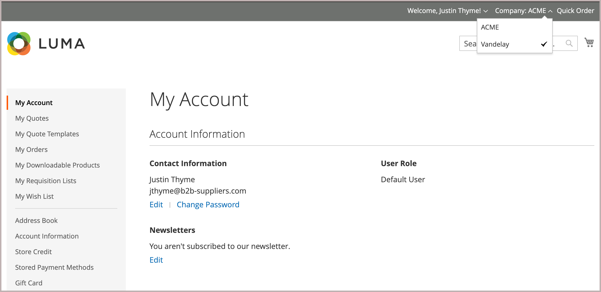

# 將使用者新增至公司帳戶

在設定中啟用時，公司管理員會從店面新增和管理公司使用者。 但是，也可以從管理員新增和管理公司使用者帳戶。

如有需要，您可以將使用者指派至多個公司。 例如，如果B2B購買者支援多家公司，您可以將他們的使用者帳戶新增至所有與其有業務往來的公司。 在店面，指派給多個公司的購買者可以透過從&#x200B;*[!UICONTROL Company]*&#x200B;選單中的可用公司選擇，在公司帳戶之間切換。

{width="700"}

>[!NOTE]
>
>如果個人已在您的商店擁有個人帳戶，且稍後前往公司工作，請勿將個人的個人帳戶指派給公司。 請改為為具有公司電子郵件地址的人員建立公司使用者帳戶。

## 新增公司使用者

當您新增公司使用者時，與該使用者帳戶建立關聯的第一個公司是預設公司。

1. 在管理員側邊欄上，移至&#x200B;**[!UICONTROL Customers > All Customers]**。

1. 按一下&#x200B;**[!UICONTROL Add new customer]**。

1. 設定新帳戶。

   1. 設定&#x200B;**[!UICONTROL Customer Active]**&#x200B;切換以指定初始帳戶狀態。

      將其開啟以立即啟用帳戶，或停用以建立非使用中帳戶。

   1. 從&#x200B;**[!UICONTROL Associate to Website]**&#x200B;清單中選取網站範圍。

   1. 按一下&#x200B;**[!UICONTROL Associate to Company]**&#x200B;以檢視可用的公司。

      {width="675"}

      如有需要，在輸入方塊中輸入公司名稱的前幾個字母來篩選清單。

   1. 在清單中，選取一或多個要指派客戶的公司，然後按一下&#x200B;**[!UICONTROL Done]**。

      公司使用者會自動新增到與其帳戶關聯的每個公司的客戶群組（或[共用目錄](catalog-shared.md)）。

   1. 輸入必要的使用者帳戶資訊： **[!UICONTROL First Name]**、**[!UICONTROL Last Name]**&#x200B;和&#x200B;**[!UICONTROL Email]**。

   1. 啟用&#x200B;**[!UICONTROL Allow remote shopping assistance]**，讓銷售代表代表客戶登入店面。

   1. 按一下&#x200B;**[!UICONTROL Save Customer]**&#x200B;套用變更。

      {width="675"}

[!UICONTROL Customers grid]會針對指派給使用者的每個公司顯示個別的列。 下列欄會更新。

- _[!UICONTROL Customer Type]_欄會更新以顯示指派給使用者的角色。

  如果這是第一次將客戶指派給公司，_[!UICONTROL Customer Type]_欄會從_[!UICONTROL Individual user]_&#x200B;更新為&#x200B;_[!UICONTROL Company User]_。

- _[!UICONTROL Group]_欄會變更為指派給公司的客戶群組（或共用目錄）名稱。

- _[!UICONTROL Company]_欄顯示現在與客戶設定檔相關聯的公司名稱。

## 將使用者指派給一或多個公司帳戶

當您指派新使用者時，您與使用者帳戶建立關聯的第一個公司是預設公司。

1. 在&#x200B;_管理員_&#x200B;側邊欄上，移至&#x200B;**[!UICONTROL Customers]** > **[!UICONTROL All Customers]**。

1. 在格線中尋找客戶，然後按一下&#x200B;_[!UICONTROL Action]_欄中的&#x200B;**[!UICONTROL Edit]**。

1. 在左側面板中選擇&#x200B;**[!UICONTROL Account Information]**。

1. 從&#x200B;**[!UICONTROL Associate to Company]**&#x200B;清單中，選取一或多個要指派給公司使用者的公司，然後按一下&#x200B;**[!UICONTROL Done]**。

1. 按一下&#x200B;**[!UICONTROL Save Customer]**&#x200B;套用變更。

## 從使用者帳戶移除公司指派

從使用者設定檔中移除公司會撤銷該公司的使用者存取權。 使用者資料仍可在「管理員」中存取。 如果您移除所有公司指派，_[!UICONTROL Customer Type]_會變更為&#x200B;*[!UICONTROL Individual user]*並停用該帳戶的B2B功能。

1. 從「管理員」的「客戶」格線中，編輯要更新的客戶設定檔。

1. 在*[!UICONTROL Account Information]區段中，按一下公司名稱標籤中的&#x200B;**[!UICONTROL X]**，從&#x200B;**[!UICONTROL Associate to Company]**&#x200B;欄位中移除指派的公司。

1. 按一下&#x200B;**[!UICONTROL Save Customer]**&#x200B;套用變更。

>[!NOTE]
>
>如果公司使用者被指派為公司管理員，則您必須更新公司帳戶以指派新的公司管理員，才能從此使用者建立公司關聯。
