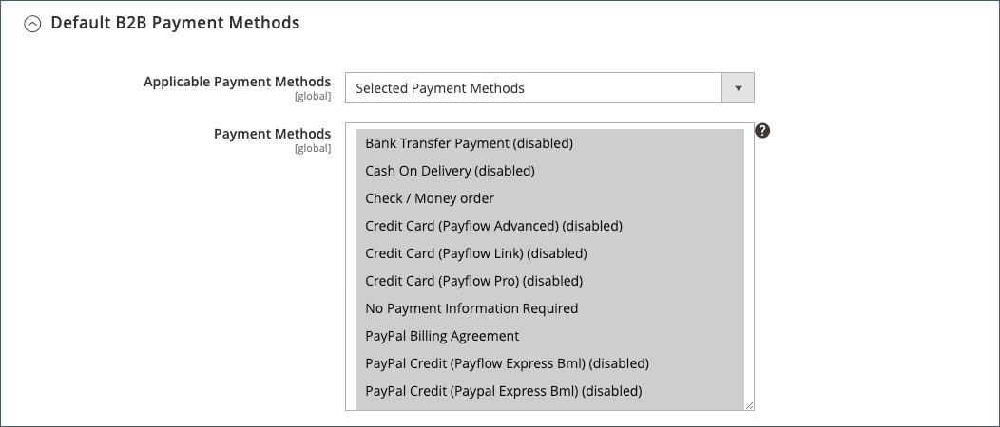
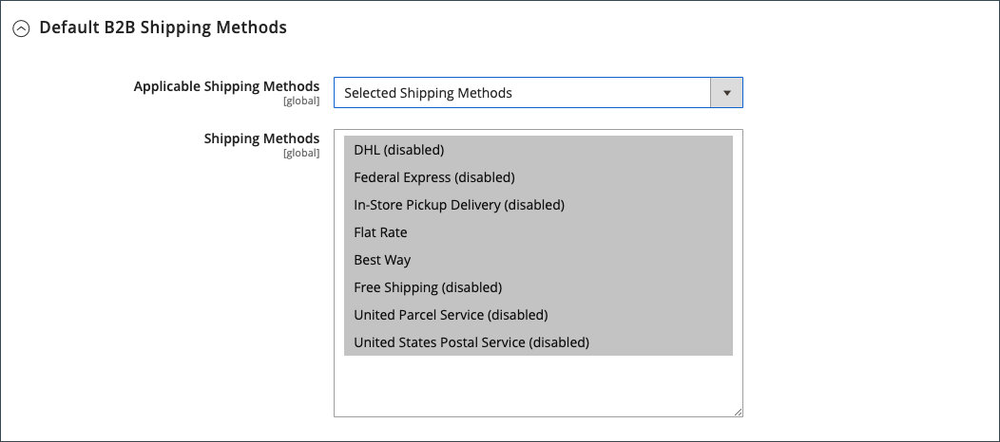
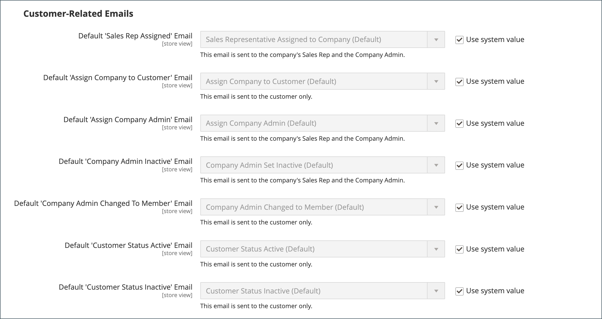
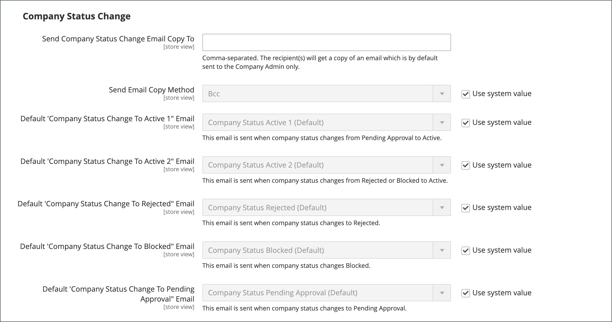
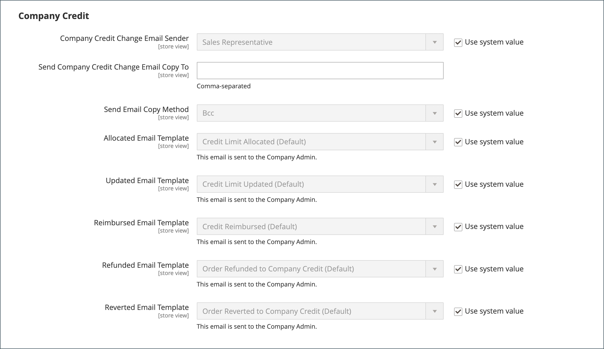

# Enable B2B features

By default, all B2B features are initially disabled. A store admin can enable or disable the B2B features as needed for Commerce stores. 

When you enable support for customer companies, additional B2B features are enabled automatically:

- [[!DNL Shared Catalog]](catalog-shared.md)

  Supports custom pricing configuration for different companies and also enables category permissions for all stores.

- [!DNL Enable Shared Catalog direct products price assigning]

  Improves site performance by storing only products that are assigned to a shared catalog in the price index. Enabling this feature is a best practice for Merchants that have many shared catalogs to manage custom pricing for different companies.

- [[!DNL B2B Quotes]](quotes.md)

  Gives sellers and company buyers the ability to negotiate prices.

- [!DNL B2B default payment and shipping methods]

  Determines the selection of payment and shipping options available to B2B buyers on the storefront.

只有當[!DNL Enable Company]設定為`Yes`時，這些功能的組態設定才可見。

B2B [[!DNL Quick Order]](quick-order.md)和[[!DNL Requisition List]](requisition-lists.md)功能可以獨立啟用和停用。

## 設定B2B功能

只有已安裝[Adobe Commerce B2B擴充功能](install.md)的Commerce專案，才能使用設定Adobe Commerce B2B功能的選項。

1. 在&#x200B;_管理員_&#x200B;側邊欄上，移至&#x200B;**[!UICONTROL Stores]** > _[!UICONTROL Settings]_>**[!UICONTROL Configuration]**。

   **[!UICONTROL Store View]**

1. _[!UICONTROL General]_**[!UICONTROL B2B Features]**

   {width="600"}

   - **[!UICONTROL Enable Company]**`Yes`

     When you enable company support, the Shared Catalog, B2B Quote, B2B Payment Methods, and B2B Shipping Methods are enabled automatically.

     {width="600"}

   - **[!UICONTROL Enable Quick Order]**`Yes`

   - **[!UICONTROL Enable Requisition List]**`Yes`

     

1. 完成時，按一下&#x200B;**[!UICONTROL Save Config]**。

## 設定預設B2B付款和送貨方法

1. **[!UICONTROL Default B2B Payment Methods]**

1. **[!UICONTROL Applicable Payment Methods]**

   - `All Payment Methods`

   - `Selected Payment Methods`

     **[!UICONTROL Payment Methods]**

   In addition to the standard payment methods, the list also includes the following:

   - No Payment Information is Required
   - [分期付款](#configure-payment-on-account)
   - 已儲存的帳戶
   - 儲存的卡片

   {width="600"}

1. 展開&#x200B;**[!UICONTROL Default B2B Shipping Methods]**&#x200B;區段的。

1. 若要指定B2B訂單的預設送貨方式，請將&#x200B;**[!UICONTROL Applicable Shipping Methods]**&#x200B;設定為下列其中一項：

   - `All Shipping Methods`
   - `Selected Shipping Methods`

     針對特定選項，在按一下每個選項時，按住Ctrl鍵(PC)或Command鍵(Mac)，以選取您要提供給客戶的&#x200B;**[!UICONTROL Shipping Methods]**。

     送貨方法清單顯示目前為[啟用或停用](../configuration-reference/sales/delivery-methods.md)。

   {width="600"}

1. 完成時，按一下&#x200B;**[!UICONTROL Save Config]**。

## 設定公司電子郵件選項

1. __**[!UICONTROL Stores]**_[!UICONTROL Settings]_**[!UICONTROL Configuration]**

1. **[!UICONTROL Customers]****[!UICONTROL Company Configuration]**

1. **[!UICONTROL Store View]**

1. **[!UICONTROL Company Registration]**

   >[!NOTE]
   >
   >**[!UICONTROL Use system value]**

   - 將&#x200B;**[!UICONTROL Company Registration Email Recipient]**&#x200B;設定為[商店連絡人](../getting-started/store-details.md#store-email-addresses)，當收到新的公司註冊要求時，會通知該連絡人。

   - 針對&#x200B;**[!UICONTROL Send Company Registration Email Copy To]**，輸入每個要接收註冊通知副本的人的電子郵件地址。 請使用逗號分隔多個電子郵件地址。

   - 若要判斷通知復本的傳送方式，請將&#x200B;**[傳送電子郵件復本方法]**&#x200B;設定為下列其中一項：

      - `Bcc` — 在傳送給客戶的同一封電子郵件的標頭中包含收件者，以傳送&#x200B;_不公開的禮貌副本_。 客戶看不到密件副本收件者。
      - `Separate Email` — 以個別電子郵件的形式傳送復本。

   - 如果您已準備要使用的電子郵件範本而非預設值，請將&#x200B;**[!UICONTROL Default Company Registration Email]**&#x200B;設定為範本的名稱。 依預設，會使用`Company Registration Request`範本。

     {width="600"}

1. 完成&#x200B;**[!UICONTROL Customer-Related Emails]**&#x200B;區段：

   如果您已準備要使用的替代電子郵件範本而非預設值，請選擇您要在下列各專案中使用的範本：

   - **[!UICONTROL Default 'Sales Rep Assigned' Email]**
   - **[!UICONTROL Default 'Assign Company to Customer' Email]**
   - **[!UICONTROL Default 'Assign Company Admin' Email]**
   - **[!UICONTROL Default 'Company Admin Inactive' Email]**
   - **[!UICONTROL Default 'Company Admin Changed to Member' Email]**
   - **[!UICONTROL Default 'Customer Status Active' Email]**
   - **[!UICONTROL Default 'Customer Status Inactive' Email]**

   {width="600"}

1. **[!UICONTROL Company Status Change]**

   - **[!UICONTROL Send Company Status Change Email Copy To]** Separate multiple email addresses with a comma.

   - ****

      - `Bcc`__ The BCC recipient is not visible to the customer.
      - `Separate Email`

   - `Pending Approval``Active`**[!UICONTROL Default 'Company Status Change to Active 1' Email]**`Company Status Active 1`

   - `Rejected``Blocked``Active`**[!UICONTROL Default 'Company Status Change to Active 2' Email]**`Company Status Active 2`

   - `Rejected`**[!UICONTROL Default 'Company Status Change to Rejected' Email]**`Company Status Rejected`

   - 如果您已準備要在公司狀態變更為`Blocked`時使用的電子郵件範本，請將&#x200B;**[!UICONTROL Default 'Company Status Change to Blocked' Email]**&#x200B;設定為範本的名稱。 依預設，會使用`Company Status Blocked`範本。

   - 如果您已準備要在公司狀態變更為`Pending Approval`時使用的電子郵件範本，請將&#x200B;**[!UICONTROL Default 'Company Status Change to Pending Approval' Email]**&#x200B;設定為範本的名稱。 依預設，會使用`Company Status Pending Approval`範本。

   {width="600"}

1. 完成&#x200B;**[!UICONTROL Company Credit Emails]**&#x200B;區段：

   - **[!UICONTROL Company Credit Change Email Sender]**__

   - **[!UICONTROL Send Company Credit Change Email Copy To]** Separate multiple email addresses with a comma.

   - ****

      - `Bcc` — 在傳送給客戶的同一封電子郵件的標頭中包含收件者，以傳送&#x200B;_不公開的禮貌副本_。 客戶看不到密件副本收件者。
      - `Separate Email`

   - If you have prepared email templates to be used instead of the defaults, choose the template for each of the following notifications that are sent to the company administrator.

      - **[!UICONTROL Allocated Email Template]**
      - **[!UICONTROL Updated Email Template]**
      - **[!UICONTROL Reimbursed Email Template]**
      - **[!UICONTROL Refunded Email Template]**
      - **[!UICONTROL Reverted Email Template]**

   {width="600"}

1. 完成時，按一下&#x200B;**[!UICONTROL Save Config]**。

## 設定訂單核准

追蹤訂單處理與採購單的功能，可讓公司管理員控制公司買家的動作。 The order approval functionality is available when the purchase orders feature is enabled by a store administrator.

1. __**[!UICONTROL Stores]**_[!UICONTROL Settings]_**[!UICONTROL Configuration]**

1. **[!UICONTROL General]****[!UICONTROL B2B Features]**

1. **[!UICONTROL Order Approval Configuration]**

   {width="600"}

1. **[!UICONTROL Enable Purchase Orders]**`Yes`

1. 完成時，按一下&#x200B;**[!UICONTROL Save Config]**。

   採購單功能會在網站層級啟用。 若要為公司啟用此型別的訂單，請對每個[公司設定檔](account-company-manage.md)中的適當設定執行相同操作。

## 設定採購單

1. 在&#x200B;_管理員_&#x200B;側邊欄上，移至&#x200B;**[!UICONTROL Customers]** > **[!UICONTROL Companies]**。

1. 在清單中尋找公司並按一下&#x200B;**[!UICONTROL Edit]**。

1. 展開&#x200B;**[!UICONTROL Advanced Settings]**&#x200B;區段的。

1. **[!UICONTROL Enable Purchase Orders]**`Yes`

1. **[!UICONTROL Save]**

啟用後，**[!UICONTROL Approval Rules]**&#x200B;區段會顯示在公司管理員的店面[帳戶儀表板](../customers/account-dashboard.md)上。

>[!NOTE]
>
>必須由公司管理員根據[公司使用者角色許可權](account-company-roles-permissions.md)授與店面上的採購單存取權。

## 設定分期付款

Payment on Account is an offline payment method that allows companies to make purchases up to the credit limit that is specified in their profile. Payment on Account can be enabled globally, or per company, and appears during checkout only if enabled. __

>[!NOTE]
>
>

To enable Payment on Account for your store:

1. 在&#x200B;_管理員_&#x200B;側邊欄上，移至&#x200B;**[!UICONTROL Stores]** > _[!UICONTROL Settings]_>**[!UICONTROL Configuration]**。

1. 在左側面板中，展開&#x200B;**[!UICONTROL Sales]**&#x200B;並選擇&#x200B;**[!UICONTROL Payment Methods]**。

1. 展開&#x200B;**[!UICONTROL Payment on Account]**&#x200B;區段的。

   {width="600"}

   >[!NOTE]
   >
   >如有必要，請先取消選取&#x200B;**[!UICONTROL Use system value]**&#x200B;核取方塊以變更這些設定。

1. 若要允許帳戶付款，請將&#x200B;**[!UICONTROL Enabled]**&#x200B;設為`Yes`。

1. 輸入在結帳時識別付款方式的&#x200B;**[!UICONTROL Title]**，或者您可以接受`Payment on Account`預設標題。

1. 如果訂單通常等待核准，請接受預設的&#x200B;**[!UICONTROL New Order Status]**&#x200B;作為`Pending`，直到它獲得核准為止。

   如果您偏好的話，可以使用此付款方式的新訂單使用`Processing`或`Suspected Fraud`狀態。

1. 將&#x200B;**[!UICONTROL Payment from Applicable Countries]**&#x200B;設定為下列其中一項：

   - `All Allowed Countries` — 來自您商店組態中指定的所有[國家/地區](../getting-started/store-details.md#country-options)的客戶都可以使用此付款方式。
   - `Specific Countries`_[!UICONTROL Payment from Specific Countries]_To select multiple countries, hold down the Ctrl key (PC) or the Command key (Mac) and click each option.

1. **[!UICONTROL Minimum Order Total]****[!UICONTROL Maximum Order Total]**

   >[!NOTE]
   >
   >An order qualifies if the total falls between, or exactly matches, the minimum or maximum total values.

1. **[!UICONTROL Sort Order]**

   The value is relative to the other payment methods. `0``1``2`

1. **[!UICONTROL Save Config]**
