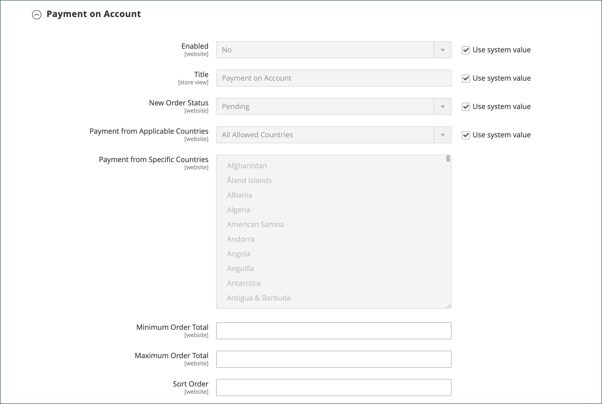

# 啟用B2B功能

依預設，所有B2B功能一開始都會停用。 商店管理員可視需要啟用或停用Commerce商店的B2B功能。 如需B2B組態設定的完整清單，請參閱[B2B功能組態參考](../configuration-reference/general/b2b-features.md)。

啟用客戶公司支援時，系統會自動啟用其他B2B功能：

- [!DNL Shared Catalog]

  支援不同公司的自訂定價設定，也啟用所有商店的類別許可權。

- [!DNL Enable Shared Catalog direct products price assigning]

  在價格索引中僅儲存指派給共用目錄的產品，以提升網站效能。 如果商家有許多共用目錄，為了管理不同公司的自訂定價，啟用此功能是最佳做法。

- [!DNL B2B Quotes]

  讓賣家和公司買家能夠協商價格。

- [!DNL B2B default payment and shipping methods]

  決定店面B2B買家可用的付款與運送選項選項。

只有當[!DNL Enable Company]設定為`Yes`時，這些功能的組態設定才可見。

B2B [!DNL Quick Order]和[!DNL Requisition List]功能可以獨立啟用和停用。

## 設定B2B功能

只有已安裝[Adobe Commerce B2B擴充功能](install.md)的Commerce專案，才能使用設定Adobe Commerce B2B功能的選項。

1. 在&#x200B;_管理員_&#x200B;側邊欄上，移至&#x200B;**[!UICONTROL Stores]** > _[!UICONTROL Settings]_>**[!UICONTROL Configuration]**。

   如果您有多站台安裝，請將左上角的&#x200B;**[!UICONTROL Store View]**&#x200B;控制項設定為套用組態的網站。

1. 在&#x200B;_[!UICONTROL General]_下方的左側面板中，選擇&#x200B;**[!UICONTROL B2B Features]**：

   {width="600"}

   - 允許客戶管理自己的公司帳戶，並透過將&#x200B;**[!UICONTROL Enable Company]**&#x200B;設定為`Yes`來啟用其他B2B功能的支援。

     啟用公司支援時，會自動啟用「共用目錄」、「B2B報價」、「B2B付款方式」和「B2B出貨方式」。

   - 若要讓客戶和來賓能根據SKU或產品名稱快速下訂單，請將&#x200B;**[!UICONTROL Enable Quick Order]**&#x200B;設為`Yes`。

   - 若要允許客戶從其帳戶儀表板建立和管理請購單清單，請將&#x200B;**[!UICONTROL Enable Requisition List]**&#x200B;設為`Yes`。

     您也可以[設定客戶可擁有其帳戶的最大清單數量](configure-requisition-lists.md)。

1. 完成時，按一下&#x200B;**[!UICONTROL Save Config]**。

## 設定預設B2B付款和送貨方法

1. 展開&#x200B;**[!UICONTROL Default B2B Payment Methods]**&#x200B;區段的。

1. 若要建立B2B訂單的預設付款方式，請將&#x200B;**[!UICONTROL Applicable Payment Methods]**&#x200B;設定為下列其中一項：

   - `All Payment Methods`

   - `Selected Payment Methods`

     針對特定選項，在按一下每個選項時，按住Ctrl鍵(PC)或Command鍵(Mac)，以選取您要提供給客戶的&#x200B;**[!UICONTROL Payment Methods]**。

   [付款方法](../configuration-reference/sales/payment-methods.md)的清單顯示目前商店中啟用或停用的選項。 除了標準付款方式之外，此清單還包括下列專案：

   - 不需要付款資訊
   - [分期付款](#configure-payment-on-account)
   - 已儲存的帳戶
   - 儲存的卡片

   {width="600"}

1. 展開&#x200B;**[!UICONTROL Default B2B Shipping Methods]**&#x200B;區段的。

1. 若要指定B2B訂單的預設送貨方式，請將&#x200B;**[!UICONTROL Applicable Shipping Methods]**&#x200B;設定為下列其中一項：

   - `All Shipping Methods`
   - `Selected Shipping Methods`

     針對特定選項，在按一下每個選項時，按住Ctrl鍵(PC)或Command鍵(Mac)，以選取您要提供給客戶的&#x200B;**[!UICONTROL Shipping Methods]**。

     送貨方法清單顯示目前為[啟用或停用](../configuration-reference/sales/delivery-methods.md)。

   {width="600"}

1. 完成時，按一下&#x200B;**[!UICONTROL Save Config]**。

## 設定公司電子郵件選項

依預設，指派為公司主要連絡人的[銷售代表](account-company-manage.md#assign-a-sales-representative)會設定為許多傳送給公司的自動化電子郵件訊息的寄件者。

1. 在&#x200B;_管理員_&#x200B;側邊欄上，移至&#x200B;**[!UICONTROL Stores]** > _[!UICONTROL Settings]_>**[!UICONTROL Configuration]**。

1. 在左側面板中，展開&#x200B;**[!UICONTROL Customers]**&#x200B;並選擇&#x200B;**[!UICONTROL Company Configuration]**。

1. 如有必要，請將&#x200B;**[!UICONTROL Store View]**&#x200B;設定為存放區檢視以定義設定的[範圍](../getting-started/websites-stores-views.md#scope-settings)。

1. 完成&#x200B;**[!UICONTROL Company Registration]**&#x200B;區段：

   >[!NOTE]
   >
   >清除&#x200B;**[!UICONTROL Use system value]**&#x200B;核取方塊，讓欄位可編輯。

   - 將&#x200B;**[!UICONTROL Company Registration Email Recipient]**&#x200B;設定為[商店連絡人](../getting-started/store-details.md#store-email-addresses)，當收到新的公司註冊要求時，會通知該連絡人。

   - 針對&#x200B;**[!UICONTROL Send Company Registration Email Copy To]**，輸入每個要接收註冊通知副本的人的電子郵件地址。 請使用逗號分隔多個電子郵件地址。

   - 若要判斷通知復本的傳送方式，請將&#x200B;**[傳送電子郵件復本方法]**&#x200B;設定為下列其中一項：

      - `Bcc` — 在傳送給客戶的同一封電子郵件的標頭中包含收件者，以傳送&#x200B;_不公開的禮貌副本_。 客戶看不到密件副本收件者。
      - `Separate Email` — 以個別電子郵件的形式傳送復本。

   - 如果您已準備要使用的電子郵件範本而非預設值，請將&#x200B;**[!UICONTROL Default Company Registration Email]**&#x200B;設定為範本的名稱。 依預設，會使用`Company Registration Request`範本。

     {width="600"}

1. 完成&#x200B;**[!UICONTROL Customer-Related Emails]**&#x200B;區段：

   如果您已準備要使用的替代電子郵件範本而非預設值，請選擇您要在下列各專案中使用的範本：

   - **[!UICONTROL Default 'Sales Rep Assigned' Email]**
   - **[!UICONTROL Default 'Assign Company to Customer' Email]**
   - **[!UICONTROL Default 'Assign Company Admin' Email]**
   - **[!UICONTROL Default 'Company Admin Inactive' Email]**
   - **[!UICONTROL Default 'Company Admin Changed to Member' Email]**
   - **[!UICONTROL Default 'Customer Status Active' Email]**
   - **[!UICONTROL Default 'Customer Status Inactive' Email]**

   {width="600"}

1. 完成&#x200B;**[!UICONTROL Company Status Change]**&#x200B;區段：

   - 針對&#x200B;**[!UICONTROL Send Company Status Change Email Copy To]**，輸入每個要接收狀態變更通知副本的人的電子郵件地址。 請使用逗號分隔多個電子郵件地址。

   - 若要判斷通知復本的傳送方式，請將&#x200B;**[傳送電子郵件復本方法]**&#x200B;設定為下列其中一項：

      - `Bcc` — 在傳送給客戶的同一封電子郵件的標頭中包含收件者，以傳送&#x200B;_不公開的禮貌副本_。 客戶看不到密件副本收件者。
      - `Separate Email` — 以個別電子郵件的形式傳送復本。

   - 如果您已準備當公司狀態從`Pending Approval`變更為`Active`時要使用的電子郵件範本，請將&#x200B;**[!UICONTROL Default 'Company Status Change to Active 1' Email]**&#x200B;設定為範本的名稱。 依預設，會使用`Company Status Active 1`範本。

   - 如果您已準備當公司狀態從`Rejected`或`Blocked`變更為`Active`時要使用的電子郵件範本，請將&#x200B;**[!UICONTROL Default 'Company Status Change to Active 2' Email]**&#x200B;設定為範本的名稱。 依預設，會使用`Company Status Active 2`範本。

   - 如果您已準備要在公司狀態變更為`Rejected`時使用的電子郵件範本，請將&#x200B;**[!UICONTROL Default 'Company Status Change to Rejected' Email]**&#x200B;設定為範本的名稱。 依預設，會使用`Company Status Rejected`範本。

   - 如果您已準備要在公司狀態變更為`Blocked`時使用的電子郵件範本，請將&#x200B;**[!UICONTROL Default 'Company Status Change to Blocked' Email]**&#x200B;設定為範本的名稱。 依預設，會使用`Company Status Blocked`範本。

   - 如果您已準備要在公司狀態變更為`Pending Approval`時使用的電子郵件範本，請將&#x200B;**[!UICONTROL Default 'Company Status Change to Pending Approval' Email]**&#x200B;設定為範本的名稱。 依預設，會使用`Company Status Pending Approval`範本。

   {width="600"}

1. 完成&#x200B;**[!UICONTROL Company Credit Emails]**&#x200B;區段：

   - 將&#x200B;**[!UICONTROL Company Credit Change Email Sender]**&#x200B;設定為[商店聯絡人](../getting-started/store-details.md#store-email-addresses)，當指派給公司的信用額度發生變更時，將會通知該聯絡人。 依預設，通知會傳送給&#x200B;_銷售代表_。

   - 針對&#x200B;**[!UICONTROL Send Company Credit Change Email Copy To]**，輸入每個要接收信用變更通知副本的人的電子郵件地址。 請使用逗號分隔多個電子郵件地址。

   - 若要判斷通知復本的傳送方式，請將&#x200B;**[傳送電子郵件復本方法]**&#x200B;設定為下列其中一項：

      - `Bcc` — 在傳送給客戶的同一封電子郵件的標頭中包含收件者，以傳送&#x200B;_不公開的禮貌副本_。 客戶看不到密件副本收件者。
      - `Separate Email` — 以個別電子郵件的形式傳送復本。

   - 如果您已準備要使用的電子郵件範本而非預設值，請為傳送給公司管理員的下列每個通知選擇範本。

      - **[!UICONTROL Allocated Email Template]**
      - **[!UICONTROL Updated Email Template]**
      - **[!UICONTROL Reimbursed Email Template]**
      - **[!UICONTROL Refunded Email Template]**
      - **[!UICONTROL Reverted Email Template]**

   {width="600"}

1. 完成時，按一下&#x200B;**[!UICONTROL Save Config]**。

## 設定訂單核准

追蹤訂單處理與採購單的功能，可讓公司管理員控制公司買家的動作。 當商店管理員啟用採購單功能時，即可使用訂單核准功能。

1. 在&#x200B;_管理員_&#x200B;側邊欄上，移至&#x200B;**[!UICONTROL Stores]** > _[!UICONTROL Settings]_>**[!UICONTROL Configuration]**。

1. 在左側面板中，展開&#x200B;**[!UICONTROL General]**&#x200B;並選擇&#x200B;**[!UICONTROL B2B Features]**。

1. 展開&#x200B;**[!UICONTROL Order Approval Configuration]**&#x200B;區段的。

   {width="600"}

1. 若要允許公司建立自己的採購單，請將&#x200B;**[!UICONTROL Enable Purchase Orders]**&#x200B;設為`Yes`。

1. 完成時，按一下&#x200B;**[!UICONTROL Save Config]**。

   採購單功能會在網站層級啟用。 若要為公司啟用此型別的訂單，請對每個[公司設定檔](account-company-manage.md)中的適當設定執行相同操作。

## 設定採購單

1. 在&#x200B;_管理員_&#x200B;側邊欄上，移至&#x200B;**[!UICONTROL Customers]** > **[!UICONTROL Companies]**。

1. 在清單中尋找公司並按一下&#x200B;**[!UICONTROL Edit]**。

1. 展開&#x200B;**[!UICONTROL Advanced Settings]**&#x200B;區段的。

1. 將&#x200B;**[!UICONTROL Enable Purchase Orders]**&#x200B;設為`Yes`。

1. 完成時，按一下&#x200B;**[!UICONTROL Save]**。

啟用後，**[!UICONTROL Approval Rules]**&#x200B;區段會顯示在公司管理員的店面[帳戶儀表板](../customers/account-dashboard.md)上。

>[!NOTE]
>
>必須由公司管理員根據[公司使用者角色許可權](account-company-roles-permissions.md)授與店面上的採購單存取權。

## 設定分期付款

「依帳戶付款」是一種離線付款方法，可讓公司以設定檔中指定的信用額度進行購買。 「帳戶付款」可全域啟用，或依公司啟用，並僅在啟用時於結帳期間顯示。 當使用&#x200B;_帳戶付款_&#x200B;作為付款方式時，訂單頂端會出現一則訊息，指出帳戶的狀態。 若要設定特定公司的付款方式，請參閱[管理公司帳戶](account-company-manage.md)。

>[!NOTE]
>
>具有[多個送貨地址](../stores-purchase/shipping-settings.md#multiple-addresses)的訂單不支援「帳戶付款」，且未出現在這些訂單的付款選項中。

若要啟用商店的「分期付款」，請執行下列步驟：

1. 在&#x200B;_管理員_&#x200B;側邊欄上，移至&#x200B;**[!UICONTROL Stores]** > _[!UICONTROL Settings]_>**[!UICONTROL Configuration]**。

1. 在左側面板中，展開&#x200B;**[!UICONTROL Sales]**&#x200B;並選擇&#x200B;**[!UICONTROL Payment Methods]**。

1. 展開&#x200B;**[!UICONTROL Payment on Account]**&#x200B;區段的。

   {width="600"}

   >[!NOTE]
   >
   >如有必要，請先取消選取&#x200B;**[!UICONTROL Use system value]**&#x200B;核取方塊以變更這些設定。

1. 若要允許帳戶付款，請將&#x200B;**[!UICONTROL Enabled]**&#x200B;設為`Yes`。

1. 輸入在結帳時識別付款方式的&#x200B;**[!UICONTROL Title]**，或者您可以接受`Payment on Account`預設標題。

1. 如果訂單通常等待核准，請接受預設的&#x200B;**[!UICONTROL New Order Status]**&#x200B;作為`Pending`，直到它獲得核准為止。

   如果您偏好的話，可以使用此付款方式的新訂單使用`Processing`或`Suspected Fraud`狀態。

1. 將&#x200B;**[!UICONTROL Payment from Applicable Countries]**&#x200B;設定為下列其中一項：

   - `All Allowed Countries` — 來自您商店組態中指定的所有[國家/地區](../getting-started/store-details.md#country-options)的客戶都可以使用此付款方式。
   - `Specific Countries` — 選取此選項後，_[!UICONTROL Payment from Specific Countries]_清單就會顯示。 若要選取多個國家/地區，請按住Ctrl鍵(PC)或Command鍵(Mac)，然後按一下每個選項。

1. 將&#x200B;**[!UICONTROL Minimum Order Total]**&#x200B;與&#x200B;**[!UICONTROL Maximum Order Total]**&#x200B;設為符合此付款方式資格的訂單金額。

   >[!NOTE]
   >
   >如果總計介於最小或最大總計值之間，或完全符合，訂單即符合條件。

1. 輸入&#x200B;**[!UICONTROL Sort Order]**&#x200B;數字，設定此專案在結帳時顯示的付款方式清單中的位置。

   該值與其他付款方式相關。 （`0` =第一個，`1` =第二個，`2` =第三個，依此類推。）

1. 完成時，按一下&#x200B;**[!UICONTROL Save Config]**。
