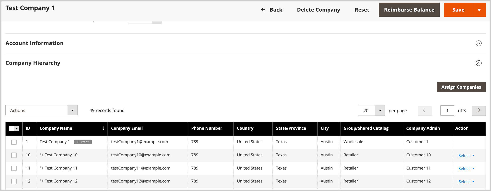

# 公司管理

[!BADGE 1.5.0測試版]{type=Informative url="/help/b2b/release-notes.md" tooltip="僅供測試版計畫參與者使用"}

公司管理可簡化具有複雜組織結構的公司的業務營運。 管理員使用者可以將公司指派給指定的母公司，藉此建立公司階層以映象B2B組織。 此指派可讓母公司管理員檢視及管理組織內的公司。

從啟動公司管理任務 *[!UICONTROL Companies]* 檢視。 從管理員，前往  **[!UICONTROL Customers]** > **[!UICONTROL Companies]**.

{width="700" zoomable="yes"}

在 *[!UICONTROL Companies grid]*，則 *[!UICONTROL Company Type]* 欄指出公司是作為組織的一部分進行管理，還是作為單獨的公司管理。

- `Parent` 是擁有一或多個指定公司的企業組織。 母公司不能被指派為其他公司的子公司。

- `Child` 是指派給組織的公司。 公司只能指派給一家母公司。

- `Company` 代表單一公司。 單一公司可以成為組織的一部分，方法是將其設為母公司，或將其指派給現有的母公司。

編輯父項或子項公司時，請展開 *[!UICONTROL Company Hierarchy]* 以檢視組織中的所有公司。 A `Current` 旗標會指出您正在編輯的公司。

{width="700" zoomable="yes"}

## 檢視和設定 [!UICONTROL Company Hierarchy]

初次建立公司時， [!UICONTROL Company Hierarchy] 格線是空的。 如果公司是單一公司，則此區域也是空的。

{width="700" zoomable="yes"}

對於母公司，具有適當許可權的Admin使用者可以完成以下工作：

- 藉由建立新的上階組織或更新現有的組織來建立公司階層。
- 管理現有組織以新增或移除公司。

如需詳細資訊，請參閱 [管理公司階層](assign-companies.md).
