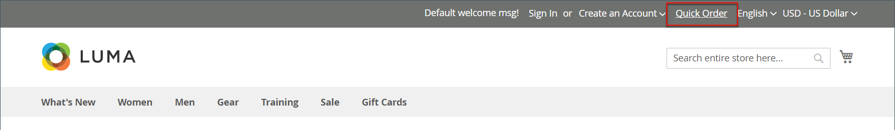
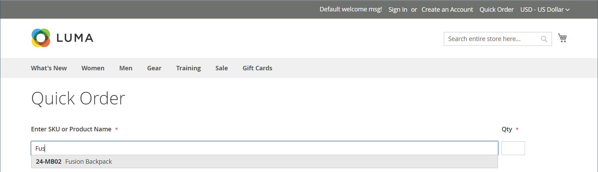

# 快速訂購

此 _快速訂購_ 功能可讓知道要訂購產品的產品名稱或SKU的客戶將訂購流程簡化為幾次點按。 您可以手動輸入具有多個SKU的訂單，或將其匯入「快速訂購」表單。 快速訂購可供登入其帳戶的客戶及來賓使用。 啟用時， _快速訂購_ 連結會出現在頁面頂端的客戶名稱旁。

{width="700" zoomable="yes"}

## 為您的商店啟用快速訂單

1. 在 _管理員_ 側欄，前往 **[!UICONTROL Stores]** > _[!UICONTROL Settings]_>**[!UICONTROL Configuration]**.

1. 在 _[!UICONTROL General]_區段中選擇&#x200B;**[!UICONTROL B2B Features]**.

1. 設定 **[!UICONTROL Enable Quick Order]** 至 `Yes`.

   {width="600" zoomable="yes"}

1. 按一下 **[!UICONTROL Save Config]**.

1. 出現提示時，按一下 [快取管理](../systems/cache-management.md) 並重新整理任何無效的快取。

## 快速訂購工作流程

客戶可使用下列其中一種方法來指定快速訂購的產品。

### 方法1：輸入個別產品

1. 客戶按一下 **[!UICONTROL Quick Order]** 連結。

1. 依SKU或產品名稱選取產品：

   放置 **依SKU快速訂購**，客戶會進行下列操作：

   - 輸入 **[!UICONTROL SKU]**.

   - 點擊數 **[!UICONTROL Add to List]**.

     SKU會顯示在輸入行中，其產品詳細資料如下。

     {width="600" zoomable="yes"}

   放置 **依產品名稱快速訂購**，客戶會進行下列操作：

   - 輸入開頭幾個字元 **[!UICONTROL Product Name]**.

     >[!NOTE]
     >
     >請勿使用 _輸入_ 鍵以選擇產品名稱。

   - 當可能的相符專案清單出現時，客戶按一下要訂購的產品。

     {width="700" zoomable="yes"}

1. 輸入 **[!UICONTROL Qty]**.

1. 使用下一個輸入行，視需要重複此程式。

1. 點擊數 **[!UICONTROL Add to Cart]**.

### 方法2：輸入多個產品

1. 在 **[!UICONTROL Enter Multiple SKUs]** 方塊中，客戶執行下列任一項作業：

   - 每行輸入一個SKU

   - 在同一行中輸入所有SKU （以逗號分隔，不含空格）。

     {width="600" zoomable="yes"}

1. 若要將產品新增至清單，請按一下 **[!UICONTROL Add to List]**.

1. 輸入 **[!UICONTROL Qty]** 以針對清單中的每個專案排序。

   {width="600" zoomable="yes"}

   >[!NOTE]
   >
   >如果產品有必要的選項，系統會提示客戶選擇選項。 他們可以等到到達購物車再新增產品選項。

   {width="600" zoomable="yes"}

### 方法3：上傳產品清單

1. 在 _[!UICONTROL Add from File]_區段，按一下&#x200B;**[!UICONTROL Download Sample]**下載訂單範本。

   {width="600" zoomable="yes"}

1. 開啟已下載的檔案。

1. 使用範本新增產品SKU以上傳給快速訂購清單。

1. 完成後，按一下 **[!UICONTROL Save]**.

   {width="400" zoomable="yes"}

1. 若要上傳檔案，請按一下 **[!UICONTROL Choose]** 並從其系統中選取檔案。

   專案會新增至「快速訂購」清單。

1. 準備就緒後，按一下 **[!UICONTROL Add to Cart]**.

客戶建立快速訂單後，就可以照常進行結帳。

{width="700" zoomable="yes"}
