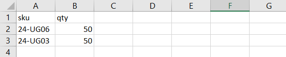

# 快速訂購

_快速訂購_&#x200B;功能可讓知道要訂購產品的產品名稱或SKU的客戶將訂購程式減少為幾次點按。 您可以手動輸入具有多個SKU的訂單，或將其匯入「快速訂購」表單。 快速訂購可供登入其帳戶的客戶及來賓使用。 啟用時，_快速訂購_&#x200B;連結會出現在頁面頂端的客戶名稱旁。

{width="700" zoomable="yes"}

## 為您的商店啟用快速訂單

1. 在&#x200B;_管理員_&#x200B;側邊欄上，移至&#x200B;**[!UICONTROL Stores]** > _[!UICONTROL Settings]_>**[!UICONTROL Configuration]**。

1. 在左側面板的&#x200B;_[!UICONTROL General]_&#x200B;區段中，選擇&#x200B;**[!UICONTROL B2B Features]**。

1. 將&#x200B;**[!UICONTROL Enable Quick Order]**&#x200B;設為`Yes`。

   {width="600" zoomable="yes"}

1. 按一下&#x200B;**[!UICONTROL Save Config]**。

1. 出現提示時，請按一下[快取管理](../systems/cache-management.md)並重新整理任何無效的快取。

## 快速訂購工作流程

客戶可使用下列其中一種方法來指定快速訂購的產品。

### 方法1：輸入個別產品

1. 客戶按一下&#x200B;**[!UICONTROL Quick Order]**&#x200B;連結。

1. 依SKU或產品名稱選取產品：

   若要透過SKU **下快速訂單**，客戶會執行下列動作：

   - 進入&#x200B;**[!UICONTROL SKU]**。

   - 按一下&#x200B;**[!UICONTROL Add to List]**。

     SKU會顯示在輸入行中，其產品詳細資料如下。

     {width="600" zoomable="yes"}

   若要依產品名稱&#x200B;**快速下單**，客戶會執行下列動作：

   - 輸入&#x200B;**[!UICONTROL Product Name]**&#x200B;的前幾個字元。

     >[!NOTE]
     >
     >請勿使用&#x200B;_Enter_&#x200B;金鑰來選擇產品名稱。

   - 當可能的相符專案清單出現時，客戶按一下要訂購的產品。

     {width="700" zoomable="yes"}

1. 進入&#x200B;**[!UICONTROL Qty]**。

1. 使用下一個輸入行，視需要重複此程式。

1. 按一下&#x200B;**[!UICONTROL Add to Cart]**。

### 方法2：輸入多個產品

1. 在&#x200B;**[!UICONTROL Enter Multiple SKUs]**&#x200B;方塊中，客戶執行下列任一項作業：

   - 每行輸入一個SKU

   - 在同一行中輸入所有SKU （以逗號分隔，不含空格）。

     {width="600" zoomable="yes"}

1. 若要將產品加入清單，請按一下&#x200B;**[!UICONTROL Add to List]**。

1. 輸入清單中每個專案要排序的&#x200B;**[!UICONTROL Qty]**。

   {width="600" zoomable="yes"}

   >[!NOTE]
   >
   >如果產品有必要的選項，系統會提示客戶選擇選項。 他們可以等到到達購物車再新增產品選項。

   {width="600" zoomable="yes"}

### 方法3：上傳產品清單

1. 在&#x200B;_[!UICONTROL Add from File]_&#x200B;區段中，按一下&#x200B;**[!UICONTROL Download Sample]**&#x200B;以下載訂單範本。

   {width="600" zoomable="yes"}

1. 開啟已下載的檔案。

1. 使用範本新增產品SKU以上傳給快速訂購清單。

1. 完成後，按一下&#x200B;**[!UICONTROL Save]**。

   要上載的{width="400" zoomable="yes"}

1. 若要上傳檔案，請按一下&#x200B;**[!UICONTROL Choose]**&#x200B;並從其系統選取檔案。

   專案會新增至「快速訂購」清單。

1. 準備就緒後，按一下&#x200B;**[!UICONTROL Add to Cart]**。

客戶建立快速訂單後，就可以照常進行結帳。

{width="700" zoomable="yes"}
