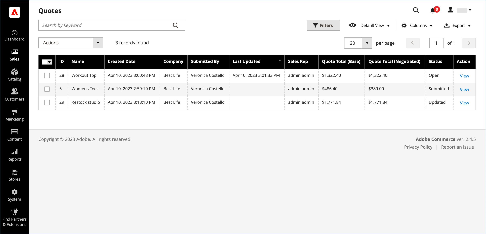
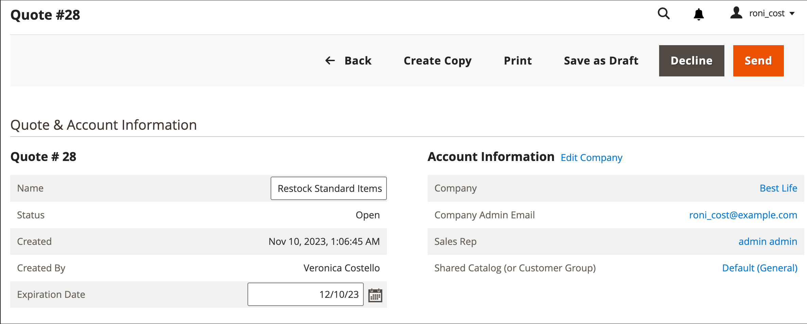
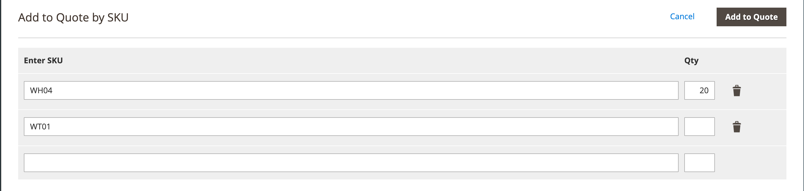
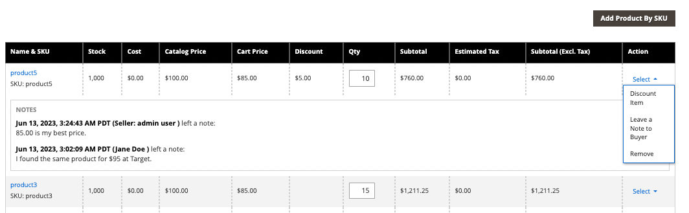

# 交涉報價

如果 [已啟用B2B報價](configure-quotes.md) 在組態中，價格議價可由授權採購員從公司或銷售代表啟動。

採購員啟動價格議價處理的方式 [請求報價](quote-request.md) 從購物車中。 銷售代表可以透過以下方式啟動議價： [為採購員建立草擬報價單](sales-rep-initiates-quote.md)，以初始訂單專案與訂價更新報價單，並傳送給採購員。

當價格議價開始時，報價會列在 [引號](quotes.md) 格線。 買方與賣方之間的所有議價都會透過電子郵件進行，並從報價的明細檢視表啟動及追蹤。

在議價過程中，賣方可向管理員執行下列作業：

- 新增或移除產品
- 變更數量
- 將折扣套用至明細專案，或套用總價
- 新增或變更送貨方法
- 新增註解
- 將更新後的報價單傳送給採購員，或另存為草稿

採購員從店面管理報價議價流程，使用 [[!UICONTROL My Quotes]](account-dashboard-my-quotes.md). 當報價單開啟以供複查時，其在採購員帳戶中的狀態會設為 `Pending`. 即使報價已遭拒絕或已過期，採購員仍可變更並重新提交報價。

## 步驟1：檢視請求

1. 在管理員側邊欄上，前往 **[!UICONTROL Sales]** > **[!UICONTROL Quotes]**.

   新請求會出現在 _[!UICONTROL Quotes]_格線。

1. 在 _動作_ 欄，按一下 **[!UICONTROL View]**.

   {width="700" zoomable="yes"}

## 步驟2：修改報價

1. 在 _[!UICONTROL Quote & Account Information]_，按一下_&#x200B;行事曆&#x200B;_()圖示。

   {width="575" zoomable="yes"}

1. 選擇 **[!UICONTROL Expiration Date]** 以取得報價。

1. 向下捲動至 _[!UICONTROL Quote Totals]_區段並更新&#x200B;**[!UICONTROL Negotiated Price]**視需要。

   {width="600" zoomable="yes"}

   如果採購員變更報價單中任何料號的數量，則會在報價單頂端顯示通知，指出料號清單已變更，且議價價格必須更新。

   {width="600" zoomable="yes"}

### 新增產品至報價單

1. 按一下 **[!UICONTROL Add Products by SKU]**.

1. 輸入 **[!UICONTROL SKU]** 和 **[!UICONTROL Qty]** 即將新增。

   {width="600" zoomable="yes"}

### 套用行專案更新

套用行專案變更於 _[!UICONTROL Items Quoted]_區段（如有需要）。

{width="600" zoomable="yes"}

- 變更 **[!UICONTROL Quantity]** 必須以建議價格購買。

- 選取 **[!UICONTROL Configure]** 並變更產品選項。

  此 [!UICONTROL Configure] 選項僅適用於可設定產品的條列專案

- 在 **[!UICONTROL Action]** 功能表，選取更新專案的動作：
   - **折扣專案** 以百分比、固定金額或偏好訂價來套用折扣。
您可以選擇鎖定折扣金額，以防止進一步折扣。 如果未鎖定折扣，則明細專案折扣與任何報價層次折扣都會套用至產品價格。
   - **給採購員留下備註** 為採購員提供有關料號的額外資訊
   - **移除** 以從報價移除專案。

### 套用變更和更新

- 若要套用變更，請按一下 **[!UICONTROL Add to Quote]**.

- 若要更新報價，請按一下 **[!UICONTROL Recalculate the Quote]**.

- 若要套用變更並將報價更新至共用型錄與價格規則，請按一下 **[!UICONTROL Update Prices]** 然後按一下 **[!UICONTROL Proceed]** 以確認更新。

  {width="600" zoomable="yes"}

### 更新送貨資訊

1. 如果採購員包含 _送貨地點_ 報價中的地址，按一下 **[!UICONTROL Get shipping methods and rates]**.

1. 從可用選項中選擇送貨方法。

1. 輸入 **[!UICONTROL Proposed Shipping Price]**.

   此 _[!UICONTROL Quote Totals]_會更新以反映建議的運費。

### 附加支援檔案

1. 在 _新增您的註解_ 方塊，按一下 **[!UICONTROL Attach file]**.

   根據預設， [附加的檔案](../configuration-reference/sales/quotes.md) 以下任何檔案格式最多可達2 MB：DOC、DOCX、XLS、XLSX、PDF、TXT、JPG或JPEG、PNG。

1. 從目錄中選擇檔案。

## 步驟3：更新報價層級資訊，並傳送您的回覆

1. 在 _[!UICONTROL Negotiation]_區段於_[!UICONTROL Comments]_ 索引標籤中，輸入您的回覆 **[!UICONTROL Add your comment]** 區段。

1. 若要包含支援檔案，請按一下 **[!UICONTROL Attach file]** 並從目錄中選取檔案。

   附件允許的最大檔案大小為2 MB。

1. 若要將折扣套用至整個報價單，請執行下列步驟：

   - 在 _[!UICONTROL Quote Totals]_在_[!UICONTROL Negotiated Price]_ 區段，選擇下列其中一種折扣型態：

      - `Percentage Discount`
      - `Amount Discount`
      - `Proposed Price`

   - 以百分比或統一價格輸入金額。

     {width="600" zoomable="yes"}

1. 傳送或儲存報價：

   - 如果報價單已準備好要傳回給採購員，請按一下 **[!UICONTROL Send]**.

   - 若要稍後繼續處理報價，請按一下 **[!UICONTROL Save as Draft]**.

## 步驟4：追蹤報價

當您傳送報價時，系統會通知購買者和管理公司帳戶的銷售代表。 電子郵件會包含購買者帳戶中報價的連結，以及報價的到期日。 在議價的任何時候，採購員都可以執行下列任一作業：

- 接受議價的報價並完成購買。
- 傳送包含還價報價的回覆，並繼續交涉。
- 結束交涉。

若要監視其在工作流程中的位置，請檢查您的電子郵件以及報價在格線中的狀態。 您可以視需要繼續交涉程式。

## 按鈕列

| 按鈕 | 說明 |
|----------------------------|---------------------------------------------------------------------------------------------------------------------------------------------------------------------------------------------------------------------------------------------------------------------------------------------------------------------------------------------------------------|
| [!UICONTROL Back] | 返回至 _[!UICONTROL Quotes]_頁面，而不儲存變更。 |
| [!UICONTROL Print] | 將報價傳送至印表機或儲存為PDF檔案。 |
| [!UICONTROL Create Copy] | [!BADGE 1.5.0 Beta版功能]{type=Informative url="/help/b2b/release-notes.md" tooltip="僅供測試版計畫參與者使用"}`(copy)` 附加至原始名稱。 透過編輯 [!UICONTROL Name] 欄位。 將新的報價單儲存為草稿，或傳送給客戶來處理它。 |
| [!UICONTROL Save as Draft] | 儲存對報價單所做的任何變更，但不要將其傳回給購買者。 |
| [!UICONTROL Decline] | 拒絕議價要求，無論是在初始詢問時還是在進行中的議價期間。 當報價被拒絕時，賣家應新增評論來解釋決定。 拒絕報價時，所有議價價格都會重設為原始值。 當賣家等待買家的回覆時，此按鈕會停用。 |
| [!UICONTROL Send] | 傳送更新後的報價作為買家查詢的回覆。 如果賣家正在等待買家的回覆，此按鈕會停用。 |

{style="table-layout:auto"}

## 欄位說明

「管理員」中的報價資訊和功能分為下列區段。

### [!UICONTROL Quote & Account Information]

| 欄位 | 說明 |
|-------------------------------------------------|------------------------------------------------------------------------------------------------------------------------------------------------------------------------------------------------------------------------------------------------------------------------------------------------------------------------------------------------------------------------------------------------------------------------------------------------------------------------------------------------------------------------------------------------------------------------------------------------------------------------------------------------------------------------------------------------------------------------------------------------------------------------------------------------------------------------------------------------------------------------------------------------------------------------------------------------------------------------------------------------------------------------------------------------------------------------------------------------------------|
| [!UICONTROL Name] | 由指派給報價請求的名稱 [購買者](account-company-roles-permissions.md). |
| [!UICONTROL Status] | 表示報價的目前狀態。 報價的狀態只能由買方或賣方執行動作來變更。 另請參閱 [狀態設定](quotes.md) 來自管理員與 [購買者帳戶](account-dashboard-my-quotes.md). |
| [!UICONTROL Created] | 買方首次提交報價請求的日期與時間。 |
| [!UICONTROL Created By] | 提交報價請求的公司買方名字和姓氏。 |
| [!UICONTROL Expiration Date] | 表示目前報價有效的最後一天。 在組態中，預設到期日設定為在採購員提交報價請求後的30天。   賣方可以輸入不同日期(YYYY MM DD )或選擇行事曆中的日期來覆寫預設到期日。 若將欄位留白，報價單將永不過期。   若為未結報價，賣方會收到 [電子郵件通知](../systems/email-templates.md) 報價排定到期前48小時。 買家會在到期日前24小時收到通知。   報價的狀態變更為 _已過期_ 而採購員無法進一步變更報價單。 報價中的建議價格會回復到目錄中的原始值。   當報價設定為到期時，如果報價開放供賣家複查，則到期日會根據設定中設定的範圍重設。   「到期日」是 _報價與帳戶_ 區段，可在稽核程式中編輯。 |
| [!UICONTROL Company] | 的法定名稱 [公司](account-companies.md) 買家所代表的。 |
| [!UICONTROL Company Admin Email] | 的電子郵件地址 [公司管理員](account-company-admin.md). |
| [!UICONTROL Sales Rep] | 此 [銷售代表](account-company-manage.md) 為賣家工作，且是指派給公司帳戶的主要聯絡人。 |
| [!UICONTROL Shared Catalog (or Customer Group)] | 此 [共用目錄](catalog-shared.md) 或 [客戶群組](account-company-customer-group.md) 將公司指派給哪個。 報價可能包含指定給公司的共用目錄中的自訂價格。 |

{style="table-layout:auto"}

### [!UICONTROL Add to Quote by SKU]

| 欄位 | 說明 |
|---------------------------|-----------------------------------------------------------|
| [!UICONTROL Enter SKU] | 要新增至報價的產品的SKU。 |
| [!UICONTROL Qty] | 要新增至報價的此SKU的專案數。 |
| [!UICONTROL Add to Quote] | 新增指定到報價單的產品數量。 |

{style="table-layout:auto"}

### [!UICONTROL Items Quoted]

| 欄位 | 說明 |
|-----------------------------------------|---------------------------------------------------------------------------------------------------------------------------------------------------------------------------------------------------------------------------|
| [!UICONTROL Name & SKU] | 連結的產品名稱與庫存單位(SKU)。 |
| [!UICONTROL Stock] | 此SKU下目前可供銷售的產品數量。 |
| [!UICONTROL Cost] | 賣家購買產品所支付的金額。 |
| [!UICONTROL Catalog Price] | 採購員型錄中的產品價格，根據指派給採購員公司的客戶群組或共用型錄。 |
| [!UICONTROL Cart Price] | 購物車中專案的原始價格，減去從購物車套用的任何折扣。 如果有適用於買家客戶群組的折扣或購物車規則，購物車價格可能會與目錄價格不同。 |
| [!UICONTROL Discount] | 套用至料號的明細專案折扣。 值可以是百分比、固定金額或建議價格。 |
| [!UICONTROL Qty] | 此SKU中作為報價基礎的單位數。 只能輸入大於零的正數。 如果您想要將數量變更為零，請從報價中刪除明細專案。 |
| [!UICONTROL Subtotal] | 建議的價格乘以訂購的料號數量。 |
| [!UICONTROL Estimated Tax] | 根據組態估計此明細專案的稅捐金額。 根據「稅捐計算設定」的不同，預估稅捐可依據下列任一專案：單價/資料列總計/總計 |
| [!UICONTROL Subtotal (Incl./Excl. Tax)] | 視組態而定，此欄位可顯示含或不含預估稅捐的小計。 |
| [!UICONTROL Action] | 可套用至行專案的作業選取功能表：<ul><li>**[!UICONTROL Discount item]**</li><li>**[!UICONTROL Leave a note to Buyer]**</li><li>**[!UICONTROL Remove an item from the quote]**</li></ul>. |
| [!UICONTROL Configure] | 可讓您變更可設定產品的產品選項。 |
| [!UICONTROL Update Prices] | 使用共用型錄與價格規則的最新變更來更新報價單。 |
| [!UICONTROL Recalculate Quote] | 重新計算所有報價價格、購物車價格規則及稅捐，以反映報價的變更。 |

{style="table-layout:auto"}

### [!UICONTROL Shipping Information]

| 欄位 | 說明 |
|--------------------------------------|------------------------------------------------------------------------------------------------------------------------------------------------------------------------------|
| [!UICONTROL Shipping Address] | 顯示採購員帳戶中指定的出貨地址。 如果買方在提交請求之前未指定地址，則出貨地址為空白。 |
| [!UICONTROL Shipping Method & Price] | 如果採購員包含下列專案，「取得出貨方式與費率」連結就會出現 _送貨地點_ 報價中的地址。 |

{style="table-layout:auto"}

### [!UICONTROL Negotiation]

| 欄位 | 說明 |
|--------------------------|----------------------------------------------------------------------------------------------------------------------------------------------------------------------------------------------------------------------------------------------------------------------------------------------------------------------------------------------------------------------------------------------------------------------------------------------------------------------------------------------------------------------------------------------------------------------------------------------------------------------------------------------------------|
| [!UICONTROL Comments] | 「議價」區段的「附註」頁標是用來輸入有關報價的訊息給採購員。  **[!UICONTROL Add your comment]**— 在議價處理期間，會使用註解與採購員溝通。 使用註解來說明報價中提供的任何折扣，或報價請求遭拒絕的原因。 **[!UICONTROL Attach file]**  — 檔案大小上限和支援的檔案型別 [附加的檔案](configure-quotes.md) 由設定決定。 依預設，附加檔案最大可達2 MB，以及下列任何檔案型別：DOC、DOCX、XLS、XLSX、PDF、TXT、JPG或JPEG、PNG。 |
| [!UICONTROL History Log] | 此索引標籤會顯示報價的完整歷史記錄，內含日期、報價狀態及註解。 |

{style="table-layout:auto"}

### [!UICONTROL Quote Totals]

| 欄位 | 說明 |
|-----------------------------------------------------|-----------------------------------------------------------------------------------------------------------------------------------------------------------------------------------------------------------------------------------------------------------------------------------------------------------------------------------------------------------------------------------------------------------------------------------------------------------------------------------------------------------------------------------------------------------------------------------------------------------------------------------------------------------------------|
| [!UICONTROL Total Cost] | 報價中包含之專案的銷售者總成本。 |
| [!UICONTROL Catalog Total Price  (Incl./Excl. Tax)] | 根據共用型錄或主要型錄中作為報價基礎的價格，報價單中不含稅捐的專案總價。 展開區段以顯示計算中使用的值，具體取決於 [顯示小計](../configuration-reference/sales/tax.md) 設定。 選項：  **[!UICONTROL Subtotal (Excl. Tax)]**— 不含預估稅捐的型錄總價。 **[!UICONTROL Subtotal (Incl. Tax)]**  — 不含預估稅捐的型錄總價。  **[!UICONTROL Estimated Tax]**— 預估要套用至「型錄總價」的稅捐金額。 |
| 議定價格 | 提供給買家的折扣可依據下列任一項：  **[!UICONTROL Percentage Discount]**— 以百分比表示的折扣。 **[!UICONTROL Amount Discount]**  — 固定金額的折扣。  **[!UICONTROL Proposed Price]**— 賣家提出的價格。
如果報價單中的所有料號都有鎖定的料號折扣，則 [!UICONTROL Negotiated Price] 區段已停用，因為無法再套用折扣。

如果產品具有未鎖定的明細專案折扣，則明細專案折扣與報價層次折扣都會套用至產品價格。
 |
| [!UICONTROL Quote Subtotal (Incl./Excl. Tax)] | 報價單中每個明細專案的建議總價（含稅或不含稅），取決於 [tax calculation — 稅捐計算](../configuration-reference/sales/tax.md) 設定。 |
| [!UICONTROL Shipping & Handling] | 賣家在報價單的「出貨資訊」區段的「建議出貨價格」欄位中輸入的金額。 如果該欄位為空，則金額會根據所選的送貨方法而定。 |
| [!UICONTROL Estimated Tax] | 預估到期的稅捐金額（如設定中所指定） [顯示設定](../configuration-reference/sales/tax.md). |
| [!UICONTROL Quote Grand Total (Incl. Tax)] | 報價底端的最終總計，包括議定價格、預估稅捐，以及提議的出貨與處理。 |

{style="table-layout:auto"}
