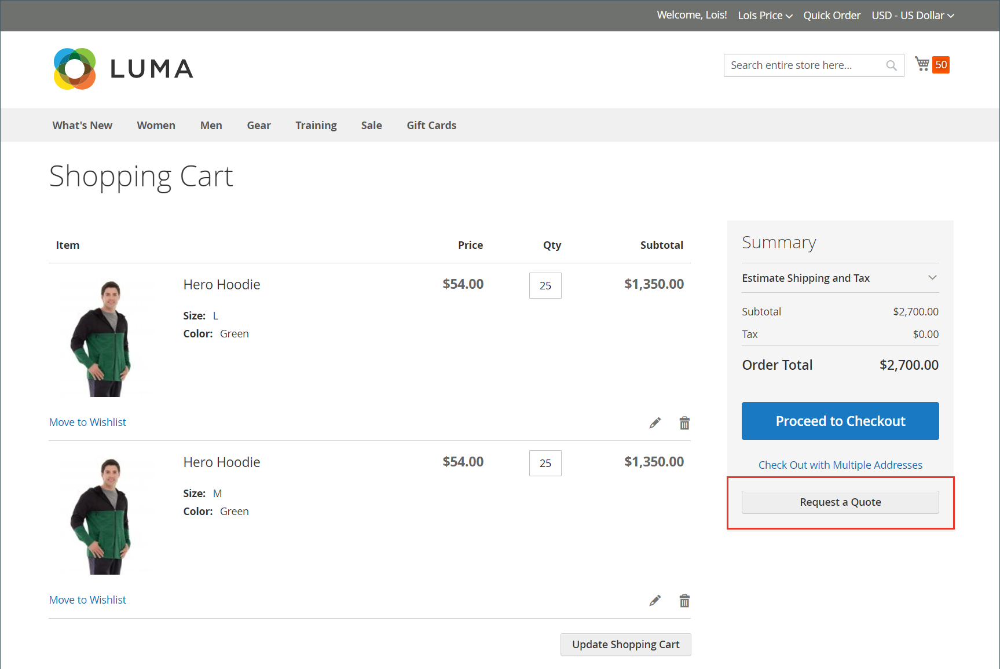

# 詢價

如果在[銷售功能組態](configure-quotes.md)中啟用報價單，來自公司的授權買家可以透過要求購物車的報價單來啟動價格議價程式。 如果採購員尚未準備好提交報價以進行議價，他們可以將報價儲存為草稿。

>[!NOTE]
>
>詢價不可包含折扣代碼或禮品卡。

## 客戶報價請求體驗

1. 客戶以具有[許可權](account-company-roles-permissions.md)的購買者身分登入其使用者帳戶以要求報價。

1. 新增要包含在報價中的產品至購物車。

   >[!TIP]
   > 
   >客戶可使用[快速訂購](quick-order.md)，更快速地新增產品SKU清單至購物車。

1. 選取&#x200B;**[!UICONTROL Request a Quote]**。

   {width="700" zoomable="yes"}

1. 在&#x200B;**[!UICONTROL Add your comment]**&#x200B;方塊中，客戶輸入簡短的附註以說明請求。

1. 輸入&#x200B;**[!UICONTROL Quote Name]**。

   {width="400" zoomable="yes"}

1. 如有需要，請將支援檔案或影像附加至報價：

   - 選取&#x200B;**[!UICONTROL Attach file]**。
   - 從系統選擇檔案。

   依預設，[附加檔案](configure-quotes.md)最大可達2 MB，為下列任何檔案格式：DOC、DOCX、XLS、XLSX、PDF、TXT、JPG或JPEG、PNG。

1. 建立及處理報價單：

   - 透過選取&#x200B;**[!UICONTROL Request a Quote]**&#x200B;將報價傳送給賣家。
   - 選取&#x200B;**[!UICONTROL Save as Draft]**，將報價儲存為草稿。

     如果購買者將報價儲存為草稿，則報價可在[!UICONTROL My Quotes]的`Draft`狀態中使用。 在買方傳送草擬報價以供複查之前，賣方無法看到草擬報價。
