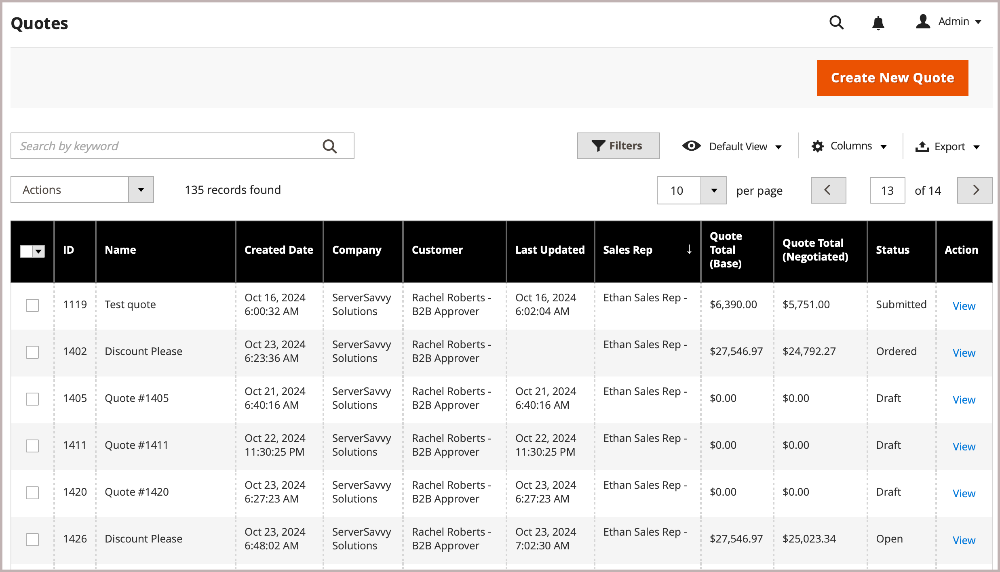

# Negotiable Quotes

Buyers and sellers use Quotes to manage the negotiation process for an order–adding items, updating quantities, requesting and applying discounts, and so on—until they reach agreement. The quote negotiation process can be initiated by an authorized company buyer, or by a company sales representative.

在Admin{width="700" zoomable="yes"}中報價清單檢視

建立報價之後，當買方或賣方提交報價以供複查時，議價處理就會開始。 _報價單_&#x200B;格線列出每個收到的報價單，並保留買賣雙方之間的通訊記錄。 [&#128279;](../getting-started/admin-workspace.md)

- [&#128279;](quote-price-negotiation.md)When creating the quote request, a buyer can save the quote as a draft, or submit it directly to the seller.

- In the Admin, Sales representatives can create quotes on behalf of company buyer. When creating the quote, a seller can save the quote as a draft, or submit it directly to the buyer to initiate the negotiation process.

During the negotiation process, the quote can only be updated by the person reviewing and proposing terms for further negotiation.

## 先決條件

Negotiable quotes are available only if Adobe Commerce has the following configuration settings:

- [The Adobe Commerce B2B extension is installed](install.md)
- [Configured B2B features](enable-basic-features.md)
   - Enable company accounts
   - Enable B2B quote

## Quote workflow

Quotes can be initiated by the buyer or the seller.

This diagram shows the quote statuses for a buyer and seller (Admin) in the different steps when you initiate a quote.

{width="700" zoomable="yes"}

**步驟1：建立報價（新）**

- **購買者要求報價** — 購買者[從購物車要求報價](quote-request.md)。 此請求會出現在買家帳戶儀表板的&#x200B;_我的報價單_&#x200B;清單中，並會傳送電子郵件通知給指派給公司帳戶的銷售代表。 在Admin中，要求出現在&#x200B;_Quotes_&#x200B;格線中，狀態為`New`。 在賣家開啟報價之前，買方可以修改報價請求。

  {width="700" zoomable="yes"}

- **銷售代表** — 銷售代表可以從管理員代表特定公司購買者[建立報價單](sales-rep-initiates-quote.md)。 銷售代表必須更新報價單，以將產品與其他資訊（如折扣與備註）新增至採購員。 銷售代表可以將報價單儲存為`draft`，或傳送給採購員以開始議價。 在草稿狀態下，只有賣家能看到報價。 傳送報價後，狀態為`Submitted`。 在買方將其送回之前，賣方無法修改它。

  {width="700" zoomable="yes"}的Quotes格線中起始買方報價

**步驟2：報價稽核與交涉（稽核）**

複查或議定報價單可包括變更數量、移除料號、新增明細專案備註、套用明細專案或報價單折扣（賣方）以及新增出貨地址（採購員）。

- **賣家檢視要求並傳送回應** — 在管理員中，賣家檢視報價要求。 在店面，報價的狀態變更為`Pending`，買方無法進行任何變更。 [賣家回應](quote-price-negotiation.md)，提供價格折扣，並視需要調整數量與專案，輸入註解，然後將報價傳回給買方。 系統會以電子郵件通知買方和銷售代表，表示賣方已回應。

- **買方檢視賣方的報價並傳送回應** — 買方按一下電子郵件通知中的連結以開啟報價，或從帳戶儀表板的&#x200B;_我的報價_&#x200B;頁面開啟報價。 採購員可在明細專案或報價層次、變更數量及移除專案等位置向賣方留下備註。

買方和賣方可以繼續議價程式，直到達成協定或賣方拒絕報價為止。 如果採購員變更報價單（新增或移除產品或變更產品數量），報價單必須退回給賣家進行複查。

- **購買者新增送貨地址** — 購買者可以在報價單中新增送貨地址。 買方新增地址後，賣方可提供運送和交貨選項。 顯示的送貨方法視店面組態而定。

如果買方新增出貨地址，則必須複查議價協定，而賣方可以繼續議價處理，直到達成協定或賣方拒絕報價為止。

**步驟3：購買者接受報價（結帳）**

買家接受建議價格並繼續結帳。 額外的折扣無法新增至議價的報價單。

Shipping options are locked on checkout.

## Quote Status

Quote status provides information about the current state of the quote in the quote workflow. The status of a quote changes only when a buyer or seller takes an action on the quote. [!UICONTROL Proceed to Checkout]

- *[!UICONTROL New]* The request can be updated by the buyer until it is opened by the seller.

- **[!UICONTROL Draft]** — 賣家為買家建立草稿報價。 在賣家新增報價詳細資料（料號、數量、折扣等）並將報價提交給買方之前，買方無法看到報價單。

- **[!UICONTROL Open]** — 賣家已開啟請求，並正在稽核請求及準備回應

- **[!UICONTROL Submitted]** — 賣家已傳送回應給買方。 報價記錄無法在交涉處理期間進行編輯。

- **[!UICONTROL Client Reviewed]** — 買方已檢視賣方的回應，且正在準備回覆。

- **[!UICONTROL Updated]** — 買方提交了回應，但賣方尚未檢視。

- **[!UICONTROL Ordered]** — 買方根據議價的報價提交訂單。

- **[!UICONTROL Closed]** — 買方已取消報價請求。

- **[!UICONTROL Declined]** — 賣家拒絕報價請求。 所有自訂訂訂訂價都會從報價中移除，且記錄會被鎖定，無法進一步編輯。

- **[!UICONTROL Expired]** — 買方在指定的期間內未回應賣方的回覆，且報價已無效。

## B2B role resources for store quotes

[&#128279;](../systems/permissions-user-roles.md#role-resources)These role resources must be set for the Admin user role that is assigned to the store administrator.

**[!UICONTROL System]**&#x200B;_[!UICONTROL Permissions]_&#x200B;**[!UICONTROL User Roles]**&#x200B;[!UICONTROL Sales]&#x200B;[!UICONTROL Operations]&#x200B;[!UICONTROL Quotes]__

{width="700" zoomable="yes"}

## Apply an action

在「管理員」中，B2B管理員和賣家可以使用[!UICONTROL Actions]功能表管理報價格線中的報價。

{width="700" zoomable="yes"}

1. __&#x200B;**[!UICONTROL Sales]**&#x200B;**[!UICONTROL Quotes]**

1. In the first column of the grid, select the checkbox for each record that you want to apply the action to.

1. **[!UICONTROL Actions]**

### View a quote

1. **[!UICONTROL Actions]**&#x200B;**[!UICONTROL View]**

1. [&#128279;](quote-price-negotiation.md)

### View quote activity

[!UICONTROL Comments]&#x200B;[!UICONTROL History Log]

1. Open a quote.

1. **[!UICONTROL Negotiation]**&#x200B;**[!UICONTROL Comments]**&#x200B;**[!UICONTROL History Log]**

   {width="400"}

1. History is also tracked at the line item level.

   {width="400"}

### Decline a request for a quote

`Open`

1. 選取您想要拒絕的每個未結報價請求。

1. 將&#x200B;_[!UICONTROL Actions]_&#x200B;控制項設為`Declined`。

1. 出現提示時，輸入報價遭拒絕的原因，然後按一下&#x200B;**[!UICONTROL Confirm]**。

   {width="400"}
