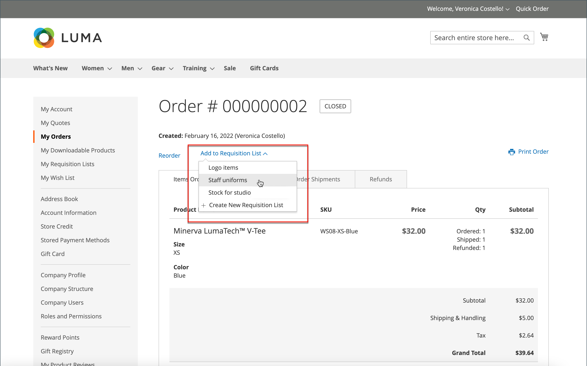
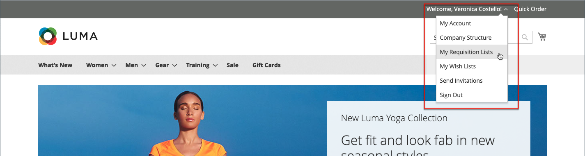

# 請購單清單

使用請購單清單可節省購買經常訂購產品的時間，因為會直接從清單將料號新增至購物車。 購買者可以維護多個清單，專注於不同廠商、購買者、團隊、行銷活動的產品，或簡化其工作流程的任何其他產品。 登入的使用者可以使用請購單清單功能。

>[!NOTE]
>
>若要啟用商店的請購單清單，請參閱[啟用B2B功能](enable-basic-features.md)。 視[組態](configure-requisition-lists.md)而定，每個採購員帳戶最多可維護999個請購單清單。

請購單清單功能與願望清單類似，但有以下差異：

- 將專案傳送至購物車後，未清除請購單清單。 可多次使用。
- 請購單清單的使用者介面使用精簡檢視來顯示許多料號。

店面顯示的{width="600" zoomable="yes"}

## 從帳戶儀表板建立請購單清單

與公司帳戶關聯的登入採購員，可以從其帳戶儀表板建立請購單清單。

1. 在其帳戶的側邊欄中，選擇&#x200B;**[!UICONTROL My Requisition Lists]**。

1. 在&#x200B;_[!UICONTROL Requisition Lists]_&#x200B;頁面上，按一下&#x200B;**[!UICONTROL Create New Requisition List]**。

1. 輸入&#x200B;**[!UICONTROL Requisition List Name]**&#x200B;和&#x200B;**[!UICONTROL Description]**。

   {width="300"}

1. 完成後，按一下&#x200B;**[!UICONTROL Save]**。

## 從產品頁面建立請購單清單

與公司帳戶關聯的登入採購員，可以從產品頁面建立請購單清單。 此方法提供建立清單和新增產品的簡單捷徑。

1. 在產品詳細資料頁面中，購買者按一下&#x200B;**[!UICONTROL Add to Requisition List]**。

1. 按一下&#x200B;**[!UICONTROL Create New Requisition List]**。

1. 輸入&#x200B;**[!UICONTROL Requisition List Name]**&#x200B;和&#x200B;**[!UICONTROL Description]**。

1. 完成後，按一下&#x200B;**[!UICONTROL Save]**。

## 將產品新增至請購單清單

採購員可從下列位置將產品新增至請購單清單：

- 產品頁面
- 目錄頁面
- 購物車
- 現有訂單
- 現有引號

### 從產品詳細資料頁面

1. 從店面，採購員前往要加入請購單清單之產品的詳細資訊頁面。

1. 按一下&#x200B;**[!UICONTROL Add to Requisition List]**&#x200B;並執行下列任一項作業：

   - 選擇現有的請購單清單。
   - 建立請購單清單。

   {width="700" zoomable="yes"}

### 從目錄頁面

1. 採購員從店面前往包含要加入請購單清單之產品的目錄頁面。

1. 將滑鼠停留在產品上。

1. 按一下&#x200B;**[!UICONTROL Add to Requisition List]**&#x200B;並執行下列任一項作業：

   - 選擇現有的請購單清單。
   - 建立請購單清單。

   {width="700" zoomable="yes"}

### 從現有訂單

1. 在其帳戶儀表板的側邊欄中，購買者選擇&#x200B;**[!UICONTROL My Orders]**。

1. 在訂單頂端，按一下&#x200B;**[!UICONTROL Add to Requisition List]**&#x200B;並執行下列任一項作業：

   - 選擇現有的請購單清單。
   - 建立請購單清單。

   {width="700" zoomable="yes"}

### 從現有報價

從可轉讓的報價單中，購買者可以使用[!UICONTROL Move to Requisition List]選項，將產品從報價單移至現有的請購單清單。 如果沒有請購單清單，則無法使用[!UICONTROL Move to Requisition List]選項。

1. 在其帳戶儀表板的側邊欄中，購買者選取&#x200B;**[!UICONTROL My Quotes]**。

1. 在清單中尋找並存取所需的報價。

1. 在[!UICONTROL Items Quoted]索引標籤中，選取要移動的產品。

1. 使用產品條列專案[!UICONTROL Actions]欄中的[!UICONTROL Select]下拉式清單，選擇&#x200B;**[!UICONTROL Move to Requisition list]**。

1. 選取所選料號的請購單清單。

1. 按一下&#x200B;**[!UICONTROL Move item to Requisition List]**。

如需有關B2B引數的詳細資訊，請參閱[我的引號](account-dashboard-my-quotes.md)主題。

### 從購物車

1. 在專案底下，購買者按一下&#x200B;**[!UICONTROL Add to Requisition List]**&#x200B;功能表並執行下列其中一項作業：

   - 選擇現有的請購單清單。
   - 建立請購單清單。

   {width="700" zoomable="yes"}

## 檢視更新的請購單清單

採購員登入其帳戶時，可以使用下列任一方法檢視其任何請購單清單。

{width="700" zoomable="yes"}

### 從帳戶儀表板

1. 在其帳戶儀表板的側邊欄中，選擇&#x200B;**[!UICONTROL My Requisition Lists]**。

1. 在請購單清單中，按一下&#x200B;_動作_&#x200B;欄中的&#x200B;**[!UICONTROL View]**。

### 從任何店面頁面

1. 在頁面頂端的快速連結列中，按一下其使用者名稱。

1. 在功能表上，選擇&#x200B;**[!UICONTROL My Requisition Lists]**。
