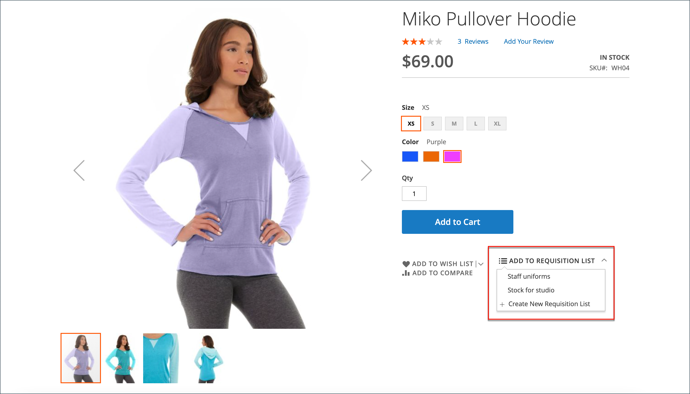

# 請購單清單

使用請購單清單可節省購買經常訂購產品的時間，因為會直接從清單將料號新增至購物車。 客戶可以維護多個清單，專注於來自不同廠商、購買者、團隊、行銷活動的產品，或簡化其工作流程的任何其他產品。 它可供登入的使用者和來賓使用。

>[!NOTE]
>
>若要啟用商店的請購單清單，請參閱 [啟用B2B功能](enable-basic-features.md). 它最多可允許為每個客戶帳戶維護999份請購單清單，具體取決於 [設定](configure-requisition-lists.md).

請購單清單功能與願望清單類似，但有以下差異：

- 將專案傳送至購物車後，未清除請購單清單。 可多次使用。
- 請購單清單的使用者介面使用精簡檢視來顯示許多料號。

{width="600" zoomable="yes"}

## 從帳戶儀表板建立請購單清單

與公司帳戶關聯的登入客戶可以從其帳戶儀表板建立請購單清單。

1. 在其帳戶的側邊欄中，選擇 **[!UICONTROL My Requisition Lists]**.

1. 在 _[!UICONTROL Requisition Lists]_頁面，點按&#x200B;**[!UICONTROL Create New Requisition List]**.

1. 輸入 **[!UICONTROL Requisition List Name]** 和 **[!UICONTROL Description]**.

   {width="300"}

1. 完成後，按一下 **[!UICONTROL Save]**.

## 從產品頁面建立請購單清單

與公司帳戶關聯的登入客戶可以從產品頁面建立請購單清單。 此方法提供建立清單和新增產品的簡單捷徑。

1. 在產品詳細資料頁面中，客戶按一下 **[!UICONTROL Add to Requisition List]**.

1. 點擊數 **[!UICONTROL Create New Requisition List]**.

1. 輸入 **[!UICONTROL Requisition List Name]** 和 **[!UICONTROL Description]**.

1. 完成後，按一下 **[!UICONTROL Save]**.

## 將產品新增至請購單清單

客戶可從下列位置將產品新增至請購單清單：

- 產品頁面
- 目錄頁面
- 購物車
- 現有訂單

### 從產品詳細資料頁面

1. 從店面，客戶前往要加入請購單清單之產品的詳細資訊頁面。

1. 點按次數 **[!UICONTROL Add to Requisition List]** 並執行下列任一項作業：

   - 選擇現有的請購單清單。
   - 建立請購單清單。

   {width="700" zoomable="yes"}

### 從目錄頁面

1. 從店面，客戶前往包含要新增至請購單清單之產品的目錄頁面。

1. 將滑鼠停留在產品上。

1. 點按次數 **[!UICONTROL Add to Requisition List]** 並執行下列任一項作業：

   - 選擇現有的請購單清單。
   - 建立請購單清單。

   {width="700" zoomable="yes"}

### 從現有訂單

1. 在其帳戶控制面板的側邊欄中，客戶選擇 **[!UICONTROL My Orders]**.

1. 在訂單頂端，按一下 **[!UICONTROL Add to Requisition List]** 並執行下列任一項作業：

   - 選擇現有的請購單清單。
   - 建立請購單清單。

   {width="700" zoomable="yes"}

### 從購物車

1. 在專案底下，客戶按一下 **[!UICONTROL Add to Requisition List]** 功能表，並執行下列任一項作業：

   - 選擇現有的請購單清單。
   - 建立請購單清單。

   {width="700" zoomable="yes"}

## 檢視更新的請購單清單

客戶登入帳戶時，可以使用下列任一方法檢視其任何請購單清單。

{width="700" zoomable="yes"}

### 從帳戶儀表板

1. 在其帳戶儀表板的側邊欄中，選擇 **[!UICONTROL My Requisition Lists]**.

1. 在請購單清單中，按一下 **[!UICONTROL View]** 在 _動作_ 欄。

### 從任何店面頁面

1. 在頁面頂端的快速連結列中，按一下其使用者名稱。

1. 在功能表上，選擇 **[!UICONTROL My Requisition Lists]**.
