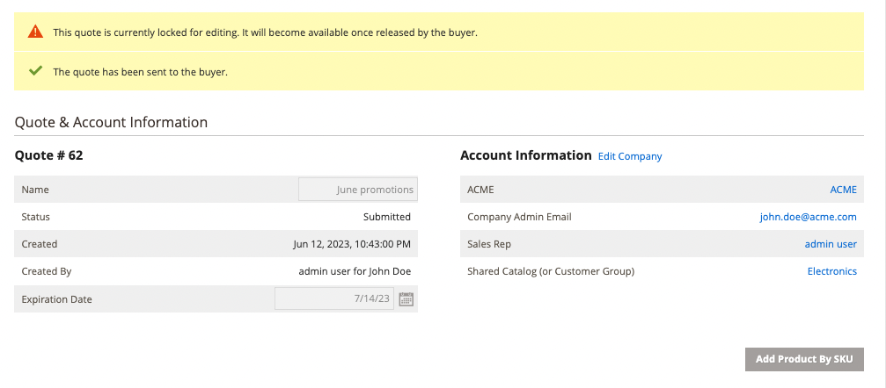

# 啟動採購員的報價單

如果在以下欄位中啟用引號： [銷售功能設定](configure-quotes.md)，銷售代表可以透過從管理員建立報價單，與公司採購員啟動議價流程。

- 草稿報價僅對賣家可見。
- 除非銷售代表新增料號、相關折扣與附註，以建立買方的初始優惠方案，否則無法提交草擬報價單。
- 賣家可從「報價單」或「客戶方格」建立報價單。

「銷售代表」會將報價單傳送給採購員，以啟動議價處理。 另請參閱 [交涉報價](quote-price-negotiation.md).

## 銷售代表報價建立經驗

銷售代表可以從「報價單」或「客戶網格」建立報價單。

>[!NOTE]
>
>如需賣家為買家建立報價的影片示範，請參閱 [銷售代表啟動報價單](https://experienceleague.adobe.com/docs/commerce-learn/tutorials/b2b/b2b-quote/sales-rep-initiates-quote.html) 在 _Commerce影片和Tutorials_.

### 從報價格線建立報價

1. 銷售代表以管理員身分登入Admin，具有 [銷售作業許可權](../systems/permissions.md) 以管理報價。

1. 在Admin中，前往 [!UICONTROL Quotes] 藉由選取 **[!UICONTROL Sales]**，然後選取 **[!UICONTROL Quotes]**.

1. 為採購員建立報價單。

   - 從「引號」格線中，選取 **[!UICONTROL Create New Quote]**.

     {width="700" zoomable="yes"}

   - 在 [!UICONTROL Create New Quote] 頁面中，選取要建立報價的客戶（公司採購員）。

     {width="700" zoomable="yes"}

     新的報價顯示於 `Draft` 狀態。

     {width="700" zoomable="yes"}

   - 更新報價單名稱，並視需要修改到期日。

   - 將報價儲存為草稿。

## 為採購員準備報價單

建立草擬報價之後，新增產品專案、套用折扣，並藉由在報價中新增註解及任何相關檔案來與買方溝通。 然後，將報價單傳送給採購員進行複查，或儲存為草稿。

1. 藉由選取將專案新增至報價單 **[!UICONTROL Add Product By SKU]**. 輸入SKU編號與數量，然後選取 **[!UICONTROL Add Product]**.

{width="700" zoomable="yes"}

1. 視需要對產品套用明細專案折扣。

   - 從 [!UICONTROL Select] 動作功能表，選擇 **[!UICONTROL Discount Item]**.

   - 在 [!UICONTROL Discount Line item] 表單，選取 **[!UICONTROL Discount Type]**.

   {width="700" zoomable="yes"}

   - 在 [!UICONTROL Discount] 欄位，輸入折扣型態的值。 例如，如果您選取了百分比折扣，請輸入10以套用10%折扣至明細行專案。

   - [!BADGE 1.5.0 Beta版功能]{type=Informative url="/help/b2b/release-notes.md" tooltip="僅供測試版計畫參與者使用"}

     確認變更後，產品格線中的明細專案屬性會更新以顯示套用的折扣金額。 如果折扣已鎖定，則會顯示鎖定圖示。

1. 視需要套用報價層級折扣：

   - 在 [!UICONTROL Quote Totals - Negotiated Price] 區段，選取折扣型態，然後輸入要套用的值。

     {width="700" zoomable="yes"}

   產品格線會更新以顯示折扣。

1. 新增採購員的額外資訊。

   在 [!UICONTROL Negotiation - Comments]，新增附註，並附加購買者所需的任何支援檔案 [!UICONTROL Negotiation - Comments]

   {width="700" zoomable="yes"}

   依預設， [附加的檔案](configure-quotes.md) 最大可達2 MB，為下列任何檔案格式：DOC、DOCX、XLS、XLSX、PDF、TXT、JPG或JPEG、PNG。

1. 處理報價。

   將報價單另存為草稿，或傳送給採購員。

   如果您將報價單傳送給採購員，則狀態會變更為 `Submitted`，而且報價會鎖定到買方報價，狀態會更新為草擬並顯示確認訊息：

   {width="700" zoomable="yes"}

採購員會收到電子郵件通知，要求複查報價單。 在採購員退回報價以供進一步議價之前，報價會被鎖定。 賣方可從報價格或客戶格檢視報價。

## 從「客戶網格」檢視及建立報價單

1. 在Admin中，前往 [!UICONTROL Customer] 藉由選取 **[!UICONTROL Customers]**，然後選取 **[!UICONTROL All Customers]**.

1. 選取「公司」採購員的客戶識別碼。

   {width="700" zoomable="yes"}

1. 選取 **[!UICONTROL Edit]** 以檢視客戶資訊。

1. 選取以下專案為客戶建立報價： **[!UICONTROL Create Quote]** 並依照此程式更新草擬報價並傳送給客戶。

1. 選取以檢視客戶現有的報價單 **[!UICONTROL Quotes]**.

   {width="700" zoomable="yes"}

1. 透過選取以下專案開啟報價 **[!UICONTROL View]**.

如需管理報價議價處理的詳細資訊，請參閱 [交涉報價](quote-price-negotiation.md)
