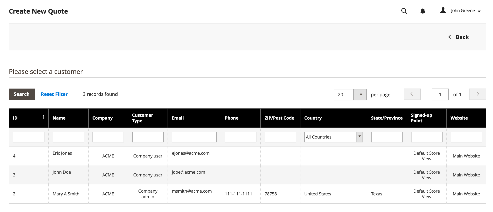
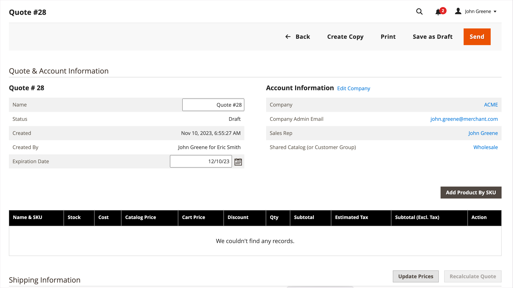
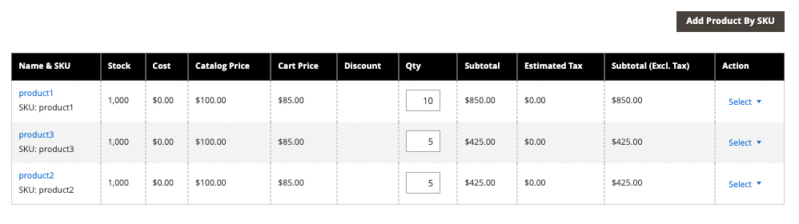

# Initiate a Quote for a Buyer

- Draft quotes are visible only to the seller.
- Draft quotes cannot be submitted until the sales representative adds items, relevant discounts, and notes to create the initial offer for the buyer.
- A seller can create a quote from the Quotes or Customer Grid.

The Sales Representative sends the quote to the buyer to initiate the negotiation process. 

## Sales representative quote creation experience

A Sales Representative can create a quote from the Quotes or Customer Grid.

>[!NOTE]
>
>__

### Create a quote from the Quote grid

1. 

1. [!UICONTROL Quotes]**[!UICONTROL Sales]****[!UICONTROL Quotes]**

1. Create a quote for a buyer.

   - **[!UICONTROL Create New Quote]**

     {width="700" zoomable="yes"}

   - [!UICONTROL Create New Quote]

     {width="700" zoomable="yes"}

     `Draft`

     {width="700" zoomable="yes"}

   - Update the quote name and modify the expiration date as needed.

   - Save the quote as a draft.

## Prepare the quote for the buyer

After creating the draft quote, add product items, apply discounts, and communicate with the buyer by adding comments and any related files to the quote. Then, send the quote to the buyer for review, or save it as a draft.

1. **[!UICONTROL Add Product By SKU]****[!UICONTROL Add Product]**

   {width="675" zoomable="yes"}

1. Apply line item discounts to products as needed.

   - [!UICONTROL Select]**[!UICONTROL Discount Item]**

   - [!UICONTROL Discount Line item]**[!UICONTROL Discount Type]**

     {width="675" zoomable="yes"}

   - [!UICONTROL Discount]For example, if you selected a percentage discount, enter 10 to apply a 10% discount to the line item.

   - Optionally, lock the line item discount value so that the product price is not further reduced by any discounts applied at the quote level.

     After confirming the change, the line item attributes in the product grid update to show the discount amount applied. If the discount is locked, a lock icon displays.

   A Sales Representative can request a discount from a specific line item in a quote.

   >[!NOTE]
   >
   >__

1. Apply a quote-level discount as needed:

   - [!UICONTROL Quote Totals - Negotiated Price]

     {width="700" zoomable="yes"}

   The product grid updates to show the discount.

1. Add additional information for the buyer.

   **[!UICONTROL Negotiation - Comments]**

   {width="700" zoomable="yes"}

   

1. Add shipping address during negotiations.

   A Sales Representative can make a shipping and delivery selection once the buyer has added a shipping address to the quote.

   Shipping options are locked on checkout.

   

1. Process the quote.

   Save the quote as a draft, or send it to the buyer.

   - `Draft`

   - `Submitted`The buyer receives an email notification to review the quote. The quote is locked until the buyer returns it for further negotiation. The seller can view the quote from the Quote grid or the Customer grid.

## View and create quotes from Customer Grid

1. [!UICONTROL Customer]**[!UICONTROL Customers]****[!UICONTROL All Customers]**

1. Select the customer ID for a Company buyer.

   {width="700" zoomable="yes"}

1. **[!UICONTROL Edit]**

1. **[!UICONTROL Create Quote]**

1. **[!UICONTROL Quotes]**

   {width="700" zoomable="yes"}

1. **[!UICONTROL View]**

