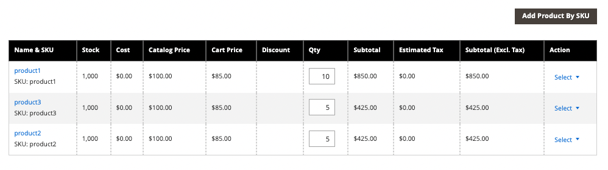
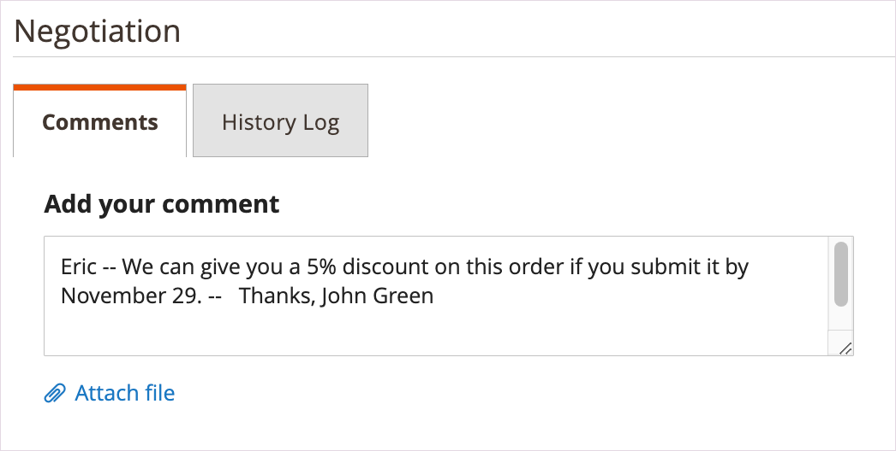

# 啟動採購員的報價單

如果在[銷售功能組態](configure-quotes.md)中啟用報價單，則銷售代表可以透過管理員建立報價單，與公司採購員啟動議價流程。

- 草稿報價僅對賣家可見。
- 除非銷售代表新增料號、相關折扣與附註，以建立買方的初始優惠方案，否則無法提交草擬報價單。
- 賣家可從「報價單」或「客戶方格」建立報價單。

「銷售代表」會將報價單傳送給採購員，以啟動議價處理。 請參閱[交涉報價](quote-price-negotiation.md)。

## 銷售代表報價建立經驗

銷售代表可以從「報價單」或「客戶網格」建立報價單。

>[!NOTE]
>
>如需為買家建立報價的賣家影片示範，請參閱&#x200B;_Commerce影片和教學課程_&#x200B;中的[銷售代表啟動報價](https://experienceleague.adobe.com/docs/commerce-learn/tutorials/b2b/b2b-quote/sales-rep-initiates-quote.html)。

### 從報價格線建立報價

1. 銷售代表以具有[Sales Operations許可權](../systems/permissions.md)的管理員身分登入管理員以管理報價。

1. 在Admin中，選取&#x200B;**[!UICONTROL Sales]**&#x200B;以移至[!UICONTROL Quotes]格線，然後選取&#x200B;**[!UICONTROL Quotes]**。

1. 為採購員建立報價單。

   - 從「引號」格線中，選取&#x200B;**[!UICONTROL Create New Quote]**。

     {width="700" zoomable="yes"}

   - 在[!UICONTROL Create New Quote]頁面上，選取要建立報價的客戶（公司購買者）。

     {width="700" zoomable="yes"}

     新的報價單以`Draft`狀態顯示。

     {width="700" zoomable="yes"}

   - 更新報價單名稱，並視需要修改到期日。

   - 將報價儲存為草稿。

## 為採購員準備報價單

建立草擬報價之後，新增產品專案、套用折扣，並藉由在報價中新增註解及任何相關檔案來與買方溝通。 然後，將報價單傳送給採購員進行複查，或儲存為草稿。

1. 選取&#x200B;**[!UICONTROL Add Product By SKU]**，將專案新增至報價單。 輸入SKU編號和數量，然後選取&#x200B;**[!UICONTROL Add Product]**。

   {width="675" zoomable="yes"}

1. 視需要對產品套用明細專案折扣。

   - 從[!UICONTROL Select]動作功能表中選擇&#x200B;**[!UICONTROL Discount Item]**。

   - 在[!UICONTROL Discount Line item]表單上，選取&#x200B;**[!UICONTROL Discount Type]**。

     {width="675" zoomable="yes"}

   - 在[!UICONTROL Discount]欄位中，輸入折扣型別的值。 例如，如果您選取了百分比折扣，請輸入10以套用10%折扣至明細行專案。

   - 選擇性地鎖定明細行料號折扣值，以便產品價格不會因報價層次套用的任何折扣而進一步降低。

     確認變更後，產品格線中的明細專案屬性會更新以顯示套用的折扣金額。 如果折扣已鎖定，則會顯示鎖定圖示。

   銷售代表可以從報價中的特定明細專案要求折扣。

   >[!NOTE]
   >
   >如需明細專案折扣運作方式的影片示範，請參閱&#x200B;_Commerce影片和教學課程_&#x200B;中的[銷售代表將折扣套用至報價明細專案](https://experienceleague.adobe.com/docs/commerce-learn/tutorials/b2b/b2b-quote/quote-line-item-discount.html)。

1. 視需要套用報價層級折扣：

   - 在[!UICONTROL Quote Totals - Negotiated Price]區段中，選取折扣型別，然後輸入要套用的值。

     {width="700" zoomable="yes"}

   產品格線會更新以顯示折扣。

1. 新增採購員的額外資訊。

   在&#x200B;**[!UICONTROL Negotiation - Comments]**&#x200B;標籤上，新增筆記並附加購買者所需的任何支援檔案。

   {width="700" zoomable="yes"}

   依預設，[附加檔案](configure-quotes.md)最大可達2 MB，為下列任何檔案格式：DOC、DOCX、XLS、XLSX、PDF、TXT、JPG或JPEG、PNG。

1. 在交涉期間新增送貨地址。

   當採購員新增出貨地址至報價單時，銷售代表即可進行出貨與交貨選擇。

   結帳時鎖定送貨選項。

   如需詳細資訊，請參閱[我的引號](account-dashboard-my-quotes.md#adding-a-shipping-address)。

1. 處理報價。

   將報價單另存為草稿，或傳送給採購員。

   - 如果您將報價另存為草稿，則狀態會更新為`Draft`並顯示確認訊息。

   - 如果您將報價傳送給買家，則狀態會變更為`Submitted`。 採購員會收到電子郵件通知，要求複查報價單。 在採購員退回報價以供進一步議價之前，報價會被鎖定。 賣家可以從「報價」網格或「客戶」網格檢視報價。

## 從「客戶網格」檢視及建立報價單

1. 在Admin中，選取&#x200B;**[!UICONTROL Customers]**&#x200B;以移至[!UICONTROL Customer]格線，然後選取&#x200B;**[!UICONTROL All Customers]**。

1. 選取「公司」採購員的客戶識別碼。

   {width="700" zoomable="yes"}

1. 選取&#x200B;**[!UICONTROL Edit]**&#x200B;以檢視客戶資訊。

1. 選取&#x200B;**[!UICONTROL Create Quote]**&#x200B;並依照程式更新草稿報價並傳送給客戶，以建立客戶的報價。

1. 選取&#x200B;**[!UICONTROL Quotes]**&#x200B;以檢視客戶現有的報價單。

   {width="700" zoomable="yes"}

1. 選取&#x200B;**[!UICONTROL View]**&#x200B;以開啟報價。

如需管理報價議價流程的詳細資訊，請參閱[議價報價單](quote-price-negotiation.md)
