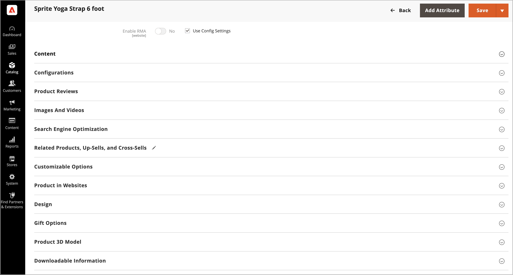

# 使用Adobe Commerce的[!DNL AR Viewer]管理產品3D模型

對於每個產品，您可以上傳允許將AR和3D模型用於產品清單中的`.USDZ`檔案。

[!DNL AR Viewer]僅支援`.USDZ`個檔案。

## 安裝擴充功能

已從[Adobe Commerce Marketplace](https://commercemarketplace.adobe.com/magento-module-arviewer.html){target=_blank}將[!DNL AR Viewer]安裝為擴充功能。

請參閱&#x200B;[_安裝指南_](https://experienceleague.adobe.com/docs/commerce-operations/installation-guide/tutorials/extensions.html?lang=zh-Hant)以瞭解擴充功能安裝程式的詳細資訊。

在安裝及設定[!DNL AR Viewer]擴充功能後，管理員使用者即可設定、自訂及管理產品清單，以包含3D模型。

## 新增3D模型

1. 在編輯模式中開啟產品。

1. 若要使用特定商店檢視，請將&#x200B;**[!UICONTROL Store View]**&#x200B;選擇器設定為適用的檢視。

   >[!NOTE]
   >
   >新產品3D模型在&#x200B;_所有_&#x200B;市集檢視中&#x200B;_一律_&#x200B;上傳並顯示，即使`All Store Views`範圍未用於上傳。   若要從特定商店檢視隱藏任何產品3D模型，您必須切換到該商店檢視，選取3D模型的「**[!UICONTROL Hide from Product Page]**」核取方塊，然後按一下「**[!UICONTROL Save]**」。

1. 向下捲動並展開&#x200B;_[!UICONTROL Product 3D Model]_&#x200B;區段。

   {width="700" zoomable="yes"}

1. 新增產品的3D模型（`.USDZ`檔案）。

1. 按一下&#x200B;**[!UICONTROL Save]**。

### 刪除3D模型

若要從產品詳細資料中移除3D模型：

1. 按一下&#x200B;**[!UICONTROL Delete]**。

1. 按一下&#x200B;**[!UICONTROL Save]**。

## 檢視產品3D模型

當使用3D模型更新產品詳細資料時：

1. [!DNL AR Viewer]在產品說明中產生QR碼，以編碼AR檔案。

1. 客戶可在產品頁面看到此QR碼。

1. 客戶使用行動裝置掃描二維碼時，行動裝置上會呈現AR體驗。

>[!NOTE]
>
> 如需使用者將3d模型新增至產品的一系列示範影片，請參閱&#x200B;_Adobe Commerce影片和Tutorials_&#x200B;中的[Commerce的AR檢視器](https://experienceleague.adobe.com/docs/commerce-learn/tutorials/catalog/augmented-reality.html?lang=zh-Hant)頁面。
