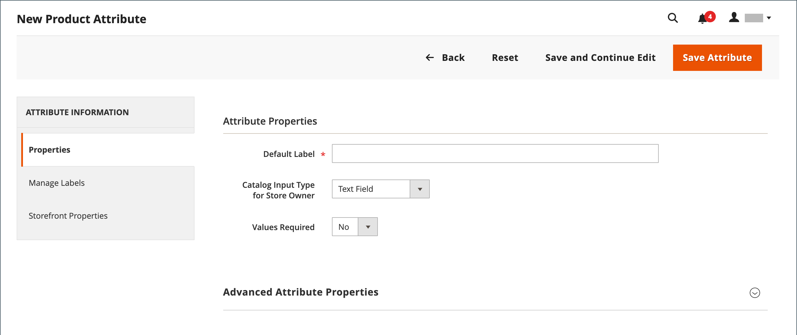
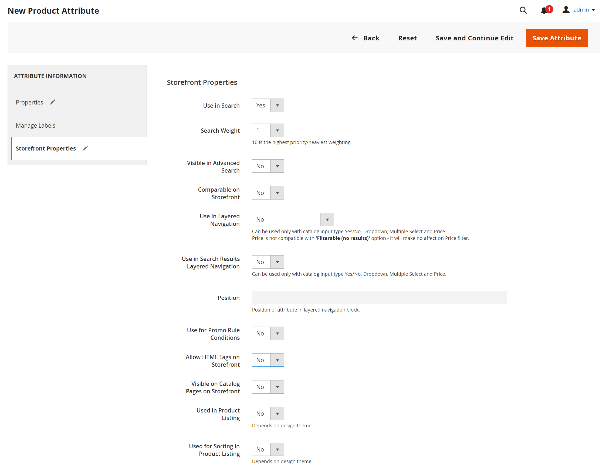

# 建立及刪除產品屬性

您可以在處理產品時或從&#x200B;_[!UICONTROL Product Attributes]_&#x200B;頁面建立屬性。 下列步驟說明如何從&#x200B;_[!UICONTROL Stores]_&#x200B;功能表建立屬性。

## 步驟1：說明基本屬性特性

1. 在&#x200B;_管理員_&#x200B;側邊欄上，移至&#x200B;**[!UICONTROL Stores]** > _[!UICONTROL Attributes]_>**[!UICONTROL Product]**。

1. 按一下&#x200B;**[!UICONTROL Add New Attribute]**。

   {width="600" zoomable="yes"}

1. 針對&#x200B;**[!UICONTROL Default Label]**，輸入識別屬性的標籤。

1. 將&#x200B;**[!UICONTROL Catalog Input Type for Store Owner]**&#x200B;設定為要用於資料輸入的[輸入控制項](attributes-input-types.md)的型別。

   如果屬性用於[可設定的產品](product-create-configurable.md)，請選擇`Dropdown`。 然後，將&#x200B;**[!UICONTROL Required]**&#x200B;設定為`Yes`。

1. 如果您想要在客戶購買產品之前要求選擇選項，請將&#x200B;**[!UICONTROL Values Required]**&#x200B;設為`Yes`。

1. 針對[!UICONTROL Dropdown]和[!UICONTROL Multiple Select]輸入型別，請執行下列動作：

   - 在&#x200B;_[!UICONTROL Manage Options]_&#x200B;底下，按一下&#x200B;**[!UICONTROL Add Option]**。

   - 輸入您要在清單中顯示的第一個值。

     您可以為管理員輸入一個值，並為每個商店檢視輸入值的翻譯。 如果您只有一個商店檢視，則只能輸入管理員值，且該值也會用於店面。

   - 按一下「**[!UICONTROL Add Option]**」，然後針對您想要加入清單的每個選項重複上一步驟。

   - 選取&#x200B;**[!UICONTROL Is Default]**&#x200B;以使用選項作為預設值。

   {width="600" zoomable="yes"}

## 步驟2：視需要說明進階屬性

1. 以小寫字元輸入唯一的&#x200B;**[!UICONTROL Attribute Code]**，不含空格。

   >[!NOTE]
   >
   >不建議在[!UICONTROL Attribute Code]欄位中使用`type`值。 這可能會造成錯誤，因為`type`值已保留供系統使用。

   {width="600" zoomable="yes"}

   可用的選項取決於&#x200B;_[!UICONTROL Catalog Input Type for Store Owner]_&#x200B;設定。

1. 若要指出在您的[存放區階層](../getting-started/websites-stores-views.md)中可以使用屬性的位置，請設定&#x200B;**[!UICONTROL Scope]**。

1. 如果您要防止任何重複值專案，請將&#x200B;**[!UICONTROL Unique Value]**&#x200B;設為`Yes`。

1. 對於輸入值的輸入型別，透過將&#x200B;**[!UICONTROL Input Validation for Store Owner]**&#x200B;設定為欄位應包含的資料型別，對輸入到文字欄位的任何資料執行有效性測試。

   此欄位不適用於已選取值的輸入型別。 此測試可驗證下列任一專案：

   - `Decimal Number`
   - `Integer Number`
   - `Email`
   - `URL`
   - `Letters`
   - `Letters (a-z, A-Z) or Numbers (0-9)`

   {width="400"}

1. 若要將此屬性新增至[產品清單](products-list.md)，請將下列選項設定為`Yes`。

   - **新增至資料行選項** — 在&#x200B;_[!UICONTROL Products]_&#x200B;清單中包含屬性作為資料行。
   - **用於篩選選項** — 將篩選控制項新增至&#x200B;_[!UICONTROL Products]_&#x200B;清單中的欄標題。

## 步驟3：輸入欄位標籤

1. 在左側導覽中選擇&#x200B;**[!UICONTROL Manage Labels]**。

1. 輸入要做為欄位標籤的&#x200B;**[!UICONTROL Title]**。

   如果您的商店提供不同語言版本，您可以為每個檢視輸入翻譯的標題。

   {width="600" zoomable="yes"}

   >[!NOTE]
   >
   > 如果您打算在「即時搜尋」中將此屬性當做多面向使用，則必須指定商店特定標籤。 若沒有它，屬性名稱可能無法正確顯示在Facet設定頁面上。 若要更新設定，請使用&#x200B;_即時搜尋指南_&#x200B;中即時搜尋多面向清單[&#128279;](https://experienceleague.adobe.com/zh-hant/docs/commerce/live-search/live-search-admin/facets/facets-add#step-2-edit-facet-properties-optional)中的編輯選項，手動編輯標籤。

## 步驟4：說明店面屬性

1. 在左側導覽中選擇&#x200B;**[!UICONTROL Storefront Properties]**。

   {width="600" zoomable="yes"}

   可用的選項取決於&#x200B;_[!UICONTROL Catalog Input Type for Store Owner]_&#x200B;設定。

1. 如果屬性可供搜尋，請將&#x200B;**[!UICONTROL Use in Search]**&#x200B;設為`Yes`。

   - 若要控制專案在搜尋結果中的顯示位置，請將&#x200B;**[!UICONTROL Search Weight]**&#x200B;值： 1 （最低權重）設定為10 （最高權重）。

   - 視需要設定&#x200B;**[!UICONTROL Visible in Advanced Search]**。 深入瞭解[進階搜尋](search.md#advanced-search)。

1. 若要在產品比較中包含屬性，請將&#x200B;**[!UICONTROL Comparable on Storefront]**&#x200B;設為`Yes`。

1. 針對下拉式清單、多重選取及價格欄位，執行下列作業：

   - 若要在分層導覽中使用屬性作為篩選器，請將&#x200B;**[!UICONTROL Use in Layered Navigation]**&#x200B;設為`Yes`。

   - 若要在搜尋結果頁面的階層式導覽中使用屬性，請將&#x200B;**[!UICONTROL Use in Search Results Layered Navigation]**&#x200B;設為`Yes`。

   - 對於&#x200B;**[!UICONTROL Position]**，請輸入數字，以表示屬性在階層式導覽區塊中的相對位置。

1. 若要在價格規則中使用屬性，請將&#x200B;**[!UICONTROL Use for Promo Rule Conditions]**&#x200B;設為`Yes`。

1. 若要允許使用HTML格式化文字，請將&#x200B;**[!UICONTROL Allow HTML Tags on Frontend]**&#x200B;設為`Yes`。

   此設定使得WYSIWYG編輯器可用於欄位。

1. 若要在產品頁面上包含屬性，請將&#x200B;**[!UICONTROL Visible on Catalog Pages on Storefront]**&#x200B;設為`Yes`。

1. 如果您的主題支援，請完成下列設定：

   - 若要在產品清單中包含屬性，請將&#x200B;**[!UICONTROL Used in Product Listing]**&#x200B;設為`Yes`。

   - 若要使用屬性作為產品清單的排序引數，請將&#x200B;**[!UICONTROL Used for Sorting in Product Listing]**&#x200B;設為`Yes`。

1. 完成時，按一下&#x200B;**[!UICONTROL Save Attribute]**。

## 步驟5：將建立的屬性指派給屬性集

若要讓屬性顯示在產品建立頁面上，請將其新增至特定屬性集。

1. 完成先前的步驟後，前往「**[!UICONTROL Stores]** > _[!UICONTROL Attributes]_>**[!UICONTROL Attribute Set]**」。

1. 在清單中選取您需要的屬性集，然後在編輯模式中開啟它。

1. 從&#x200B;**[!UICONTROL Unassigned Attributes]**&#x200B;清單將建立的屬性拖曳至&#x200B;**群組**&#x200B;資料欄中的適當資料夾。

1. 完成時，按一下&#x200B;**[!UICONTROL Save]**。

## 可設定產品的屬性

任何用作[可設定產品](product-create-configurable.md)之選項下拉式清單的屬性，都必須具備下列屬性：

| 屬性 | 值 |
|----------|------ |
| 存放區所有者的目錄輸入型別 | 下拉式清單 |
| 範圍 | 全域 |

{style="table-layout:auto"}

## 刪除屬性

刪除屬性時，該屬性會從任何相關的產品和屬性集中移除。 系統屬性是存放區核心功能的一部分，無法刪除。

在刪除屬性之前，請確定目錄中目前沒有任何產品使用它。 若要判斷屬性是否正在使用中，一個簡單的方法是使用[匯出](../systems/data-export.md)工具來檢查產品實體屬性的清單。 如果清單不包含屬性，則目錄中的任何產品都不會使用它。

**_若要刪除屬性:_**

1. 在&#x200B;_管理員_&#x200B;側邊欄上，移至&#x200B;**[!UICONTROL Stores]** > _[!UICONTROL Attributes]_>**[!UICONTROL Product]**。

1. 在清單中尋找屬性，並在編輯模式中開啟。

1. 按一下&#x200B;**[!UICONTROL Delete Attribute]**。

   {width="600" zoomable="yes"}

1. 提示確認時，按一下&#x200B;**[!UICONTROL OK]**。

