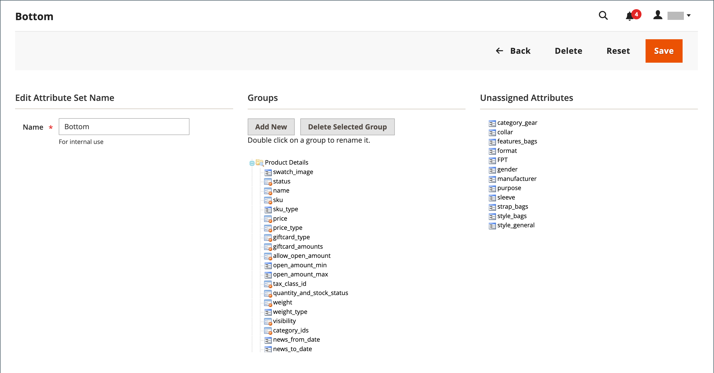

# 屬性集

建立產品時的第一步是選擇用來作為產品記錄範本的屬性集。 屬性集決定資料輸入期間可用的欄位，以及顯示給客戶的值。

屬性會組織成群組，決定它們在產品記錄中的顯示位置。 您的商店隨附初始屬性集（稱為&#x200B;_預設_），其中包含一組常用的屬性。 如果您只想新增幾個屬性，您可以將其新增至此預設屬性集。 如果您銷售的產品需要特定型別的資訊，最好建立專用的屬性集，其中包含產品所需的特定屬性。

{width="700" zoomable="yes"}

## 建立屬性集

1. 在&#x200B;_管理員_&#x200B;側邊欄上，移至&#x200B;**[!UICONTROL Stores]** > _[!UICONTROL Attributes]_>**[!UICONTROL Attribute Set]**。

1. 按一下&#x200B;**[!UICONTROL Add New Set]**。

   {width="600" zoomable="yes"}

1. 輸入屬性集的&#x200B;**[!UICONTROL Name]**。

1. 將&#x200B;**[!UICONTROL Based On]**&#x200B;設為要做為範本使用的現有屬性集。

1. 按一下&#x200B;**[!UICONTROL Save]**。

   下一頁會顯示下列內容：

   - 左欄顯示屬性集的名稱。 此名稱供內部參照，可視需要變更。
   - 頁面中央會列出目前選擇的屬性群組。
   - 右欄列出目前未指派給屬性集的屬性選擇。

1. 若要將屬性新增至集合，請將屬性從&#x200B;**[!UICONTROL Unassigned Attributes]**&#x200B;清單拖曳至&#x200B;**[!UICONTROL Groups]**&#x200B;欄中的適當資料夾。 若要從集合中移除屬性，請將其拖曳至&#x200B;**[!UICONTROL Unassigned Attributes]**&#x200B;清單。

   >[!NOTE]
   >
   >系統屬性標有點，無法從&#x200B;_[!UICONTROL Groups]_&#x200B;清單中移除。 但是，它們可以拖曳到屬性集中的另一個群組。

1. 完成時，按一下&#x200B;**[!UICONTROL Save]**。

{width="600" zoomable="yes"}

## 建立屬性群組

1. 在屬性集的&#x200B;_[!UICONTROL Groups]_&#x200B;欄中，按一下&#x200B;**[!UICONTROL Add New]**。

1. 輸入新群組的&#x200B;**[!UICONTROL Name]**，然後按一下&#x200B;**[!UICONTROL OK]**。

1. 執行下列任一項作業：

   - 將&#x200B;**[!UICONTROL Unassigned Attributes]**&#x200B;拖曳到新群組。
   - 將屬性從任何其他群組拖曳至新群組。
   - 拖曳不必要的屬性至&#x200B;**[!UICONTROL Unassigned Attributes]**。

   新群組會成為任何以屬性集為基礎之產品中的屬性區段。

## 刪除屬性集

1. 在&#x200B;_管理員_&#x200B;側邊欄上，移至&#x200B;**[!UICONTROL Stores]** > _[!UICONTROL Attributes]_>**[!UICONTROL Attribute Set]**。

1. 在清單中選取屬性集，並以編輯模式開啟。

1. 按一下&#x200B;**[!UICONTROL Delete]**。

1. 提示確認時，按一下&#x200B;**[!UICONTROL OK]**。
