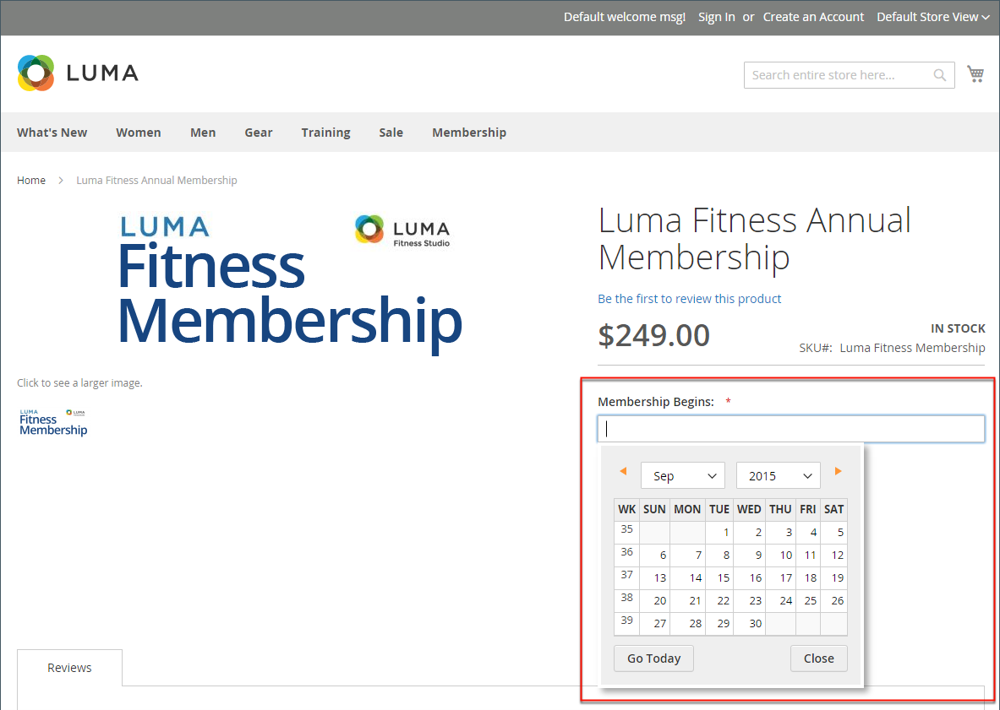

# 屬性輸入型別

從「管理員」檢視時，屬性是您在建立產品時完成的欄位。 指定給屬性的輸入型別決定可輸入的資料型別，以及欄位或輸入控制項的格式。 從客戶的觀點來看，屬性會提供有關產品的資訊，而且是購買產品必須完成的選項和資料輸入欄位。

## 輸入型別

| 屬性 | 說明 |
|--- |--- |
| [!UICONTROL Text Field] | 單行文字輸入欄位。 |
| [!UICONTROL Text Area] | 用於輸入文欄位落（如產品說明）的多行輸入欄位。 您可以使用WYSIWYG編輯器將文字格式化為HTML標籤，或直接在文字中輸入標籤。 |
| [!UICONTROL Text Editor] | 屬性位置的完整文字編輯器。 |
| [!UICONTROL Date] | 以[偏好的格式](#date-and-time-options)和[時區](../getting-started/store-details.md#locale-options)顯示日期值。 日期值可從清單或行事曆中選取（  ）。   **_注意：_**根據您的系統組態，_管理員&#x200B;_使用者可以直接在欄位中輸入日期，或從行事曆或清單中選取日期。 如需有關指定日期和時間值的資訊，請參閱[日期和時間選項](#date-and-time-options)。 |
| [!UICONTROL Date and Time] | 以[偏好的格式](#date-and-time-options)和[時區](../getting-started/store-details.md#locale-options)顯示日期和時間值。 日期與時間可以手動輸入，或從行事曆中選取。 範例格式： MM/DD/YYYY HH：MM |
| [!UICONTROL Yes/No] | 顯示含有預先定義選項`Yes`和`No`的下拉式清單。 |
| 下拉式清單 | 顯示只接受單一選取專案的下拉式值清單。 下拉式清單輸入型別是[可設定產品](../catalog/product-create-configurable.md)的關鍵元件。 |
| [!UICONTROL Multiple Select] | 顯示接受多個選取專案的下拉式值清單。 |
| [!UICONTROL Price] | 此輸入型別用於建立預先定義屬性以外的價格欄位： `Price`、`Special Price`、`Tier Price`和`Cost`。 使用的貨幣由您的系統組態決定。 |
| [!UICONTROL Media Image] | 將額外的影像與產品建立關聯，例如產品標誌、護理指示或食品標籤的成分。 將媒體影像屬性新增至產品的屬性集時，該屬性會變成額外的影像型別，連同基底、小型和縮圖。 媒體影像屬性可以從[店面媒體瀏覽器](catalog-images-video.md#storefront-media-browser)中排除。 |
| [!UICONTROL Fixed Product Tax] | 可讓您根據地區設定的要求定義[FPT費率](../stores-purchase/fixed-product-tax.md)。 |
| [!UICONTROL Visual Swatch] | 顯示描述可設定產品顏色、紋理或圖樣的色票。 [視覺色票](swatches.md)可以用十六進位色彩值填滿，或顯示代表選項色彩、材質、紋理或圖樣的上傳影像。 |
| [!UICONTROL Text Swatch] | 經常用於尺寸的可設定產品選項的文字表示。 [文字色票](swatches.md)也可以包含十六進位色彩值。 |
| [!UICONTROL Page Builder] | 屬性位置的[[!DNL Page Builder]](../page-builder/workspace.md)工作區可讓您輕鬆將吸引人的內容新增至產品頁面。 |

{style="table-layout:auto"}

## 日期和時間選項

您可以自訂日期和時間欄位的格式，並選取用於資料輸入的輸入控制項。 日期值可從下拉式清單或快顯行事曆中選取。

{width="700" zoomable="yes"}

**_格式化日期/時間欄位：_**

1. 在&#x200B;_管理員_&#x200B;側邊欄上，移至&#x200B;**[!UICONTROL Stores]** > _[!UICONTROL Settings]_>**[!UICONTROL Configuration]**。

1. 在左側的面板中，展開&#x200B;**[!UICONTROL Catalog]**&#x200B;並按一下&#x200B;**[!UICONTROL Catalog]**&#x200B;子專案。

1. 展開&#x200B;**[!UICONTROL Date & Time Custom Options]**&#x200B;區段。

   {width="600" zoomable="yes"}

   如需這些選項的詳細清單，請參閱&#x200B;_組態參考_&#x200B;中的&#x200B;[_日期與時間自訂選項_](../configuration-reference/catalog/catalog.md)。

1. 若要使用彈出式行事曆作為日期欄位的輸入控制項，請將&#x200B;**[!UICONTROL Use JavaScript Calendar]**&#x200B;設為`Yes`。

1. 若要建立&#x200B;**[!UICONTROL Date Fields Order]**，視需要設定日期欄位每個部分的順序：

   - 月
   - 日
   - 年

1. 若要設定您偏好的時間格式，請將&#x200B;**時間格式**&#x200B;設定為下列其中一項：

   - `12h AM/PM`
   - `24h`

1. 若要為下拉式清單值建立&#x200B;**[!UICONTROL Year Range]**，請輸入年份(YYYY)以設定&#x200B;**[!UICONTROL from]**&#x200B;和&#x200B;**[!UICONTROL to]**&#x200B;日期。

   如果留空，欄位會預設為目前年份。

1. 完成時，按一下&#x200B;**[!UICONTROL Save Config]**。
