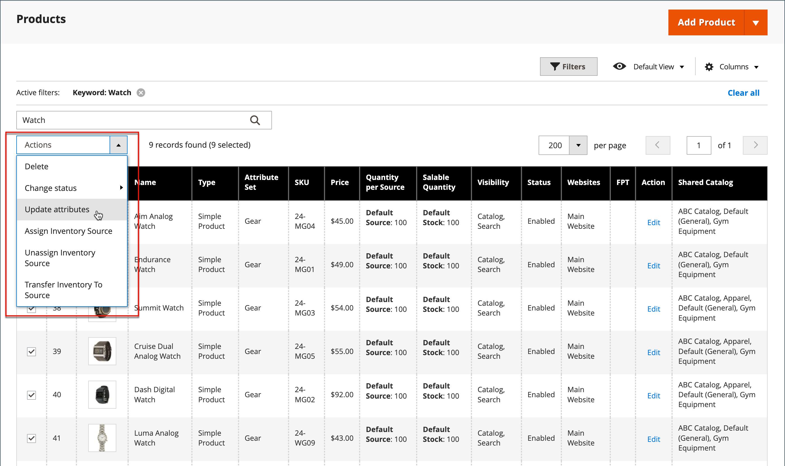
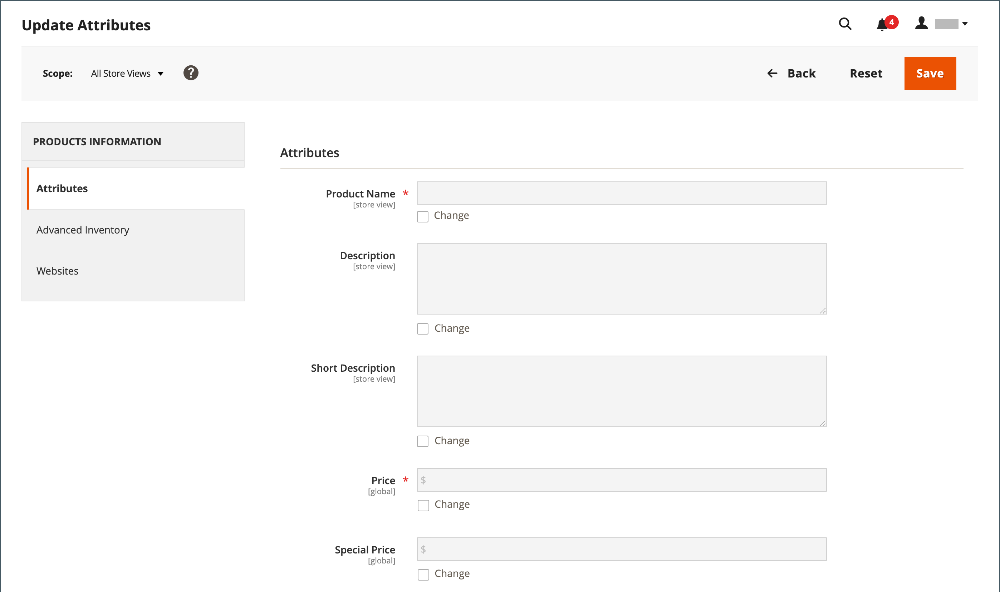

# 產品屬性的大量更新

使用 _[!UICONTROL Update Attributes]_工具，可變更產品中的一或多個屬性。 此工具可讓您對大量產品套用重大變更。

1. 在 _管理員_ 側欄，前往 **[!UICONTROL Catalog]** > **[!UICONTROL Products]**.

1. 選取您要修改來源的產品。

   瀏覽或搜尋以尋找產品並選取這些核取方塊。

1. 按一下 **[!UICONTROL Actions]** 選單並選取 **[!UICONTROL Update Attributes]**.

   {width="600" zoomable="yes"}

1. 根據您的需求，更新所選產品的屬性、進階詳細目錄或網站資料。

   {width="600" zoomable="yes"}

1. 完成後，按一下 **[!UICONTROL Save]**.
