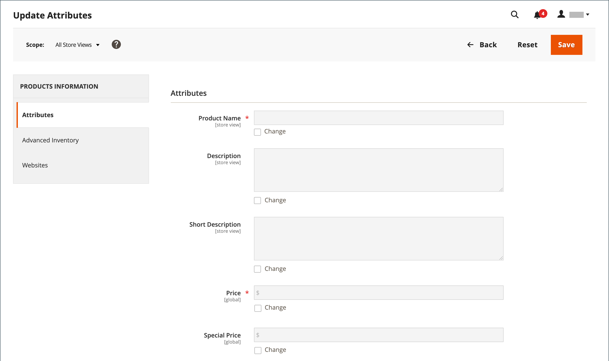

# 產品屬性的大量更新

使用&#x200B;_[!UICONTROL Update Attributes]_工具變更產品中的一或多個屬性。 此工具可讓您對大量產品套用重大變更。

1. 在&#x200B;_管理員_&#x200B;側邊欄上，移至&#x200B;**[!UICONTROL Catalog]** > **[!UICONTROL Products]**。

1. 選取您要修改來源的產品。

   瀏覽或搜尋以尋找產品並選取這些核取方塊。

1. 按一下頂端的&#x200B;**[!UICONTROL Actions]**&#x200B;功能表，然後選擇&#x200B;**[!UICONTROL Update Attributes]**。

   {width="600" zoomable="yes"}

1. 根據您的需求，更新所選產品的屬性、進階詳細目錄或網站資料。

   {width="600" zoomable="yes"}

1. 完成時，按一下&#x200B;**[!UICONTROL Save]**。

