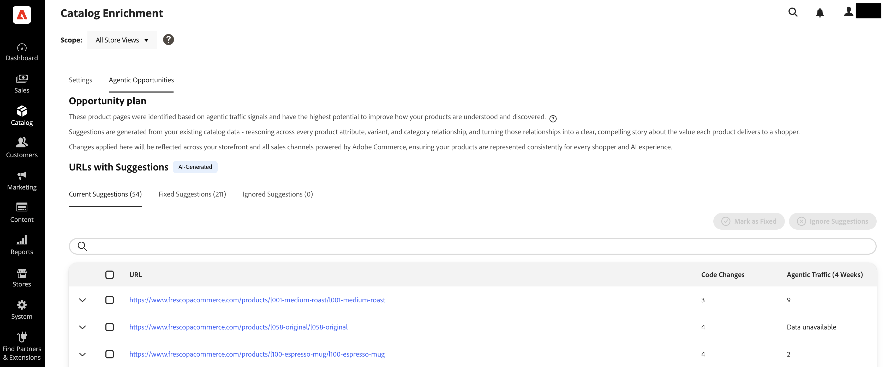

# 目錄擴充

目錄擴充是原生[!DNL Adobe Commerce]功能，可協助您改善產品名稱和詳細說明，以便當購物者使用LLM和AI助理進行產品研究和探索時，能更準確地呈現您的目錄。

>[!NOTE]
>
>目錄擴充功能由[!DNL Commerce Catalog Agent]和[!DNL Adobe LLM Optimizer]幕後提供技術支援。 您使用擴充作為Commerce目錄工作流程的一部分。 您沒有另外管理LLM Optimizer整合，以套用核准的名稱和說明更新。 如需Commerce外部更廣泛的LLM監視和最佳化，請參閱[LLM Optimizer產品檔案](https://experienceleague.adobe.com/en/docs/llm-optimizer/using/home)。

## 運作方式 {#how-it-works}

您的[!DNL Adobe Commerce]產品目錄是產品資料的記錄系統：名稱、說明、屬性、定價及詳細目錄。[!DNL Adobe Commerce] Storefront MCP （模型內容通訊協定）將即時目錄資料連線到Adobe AI體驗。 從那裡，目錄代理程式可以識別產品名稱和完整說明中的間隙、提出改進建議，並將已核准的變更寫回Commerce，以便您可以在Commerce管理員中檢閱。

透過目錄擴充，您可以：

- 找出產品名稱及詳細說明中的差距和不一致，以影響LLM解譯產品的方式。
- 檢閱支援內容的建議改進，包括理由和前後比較。
- 將核准的更新直接套用至Commerce目錄，使管理員、店面和讀取這些欄位的其他管道保持一致。

由於產品名稱和完整說明會在Commerce中上線，因此改善一次複製可讓使用該產品資料的每個管道受益。 其優點取決於系統重新整理的方式和時間。

| 方向 | 用途 |
| --- | --- |
| Commerce目錄 — >分析 | 目錄和URL訊號會提供擴充建議。 |
| 擴充 — > Commerce目錄 | 在您核准更新後，產品名稱和說明的變更會儲存至Commerce目錄，讓管理員和店面可反映最佳化的值。 |

## 這是給誰的 {#who-this-is-for}

- 想要讓LLM導向的答案中的產品資料正確且一致的數位行銷人員和銷售商。
- 需要控制方式大規模改善目錄複製的數位行銷人員和銷售商。
- 擁有目錄完整性、管理流程以及提供產品屬性的整合(API、CSV、PIM)的Commerce管理員。

## 先決條件 {#prerequisites}

當您擁有目錄擴充的存取權時，下列先決條件即適用。

- 您的店面可由LLM導向和代理程式機器人抓取，其中目錄感知建議需要抓取涵蓋範圍。
- 必要的Commerce服務和目錄連線已啟用且狀況良好。 請參閱[啟用目錄擴充](#enable-catalog-enrichment)以瞭解更多資訊。
- [IMS已設定](https://experienceleague.adobe.com/en/docs/core-services/interface/administration/organizations)。
- 您有[Adobe Admin Console](https://helpx.adobe.com/business/enterprise/plan-your-deployment/basic-concepts/admin-console.html)的存取權。

> 如果您沒有IMS組織，請聯絡您的Adobe客戶團隊以布建一個。

## 啟用目錄擴充 {#enable-catalog-enrichment}

在檢閱或套用建議之前，請與您的Commerce管理員或實作合作夥伴合作，確認下列事項：

### 安裝目錄擴充和目錄服務擴充功能

1. 執行以下命令，在Commerce執行個體中安裝目錄擴充擴充功能：

   ```bash
   composer require magento/module-catalog-enrichment --no-update
   composer update magento/module-catalog-enrichment
   ```

1. 如果您尚未安裝目錄服務，請[安裝](https://experienceleague.adobe.com/en/docs/commerce/catalog-service/installation#install-the-catalog-service-extension)。

   **[!UICONTROL Catalog enrichment]**&#x200B;現在可在您的Commerce執行個體中使用。

### 存取目錄擴充

安裝目錄擴充和目錄服務擴充功能後，「管理員」中的&#x200B;**[!UICONTROL Catalog]** > **[!UICONTROL Catalog Enrichment]**&#x200B;下會提供目錄擴充功能。


### 設定目錄擴充

在「**[!UICONTROL Settings]**」索引標籤上設定目錄擴充，讓[!DNL Commerce Catalog Agent]可以連線至您的[!DNL Adobe Commerce]環境，並在Commerce管理員中顯示建議。

1. 在Admin中，移至&#x200B;**[!UICONTROL Catalog]** > **[!UICONTROL Catalog Enrichment]**。
1. 在頁面頂端的&#x200B;**[!UICONTROL Scope]**&#x200B;清單中，選取您要設定的商店檢視，或保留&#x200B;**[!UICONTROL All Store Views]**&#x200B;以跨商店檢視管理設定。
1. 開啟&#x200B;**[!UICONTROL Settings]**&#x200B;標籤。
1. 在&#x200B;**[!UICONTROL Commerce Configuration]**&#x200B;中，展開標示其URL的存放區檢視面板。

   提供您的[!DNL Adobe Commerce]環境詳細資訊，以啟用目錄LLM Optimizer服務和稽核工作流程。

   目錄擴充設定索引標籤上的

1. 輸入存放區檢視所需的連線詳細資料。

   - **[!UICONTROL Store View URL]**：對應至商店檢視的URL （例如，`https://brand.example.com/fr/`）。
   - **[!UICONTROL Environment ID]**：連線存取之[!DNL Adobe Commerce]環境的唯一識別碼。
   - **[!UICONTROL Website Code]**、**[!UICONTROL Store Code]**&#x200B;和&#x200B;**[!UICONTROL Store View Code]**： Commerce網站的網站、商店和商店檢視代碼。 這些值必須符合您Commerce管理員中的程式碼。

1. 可選：如果您的環境需要&#x200B;**[!UICONTROL Host Name]**&#x200B;和&#x200B;**[!UICONTROL API Key]**，請輸入。

   - **[!UICONTROL Host Name]**： [!DNL Adobe Commerce]執行個體的主機名稱。
   - **[!UICONTROL API Key]**：用來安全存取[!DNL Adobe Commerce] API的驗證金鑰。 如果您需要在其他位置複製金鑰，請按一下欄位旁的&#x200B;**[!UICONTROL Copy]**。

1. 按一下&#x200B;**[!UICONTROL Save]**。

儲存後，請等待任何初始同步或驗證工作完成，然後再為該存放區檢視依賴目錄或稽核結果。 產品建議最多可能需要24小時的時間才會出現在&#x200B;**[!UICONTROL Catalog Enrichment]**&#x200B;頁面上。

若要移除存放區檢視設定，請展開該專案，然後按一下&#x200B;**[!UICONTROL Delete]**。

#### 欄位說明 {#commerce-connection-fields}

在&#x200B;**[!UICONTROL Commerce Configuration]**&#x200B;表單上，必填欄位標有星號(*)。

| 欄位 | 必填 | 說明 |
| --- | --- | --- |
| 存放區檢視URL | 是 | 對應至商店檢視的URL （例如，`https://brand.example.com/fr/`）。 |
| 環境ID | 是 | 連線存取之[!DNL Adobe Commerce]環境的唯一識別碼。 |
| 網站程式碼 | 是 | Commerce網站的網站程式碼。 |
| 存放區代碼 | 是 | Commerce網站的商店代碼。 |
| 存放區檢視代碼 | 是 | Commerce網站的商店檢視。 |
| 主機名稱 | 否 | 您的[!DNL Adobe Commerce]執行個體的主機名稱。 |
| API金鑰 | 否 | 用來安全存取[!DNL Adobe Commerce] API的驗證金鑰。 將其視為任何生產認證。 |

### 檢閱並套用目錄擴充 {#review-and-apply}

啟用及設定目錄擴充後，**[!UICONTROL Agentic Opportunities]**&#x200B;標籤上會顯示產品建議。 您可以從這裡檢閱建議，並將核准的更新套用至Commerce目錄中的產品名稱和詳細說明。

目錄擴充使用下列工作流程檢視：

- **[!UICONTROL Current Suggestions]**：要檢閱的新專案或作用中專案。
- **[!UICONTROL Fixed Suggestions]**：您已經套用或解析的專案。
- **[!UICONTROL Ignored Suggestions]**：您刻意從動作中排除的專案。



### 部署已核准的建議 {#review-deploy-catalog}

若要部署已核准的建議，請執行下列動作：

1. 選取&#x200B;**[!UICONTROL Current Suggestions]**。
1. 按一下URL或SKU列的展開控制項，以顯示建議的產品名稱和產品說明更新。
1. 檢閱建議，並確認其符合您的銷售和SEO策略。

您可以在部署建議之前對其進行編輯，如果建議不符合您的策略，則將其移至&#x200B;**[!UICONTROL Ignored Suggestions]**。

1. 選取URL或SKU要更新的列。
1. 按一下&#x200B;**[!UICONTROL Deploy optimizations]**&#x200B;並確認。

核准的名稱和描述變更會像其他產品更新一樣儲存到您的[!DNL Adobe Commerce]目錄。

>[!IMPORTANT]
>
>將每個套用的更新視為生產目錄變更。 使用您一般的變更控制、測試和QA實務。 只有在銷售和SEO利害關係人在最終副本上達成一致後，才套用更新。

套用更新後，建議會移至狀態為&#x200B;**標籤為「已修正」**&#x200B;的&#x200B;**[!UICONTROL Fixed Suggestions]**。

## 在管理員中驗證擴充 {#verify-in-admin}

**若要驗證套用的目錄擴充：**

1. 前往Commerce管理員中的&#x200B;**[!UICONTROL Catalog]** > **[!UICONTROL Products]**。
1. 視需要使用篩選器和&#x200B;**[!UICONTROL Store View]**&#x200B;選擇器（例如&#x200B;**[!UICONTROL Default Store View]**）。
1. 搜尋SKU。
1. 在編輯模式中開啟產品。

   產品表單會顯示擴充的產品名稱及/或說明。

   

1. 可選：如果您要保留手動輸入的名稱，請選取&#x200B;**[!UICONTROL Override Catalog Agent provided Product Name]**。

   手動覆寫會影響建議與目錄保持同步的方式。 如需詳細資訊，請參閱[管理員中的手動覆寫](#manual-override-in-the-admin)。

1. 展開&#x200B;**[!UICONTROL Content]**&#x200B;區段並找出說明欄位。

   當您套用說明變更時，就會顯示擴充說明。

   

1. 可選：如果您要保留手動輸入的描述，請選取&#x200B;**[!UICONTROL Override Catalog Agent provided Description]**。

手動覆寫會影響建議與目錄保持同步的方式。 如需詳細資訊，請參閱[管理員中的手動覆寫](#manual-override-in-the-admin)。

## 驗證店面的擴充 {#verify-storefront}

**若要驗證店面的擴充：**

1. 在您的店面搜尋SKU。
1. 開啟產品頁面。
1. 確認產品名稱和說明符合您核准的內容。

   擴充功能可能需要一些時間才會出現在您的店面上。

1. 確認顯示完整說明的區域符合您核准的內容。
1. 可選：確認使用相同目錄屬性的下游管道（與您的轉出相關）。

## 覆寫、擷取和過時的建議 {#overrides-ingestion}

在目錄擴充更新產品的名稱或說明後，其他擷取系統可能會變更相同欄位。 範例包括REST API呼叫、CSV匯入和PIM摘要。

### 已重新擷取原始值 {#original-value-reingested}

如果外部程式寫入原始名稱或說明（套用擴充之前存在的值），Commerce會根據目錄擴充規則，繼續遵循該欄位的擴充值。 建議可能不會單獨根據該擷取自動回覆。

### 新值已重新內嵌 {#new-value-reingested}

如果外部程式傳送的新值不是預先擴充文字的重複，Commerce會遵循新目錄值。 例如，將「Red Shoes」重新命名為「Iconic Red Shoes」會取代擴充值。 相關擴充建議通常會標示為&#x200B;*已過時*，因為即時目錄不再符合建議內容。

### 在管理員中手動覆寫 {#manual-override-in-the-admin}

如果您在「[!DNL Adobe Commerce]管理員」中手動編輯產品名稱或說明：

- Admin值會作為該手動變更的記錄系統而獲勝。
- 擴充建議標示為&#x200B;*已過時*。
- 建議工作流程會回到該專案的原始狀態，這樣您就可以重新基準化，或者接受新的建議（如果分析再次執行）。

這些規則可協助您瞭解當多個管道接觸同一個SKU時，目錄擴充、擷取摘要或管理員編輯是否具有權威性。

## 限制和考量事項 {#limits}

- 擴充僅適用於產品名稱和詳細說明。 它不會變更PDP配置、Widget或其他頁面層級的店面內容。
- 大型目錄和高的URL計數可能會影響分析完成的速度，以及同時出現的建議數量。
- 有意義的建議假設與LLM相關的機器人可以存取您關心的產品URL。 機器人規則、驗證、地理封鎖和重度個人化可能會減少涵蓋範圍。

## 最佳實務 {#best-practices}

- 產品名稱和說明的檔案系統所有權，這樣PIM或摘要工作就不會無意中與目錄擴充衝突。
- 在大量套用標題或說明之前，請先與SEO和品牌團隊協調。
- 主要目錄匯入後重新同步或重新分析，讓建議反映目前的目錄狀態。

<!--## Examples This section will provide examples of what enrichment before/after looks like:-->
