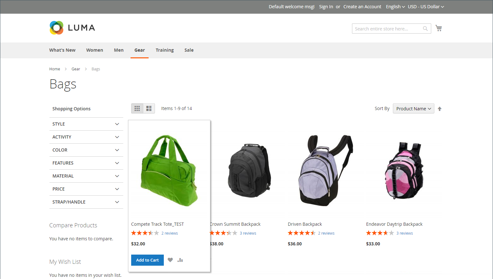
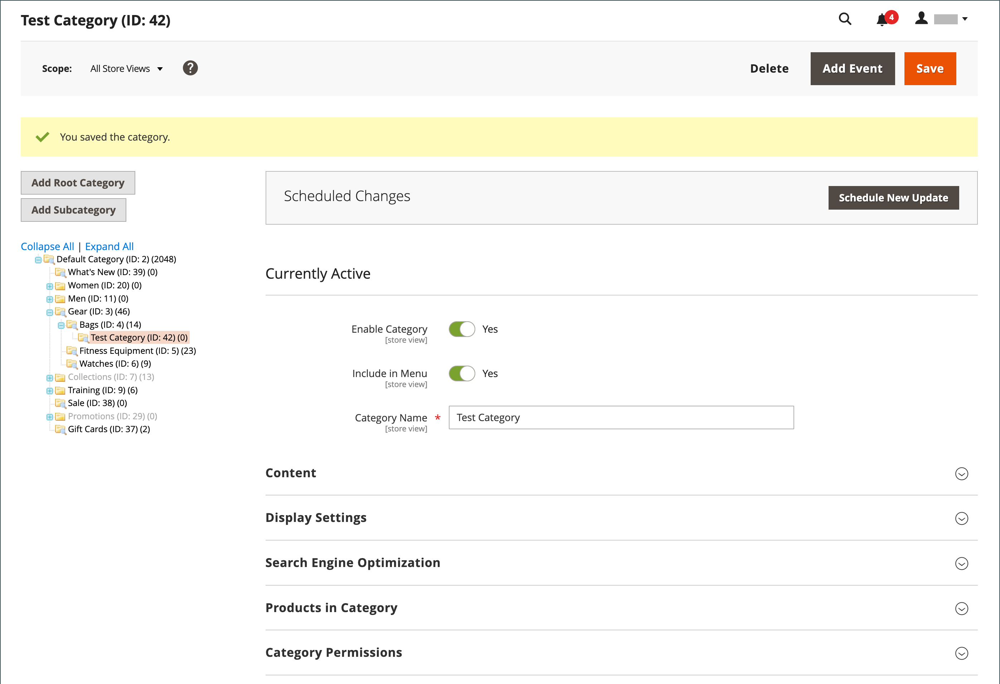
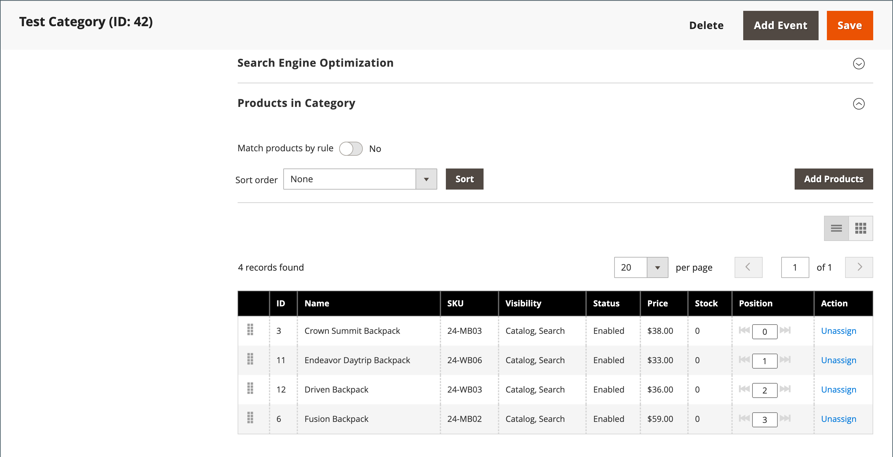

# 平面目錄

>[!IMPORTANT]
>
>不再建議使用平面型錄作為最佳實務。 據悉，繼續使用此功能會導致效能降低和其他索引問題。 [說明中心](https://experienceleague.adobe.com/docs/commerce-knowledge-base/kb/troubleshooting/miscellaneous/slow-performance-slow-and-long-running-crons.html?lang=zh-Hant)提供詳細的說明和解決方案。  受影響的版本包括：  — 雲端基礎結構上的Adobe Commerce、2.3.x和更高版本 - Adobe Commerce （內部部署）、2.3.x和更高版本 -Magento Open Source、2.3.x和更高版本  在任何發行版本上，某些擴充功能僅適用於平面表格，因此如果您停用平面表格，就會產生風險。 如果您知道有些擴充功能使用一般目錄索引子，則將這些值設定為`No`時，您必須注意這項風險。

Commerce通常會根據實體屬性值(EAV)模型，將目錄資料儲存在多個表格中。 由於產品屬性儲存在許多表格中，因此SQL查詢有時很長且複雜。

相對地，平面型錄會即時建立表格，其中每一列包含有關產品或類別的所有必要資料。 平面目錄會每分鐘自動更新，或根據您的cron工作更新。 平面目錄索引還可以加快目錄和購物車價格規則的處理。 擁有多達500,000個SKU的目錄可以快速索引為平面目錄。

>[!NOTE]
>
>在啟用即時存放區的平面目錄之前，請務必在開發環境中測試設定。

## 步驟1：啟用平面型錄

1. 在&#x200B;_管理員_&#x200B;側邊欄上，移至&#x200B;**[!UICONTROL Stores]** > _[!UICONTROL Settings]_>**[!UICONTROL Configuration]**。

1. 在左側面板中，展開&#x200B;**[!UICONTROL Catalog]**&#x200B;並在下方選擇&#x200B;**[!UICONTROL Catalog]**。

1. 展開&#x200B;_店面_&#x200B;區段並執行下列動作：

   - 將&#x200B;**[!UICONTROL Use Flat Catalog Category]**&#x200B;設為`Yes`。 （如有必要，請取消選取「**[!UICONTROL Use system value]**」核取方塊。）

   - 將&#x200B;**[!UICONTROL Use Flat Catalog Product]**&#x200B;設為`Yes`。

   {width="700" zoomable="yes"}

1. 完成時，按一下&#x200B;**[!UICONTROL Save Config]**。

1. 當提示更新快取時，按一下系統訊息中的&#x200B;**[!UICONTROL Cache Management]**，然後依照指示重新整理快取。

## 步驟2：驗證結果

您可以使用兩種方法驗證結果。

### 方法1：驗證單一產品的結果

1. 在&#x200B;_管理員_&#x200B;側邊欄上，移至&#x200B;**[!UICONTROL Catalog]** > **[!UICONTROL Products]**。

1. 在編輯模式中開啟產品。

1. 針對&#x200B;**[!UICONTROL Name]**，將文字`_TEST`新增至產品名稱的結尾。

1. 按一下&#x200B;**[!UICONTROL Save]**。

1. 在新瀏覽器標籤上，導覽至您的商店首頁，並執行下列動作：

   - 搜尋您編輯的產品。

   - 使用導覽來瀏覽至其指派類別下的產品。

     如有必要，請重新整理頁面以檢視結果。 此變更會在此分鐘內顯示或根據您的[Cron](../systems/cron.md)排程顯示。

   {width="700" zoomable="yes"}

### 方法2：驗證類別的結果

1. 在&#x200B;_管理員_&#x200B;側邊欄上，移至&#x200B;**[!UICONTROL Catalog]** > **[!UICONTROL Categories]**。

1. 在左上角，確認&#x200B;**[!UICONTROL Store View]**&#x200B;已設為`All Store Views`。

   如果出現提示，請按一下&#x200B;**[!UICONTROL OK]**&#x200B;確認。

1. 在類別樹狀結構中，選取現有的類別，按一下&#x200B;**[!UICONTROL Add Subcategory]**，然後執行下列動作：

   - 針對&#x200B;**[!UICONTROL Category Name]**，輸入`Test Category`。

   - 完成時，按一下&#x200B;**[!UICONTROL Save]**。

     {width="600" zoomable="yes"}

   - 展開 **[!UICONTROL Products in Category]**&#x200B;區段，然後按一下&#x200B;**[!UICONTROL Reset Filter]**&#x200B;以顯示所有產品。

   - 選取要新增至新類別的多個產品核取方塊。

   - 按一下&#x200B;**[!UICONTROL Save]**。

   {width="600" zoomable="yes"}

1. 在新瀏覽器標籤上，導覽至您商店的首頁，並使用商店導覽來瀏覽至您建立的類別。

   如有必要，請重新整理頁面以檢視結果。 變更會在分鐘內顯示或根據您的cron排程顯示。

## 步驟3：移除測試資料

執行下列操作以移除測試資料，並還原原始產品名稱和目錄設定。

### 移除測試類別

1. 在&#x200B;_管理員_&#x200B;側邊欄上，移至&#x200B;**[!UICONTROL Catalog]** > **[!UICONTROL Categories]**。

1. 在類別樹狀結構中，選取您建立的測試子類別。

1. 按一下右上角的&#x200B;**[!UICONTROL Delete]**。

1. 提示確認時，按一下&#x200B;**[!UICONTROL OK]**。

   此類別移除不會移除指派給此類別的產品。

### 還原原始產品名稱

1. 在&#x200B;_管理員_&#x200B;側邊欄上，移至&#x200B;**[!UICONTROL Catalog]** > **[!UICONTROL Categories]**。

1. 在編輯模式中開啟測試產品。

1. 移除您新增至&#x200B;**[!UICONTROL Product Name]**&#x200B;的`_TEST`文字。

1. 按一下右上角的&#x200B;**[!UICONTROL Save]**。

### 還原原始目錄設定

1. 在&#x200B;_管理員_&#x200B;側邊欄上，移至&#x200B;**[!UICONTROL Stores]** > _[!UICONTROL Settings]_>**[!UICONTROL Configuration]**。

1. 在左側面板中，展開&#x200B;**[!UICONTROL Catalog]**&#x200B;並在下方選擇&#x200B;**[!UICONTROL Catalog]**。

1. 展開&#x200B;_店面_&#x200B;區段並執行下列動作：

   - 將&#x200B;**[!UICONTROL Use Flat Catalog Category]**&#x200B;設為`No`。

   - 將&#x200B;**[!UICONTROL Use Flat Catalog Product]**&#x200B;設為`No`。

1. 完成時，按一下&#x200B;**[!UICONTROL Save Config]**。

1. 出現提示時，請重新整理快取。
