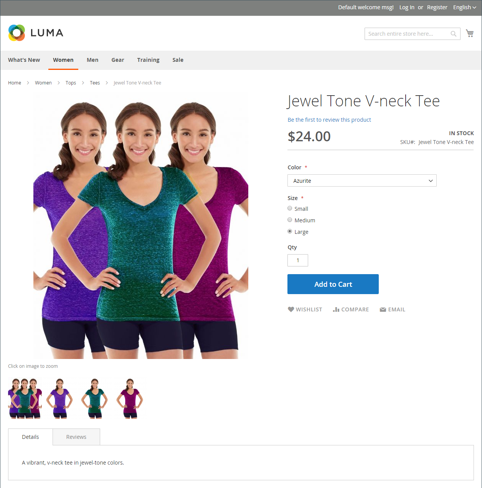

# 將影像和視訊編目

使用高品質且比例一致的影像，讓您的目錄具有專業外觀和商業吸引力。 如果您的目錄很大，每個產品都有數個影像，您可以輕鬆管理數百個（甚至數千個）產品影像。 開始之前，請先建立影像檔案的命名慣例，並加以整理，以便在需要時找到原始檔案。

{width="600" zoomable="yes"}

單一產品影像在整個目錄中會以不同大小呈現。 頁面上影像容器的顯示大小是在主題的樣式表中定義。 不過，影像在存放區中出現的位置取決於指派給影像的角色。 主要產品影像（或&#x200B;_基底_&#x200B;影像）必須足夠大，才能產生縮放所需的縮放比例。 除了主影像外，相同影像的較小版本也可能會出現在產品清單中，或作為購物車的縮圖。 您可以上傳所需最大大小的影像或使用[Adobe Stock](../content-design/adobe-stock.md)影像，讓Commerce演算每項使用所需的大小。 所有角色都可以使用相同的影像，或者可以為每個角色指派不同的影像。 依預設，上傳的第一個影像會指派給所有三個角色。

## 店面媒體瀏覽器

產品頁面上的媒體瀏覽器會顯示與產品相關的多個影像、視訊或色票。 每個縮圖可顯示產品的不同檢視或變數。 購物者可以按一下縮圖，以瀏覽媒體資產。 雖然媒體瀏覽器的位置會依主題而有所不同，但預設位置卻剛好在產品頁面上的主影像下方。 如需協助工具控制項，請參閱[導覽協助工具](../getting-started/navigation-accessibility.md)。

{width="700" zoomable="yes"}

### 影像縮放

如果[基本影像](product-image.md)夠大，可以建立縮放效果，則客戶可以在滑鼠懸停時檢視影像的放大部分。 啟用縮放時，客戶可以按一下主影像，並移動游標來放大影像的不同部分。 放大的選取範圍會出現在影像的右側。

{width="700" zoomable="yes"}

### 燈箱和滑桿

有許多協力廠商的燈箱和滑桿，可用來增強產品影像的呈現方式。 尋找[Commerce Marketplace](../getting-started/commerce-marketplace.md)的擴充功能。

## 疑難排解資源

如需疑難排解影像和視訊問題的說明，請參閱下列Commerce支援知識庫文章：

- [安裝後，影像和樣式表不會載入；只會顯示文字，沒有圖形](https://experienceleague.adobe.com/docs/commerce-knowledge-base/kb/troubleshooting/storefront/after-installing-images-and-stylesheets-do-not-load-only-text-displays-no-graphics.html)
mdva-31969-magento-patch-import-products-.csv-images-duplicated.html)
- [儘管具有「產品編輯」影像角色，仍無法顯示產品影像](https://experienceleague.adobe.com/docs/commerce-knowledge-base/kb/troubleshooting/storefront/product-images-do-not-display-despite-product-edit-image-roles.html)
- [部署後未顯示存放區影像](https://experienceleague.adobe.com/docs/commerce-knowledge-base/kb/troubleshooting/storefront/store-images-not-displayed-after-deployment.html)
