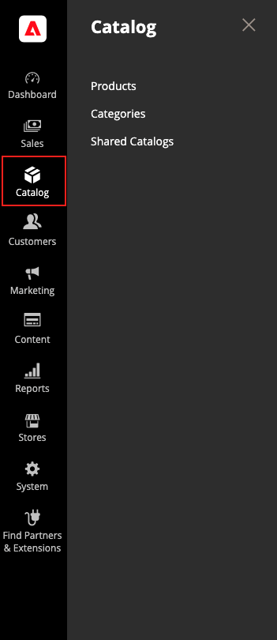

# [!UICONTROL Catalog]功能表

[!UICONTROL Catalog]功能表可讓您在[B2B商店](https://experienceleague.adobe.com/docs/commerce-admin/b2b/introduction.html)中輕鬆存取產品建立、類別和存貨管理工具，以及自訂訂訂價的共用類別目錄。

>[!BEGINTABS]

>[!TAB Adobe Commerce]

僅[!BADGE 個PaaS]{type=Informative url="https://experienceleague.adobe.com/en/docs/commerce/user-guides/product-solutions" tooltip="僅適用於雲端專案(Adobe管理的PaaS基礎結構)和內部部署專案的Adobe Commerce 。"}

{width="300" zoomable="yes"}

>[!TAB Adobe Commerce as a Cloud Service]

僅[!BADGE SaaS]{type=Positive url="https://experienceleague.adobe.com/en/docs/commerce/user-guides/product-solutions" tooltip="僅適用於Adobe Commerce as a Cloud Service和Adobe Commerce Optimizer專案(Adobe管理的SaaS基礎結構)。"}

{width="300" zoomable="yes"}

>[!ENDTABS]

在&#x200B;_管理員_&#x200B;側邊欄上，按一下&#x200B;**[!UICONTROL Catalog]**。

## [!UICONTROL Products]

建立每種型別的[產品](products-list.md)並管理您的詳細目錄。

{width="700" zoomable="yes"}

## [!UICONTROL Categories]

建立作為商店導覽基礎的[類別](categories.md)結構。

{width="700" zoomable="yes"}

## [!UICONTROL Shared Catalogs]

對於已安裝並啟用Adobe Commerce B2B的商店，[共用目錄](https://experienceleague.adobe.com/docs/commerce-admin/b2b/shared-catalogs/catalog-shared.html)可讓您為不同的公司提供自訂價格。

{width="700" zoomable="yes"}
