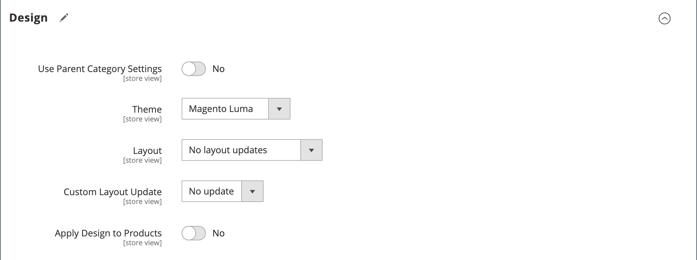

# 類別 — 設計設定

_[!UICONTROL Design]_&#x200B;區段可讓您控制類別、所有關聯產品頁面及頁面配置的外觀與風格。 您可以為促銷自訂類別頁面及其相關產品，或區別類別。 例如，您可以為某個品牌或特殊產品線開發獨特的設計，或為特定時段套用更新。

{width="600" zoomable="yes"}

>[!NOTE]
>
>當相同的產品被指派給數個類別，且每個類別的設計設定不同時，建議在[搜尋引擎最佳化組態選項](../configuration-reference/catalog/catalog.md#search-engine-optimization)中設定&#x200B;**產品URL的使用類別路徑** = `Yes`。 若要存取此設定，請移至&#x200B;**[!UICONTROL Stores]** > _[!UICONTROL Settings]_>**[!UICONTROL Configuration]**，展開&#x200B;**[!UICONTROL Catalog]**&#x200B;並選擇左側面板下的&#x200B;**目錄**，然後展開頁面上的&#x200B;**搜尋引擎最佳化**&#x200B;區段。

| 欄位 | 說明 |
|--- |--- |
| [!UICONTROL Use Parent Category Settings] | 允許目前類別從父類別繼承設計設定。 若使用，設計區段中的所有其他欄位將會變為無法使用。 選項： `Yes` / ` No` |
| [!UICONTROL Theme] | 將自訂主題套用至類別。 |
| [!UICONTROL Layout] | 將不同的版面配置套用至類別頁面。 選項：  **[!UICONTROL No layout updates]**— 依預設，配置更新不適用於類別頁面。 **[!UICONTROL Empty]** — 用來定義您自己的頁面配置。 （需要瞭解XML。）  **[!UICONTROL 1 column]**— 將一欄式配置套用至類別頁面。 **[!UICONTROL 2 columns with left bar]** — 將具左側欄的雙欄版面配置套用至類別頁面。  **[!UICONTROL 2 columns with right bar]**— 將帶有右側欄的雙欄版面配置套用至類別頁面。 **[!UICONTROL 3 columns]** — 將三欄式配置套用至類別頁面。 **[!UICONTROL Page -- Full Width]**- （需要[頁面產生器](../page-builder/introduction.md)）將CMS頁面的完整版面配置套用至類別頁面。 **[!UICONTROL Category -- Full Width]** - （需要頁面產生器）將類別頁面的完整版面配置套用至類別頁面。  **[!UICONTROL Product -- Full Width]**- （需要頁面產生器）將產品頁面的完整版面配置套用至類別頁面。 |
| [!UICONTROL Custom Layout Update] | 列出伺服器上可用的自訂配置更新檔案。 選擇您要套用至類別的自訂版面配置更新。 |
| [!UICONTROL Apply Design to Products] | 選取後，會將自訂設定套用至類別中的所有產品。 |

{style="table-layout:auto"}

## [!UICONTROL Scheduled Design Update]

{{ce-feature}}

_[!UICONTROL Scheduled Design Update]_&#x200B;區段會決定自訂設計套用至類別頁面時的日期範圍。

| 欄位 | 說明 |
|--- |--- |
| [!UICONTROL Schedule Update From/To] | 決定套用自訂配置至類別的日期範圍。 |

{width="600" zoomable="yes"}
